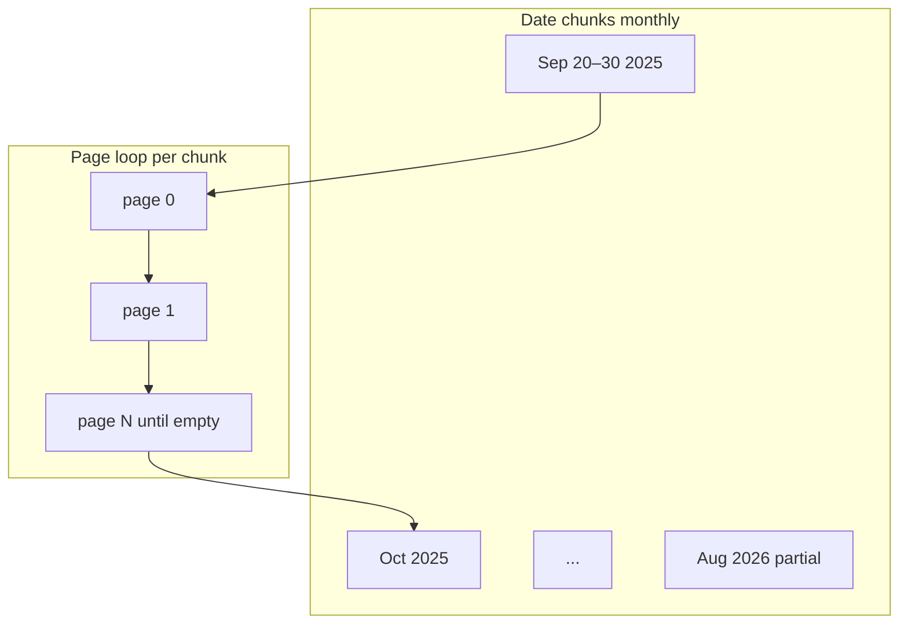

<!-- Generated by SpecStory, Markdown v2.1.0 -->

# 2026-08-11 09:56:16Z

<!-- Cursor IDE Session 00e11b9f-f65f-474c-ac77-489d75ff4aad (2026-08-11 09:56:16Z) -->

_**User**_

Before phase 2 i first want to fetch all possible data of last 1 year.
First trade was placed on 25 september...so i want you to fetch all the trades from 20 september 2025 till today.

Now everything should be stored in postgres.
Lets do that work first

Now what all i have to store in postgres for my work...first discuss that then we will proceed

---

_**Agent (composer-2.5)**_

Reviewing the project plan, current data model, and Dhan API usage so we can propose what belongs in PostgreSQL before the historical fetch.


_**Agent (composer-2.5)**_

<tool-use data-tool-type="search" data-tool-name="glob_file_search"><details>
<summary>Tool use: **glob_file_search** • Searched codebase "" • **9** results in **1** directory</summary>

Directory: **`/home/niraj/Desktop/Holdings-Tracker`** (9 files)

| File |
|------|
| `src/retry.py` |
| `src/__init__.py` |
| `src/dhan_client.py` |
| `src/auth.py` |
| `scripts/phase1_validate.py` |
| `README.md` |
| `src/config.py` |
| `docs/DHAN_API_QUESTIONS.md` |
| `dhan-api-docs.md` |
</details></tool-use>

_**Agent (composer-2.5)**_

<tool-use data-tool-type="read" data-tool-name="read_file_v2"><details>
<summary>Tool use: **read_file_v2** • Read file: /home/niraj/Desktop/Holdings-Tracker/.cursor/rules/dhan-api-compliance.mdc</summary>

</details></tool-use>

_**Agent (composer-2.5)**_

<tool-use data-tool-type="read" data-tool-name="read_file_v2"><details>
<summary>Tool use: **read_file_v2** • Read file: /home/niraj/Desktop/Holdings-Tracker/README.md</summary>

</details></tool-use>

_**Agent (composer-2.5)**_

<tool-use data-tool-type="read" data-tool-name="read_file_v2"><details>
<summary>Tool use: **read_file_v2** • Read file: /home/niraj/Desktop/Holdings-Tracker/.cursor/rules/holdings-tracker-plan.mdc</summary>

</details></tool-use>

_**Agent (composer-2.5)**_

<tool-use data-tool-type="read" data-tool-name="read_file_v2"><details>
<summary>Tool use: **read_file_v2** • Read file: /home/niraj/Desktop/Holdings-Tracker/output/trade_history.json</summary>

</details></tool-use>

_**Agent (composer-2.5)**_

<tool-use data-tool-type="read" data-tool-name="read_file_v2"><details>
<summary>Tool use: **read_file_v2** • Read file: /home/niraj/Desktop/Holdings-Tracker/output/holdings.json</summary>

</details></tool-use>

_**Agent (composer-2.5)**_

<tool-use data-tool-type="read" data-tool-name="read_file_v2"><details>
<summary>Tool use: **read_file_v2** • Read file: /home/niraj/Desktop/Holdings-Tracker/output/profile.json</summary>

</details></tool-use>

_**Agent (composer-2.5)**_

<tool-use data-tool-type="read" data-tool-name="read_file_v2"><details>
<summary>Tool use: **read_file_v2** • Read file: /home/niraj/Desktop/Holdings-Tracker/docs/DHAN_API_QUESTIONS.md</summary>

</details></tool-use>

_**Agent (composer-2.5)**_

<tool-use data-tool-type="unknown" data-tool-name="ripgrep_raw_search"><details>
<summary>Tool use: **ripgrep_raw_search**</summary>

Parameters:

```json
{
  "caseInsensitive": false,
  "path": "/home/niraj/Desktop/Holdings-Tracker/dhan-api-docs.md",
  "pattern": "trades|holdings|profile"
}
```
Additional data:

```json
{
  "isPruned": true,
  "outputMode": "content",
  "path": "/home/niraj/Desktop/Holdings-Tracker/dhan-api-docs.md",
  "pattern": "trades|holdings|profile",
  "topFiles": [
    {
      "matchCount": 40,
      "uri": "dhan-api-docs.md"
    }
  ],
  "totalFiles": 1,
  "totalMatches": 100
}
```
Status: **completed**

</details></tool-use>

_**Agent (composer-2.5)**_

<tool-use data-tool-type="read" data-tool-name="read_file_v2"><details>
<summary>Tool use: **read_file_v2** • Read file: /home/niraj/Desktop/Holdings-Tracker/dhan-api-docs.md</summary>

</details></tool-use>

_**Agent (composer-2.5)**_

<tool-use data-tool-type="read" data-tool-name="read_file_v2"><details>
<summary>Tool use: **read_file_v2** • Read file: /home/niraj/Desktop/Holdings-Tracker/dhan-api-docs.md</summary>

</details></tool-use>

_**Agent (composer-2.5)**_

<tool-use data-tool-type="read" data-tool-name="read_file_v2"><details>
<summary>Tool use: **read_file_v2** • Read file: /home/niraj/Desktop/Holdings-Tracker/src/dhan_client.py</summary>

</details></tool-use>

_**Agent (composer-2.5)**_

<tool-use data-tool-type="read" data-tool-name="read_file_v2"><details>
<summary>Tool use: **read_file_v2** • Read file: /home/niraj/Desktop/Holdings-Tracker/scripts/phase1_validate.py</summary>

</details></tool-use>

_**Agent (composer-2.5)**_

<tool-use data-tool-type="read" data-tool-name="read_file_v2"><details>
<summary>Tool use: **read_file_v2** • Read file: /home/niraj/Desktop/Holdings-Tracker/sample.env</summary>

</details></tool-use>

_**Agent (composer-2.5)**_

<tool-use data-tool-type="read" data-tool-name="read_file_v2"><details>
<summary>Tool use: **read_file_v2** • Read file: /home/niraj/Desktop/Holdings-Tracker/requirements.txt</summary>

</details></tool-use>

_**Agent (composer-2.5)**_

<tool-use data-tool-type="unknown" data-tool-name="ripgrep_raw_search"><details>
<summary>Tool use: **ripgrep_raw_search**</summary>

Parameters:

```json
{
  "caseInsensitive": false,
  "outputMode": "content",
  "path": "/home/niraj/Desktop/Holdings-Tracker/output/trade_history.json",
  "pattern": "\"productType\""
}
```
Additional data:

```json
{
  "isPruned": true,
  "outputMode": "content",
  "path": "/home/niraj/Desktop/Holdings-Tracker/output/trade_history.json",
  "pattern": "\"productType\"",
  "topFiles": [
    {
      "matchCount": 19,
      "uri": "output/trade_history.json"
    }
  ],
  "totalFiles": 1,
  "totalMatches": 19
}
```
Status: **completed**

</details></tool-use>

_**Agent (composer-2.5)**_

Checking trade date range and product types in the sample data:


_**Agent (composer-2.5)**_

<tool-use data-tool-type="unknown" data-tool-name="ripgrep_raw_search"><details>
<summary>Tool use: **ripgrep_raw_search**</summary>

Parameters:

```json
{
  "caseInsensitive": false,
  "path": "/home/niraj/Desktop/Holdings-Tracker/output/trade_history.json",
  "pattern": "\"exchangeTime\""
}
```
Additional data:

```json
{
  "isPruned": true,
  "outputMode": "content",
  "path": "/home/niraj/Desktop/Holdings-Tracker/output/trade_history.json",
  "pattern": "\"exchangeTime\"",
  "topFiles": [
    {
      "matchCount": 5,
      "uri": "output/trade_history.json"
    }
  ],
  "totalFiles": 1,
  "totalMatches": 19
}
```
Status: **completed**

</details></tool-use>

_**Agent (composer-2.5)**_

<tool-use data-tool-type="unknown" data-tool-name="ripgrep_raw_search"><details>
<summary>Tool use: **ripgrep_raw_search**</summary>

Parameters:

```json
{
  "caseInsensitive": false,
  "outputMode": "count",
  "path": "/home/niraj/Desktop/Holdings-Tracker/output/trade_history.json",
  "pattern": "\"exchangeSegment\""
}
```
Additional data:

```json
{
  "isPruned": true,
  "outputMode": "count",
  "path": "/home/niraj/Desktop/Holdings-Tracker/output/trade_history.json",
  "pattern": "\"exchangeSegment\"",
  "topFiles": [
    {
      "matchCount": 19,
      "uri": "output/trade_history.json"
    }
  ],
  "totalFiles": 1,
  "totalMatches": 19
}
```
Status: **completed**

</details></tool-use>

_**Agent (composer-2.5)**_

<tool-use data-tool-type="unknown" data-tool-name="ask_question"><details>
<summary>Tool use: **ask_question**</summary>

Parameters:

```json
{
  "questions": [
    {
      "id": "postgres_ready",
      "options": [
        {
          "id": "yes_neon",
          "label": "Yes — Neon is ready, I have DATABASE_URL"
        },
        {
          "id": "no_setup",
          "label": "No — include Neon setup in the plan"
        },
        {
          "id": "local_first",
          "label": "Use local PostgreSQL for now, Neon later"
        }
      ],
      "prompt": "Do you already have a Neon PostgreSQL database set up with a connection string (DATABASE_URL)?"
    },
    {
      "id": "holdings_strategy",
      "options": [
        {
          "id": "snapshot_history",
          "label": "Keep daily snapshot history (each sync = new snapshot row + child rows)"
        },
        {
          "id": "latest_only",
          "label": "Latest snapshot only (overwrite on each sync)"
        },
        {
          "id": "skip_holdings",
          "label": "Skip holdings in DB for now — trades only"
        }
      ],
      "prompt": "For Holdings API data (reconciliation snapshots), how should we store it?"
    }
  ]
}
```
Additional data:

```json
{
  "status": "submitted"
}
```
Result:

```json
{
  "answers": [
    {
      "freeformText": "I have only created a fresh new neon free tier account",
      "questionId": "postgres_ready"
    },
    {
      "freeformText": "I dont understand your question",
      "questionId": "holdings_strategy"
    }
  ]
}
```
Status: **completed**

</details></tool-use>

_**Agent (composer-2.5)**_

Holdings snapshots are a reconciliation check, not the trade ledger — I'll recommend a simple approach and draft the full PostgreSQL storage plan.


_**Agent (composer-2.5)**_

<tool-use data-tool-type="unknown" data-tool-name="create_plan"><details>
<summary>Tool use: **create_plan**</summary>

Parameters:

````json
{
  "name": "PostgreSQL Data Model",
  "overview": "Define what belongs in PostgreSQL before Phase 2, then backfill all Dhan trades from 2025-09-20 through today into Neon with idempotent ingestion. Holdings stored as a current snapshot for reconciliation only.",
  "plan": "# PostgreSQL Storage Design + Historical Backfill\n\n## What problem the DB solves\n\nYour app’s core job is: **reconstruct open lots from trade history (FIFO) and predict when each lot becomes long-term (\u003e12 months).**\n\nPostgreSQL is not the source of truth — **Dhan Trade History is**. The DB is a permanent, queryable cache so you do not re-fetch 11 months of trades on every run and so Phase 2 FIFO has stable input.\n\n```mermaid\nflowchart LR\n  DhanAPI[\"Dhan API\"] --\u003e Trades[\"dhan_trades table\"]\n  DhanAPI --\u003e Holdings[\"holdings_current table\"]\n  Trades --\u003e FIFO[\"Phase 2 FIFO Engine\"]\n  FIFO --\u003e Lots[\"lots table Phase 2\"]\n  Holdings --\u003e Reconcile[\"Reconciliation check\"]\n  Lots --\u003e Reconcile\n```\n\n---\n\n## What to store — and what NOT to store\n\n### 1. Store now (this task): Raw trades — REQUIRED\n\n**Table: `dhan_trades`**\n\nThis is the most important table. Store every field from `GET /v2/trades/...` exactly as returned, plus ingestion metadata.\n\n| Column group | Fields | Why |\n|---|---|---|\n| Dedup key | `order_id`, `exchange_time`, `transaction_type`, `traded_quantity`, `traded_price`, `security_id` | `exchangeTradeId` is always `\"0\"` in your live data — composite key prevents duplicates on re-runs ([`docs/DHAN_API_QUESTIONS.md`](docs/DHAN_API_QUESTIONS.md)) |\n| Identity | `dhan_client_id`, `exchange_order_id`, `exchange_trade_id` | Audit + future if Dhan fixes trade IDs |\n| Trade core | `exchange_segment`, `product_type`, `order_type`, `custom_symbol`, `isin`, `instrument` | FIFO filtering (you only trade `NSE_EQ` / `CNC` today) |\n| Economics | `traded_quantity`, `traded_price`, all charge fields | Lot cost basis |\n| Timestamps | `exchange_time` (parsed), `create_time`, `update_time` | LT conversion date comes from BUY `exchange_time` |\n| Derivatives placeholders | `drv_expiry_date`, `drv_option_type`, `drv_strike_price` | Store as-is; ignore for equity V1 |\n| Audit | `raw_payload JSONB`, `ingested_at`, `sync_run_id` | Full API row preserved permanently (approved plan rule) |\n\n**Unique constraint:** `(order_id, exchange_time, transaction_type, traded_quantity, traded_price, security_id)`\n\n**Filter for FIFO (Phase 2, not at ingest time):** Only `product_type = 'CNC'` and `exchange_segment = 'NSE_EQ'` matter for demat lot tracking. Store everything; filter when building lots.\n\n---\n\n### 2. Store now: Sync run log — REQUIRED\n\n**Table: `sync_runs`**\n\nTracks each fetch/backfill execution (manual now, GitHub Actions later).\n\n| Field | Purpose |\n|---|---|\n| `started_at`, `finished_at`, `status` | Ops visibility |\n| `trade_from`, `trade_to` | Which date window was fetched |\n| `trades_fetched`, `trades_inserted`, `trades_skipped` | Idempotency stats |\n| `error_message` | Fail loudly on errors |\n\nEvery inserted trade links to the run via `sync_run_id`.\n\n---\n\n### 3. Store now: Current holdings snapshot — RECOMMENDED\n\n**Table: `holdings_current`** (one row per security, upserted each sync)\n\nHoldings answers: *“What does Dhan say I own right now?”* — used only to **reconcile** FIFO output vs Dhan, not to reconstruct history.\n\n| Field | From API |\n|---|---|\n| `security_id`, `trading_symbol`, `isin` | Identity |\n| `total_qty`, `dp_qty`, `t1_qty`, `available_qty`, `collateral_qty` | Quantities |\n| `avg_cost_price`, `last_traded_price` | Reference (may diverge from FIFO — expected) |\n| `raw_payload JSONB`, `synced_at` | Audit |\n\n**Why not historical holdings snapshots?** For V1, a single current snapshot is enough. You compare “FIFO open qty per ISIN” vs `total_qty` (or `dp_qty` for settled shares). Daily snapshot history can be added in Phase 3/4 if you want trend tracking — not needed for LT alerts.\n\n---\n\n### 4. Defer to Phase 2: Derived lot tables — DO NOT BUILD YET\n\nThese are **computed from `dhan_trades`**, not fetched from Dhan:\n\n| Table | Contents |\n|---|---|\n| `lots` | Each open BUY lot: purchase date, original qty, remaining qty, LT conversion date |\n| `lot_allocations` | Each SELL → which lots consumed (FIFO) |\n\nBuilding these before trades are in Postgres would be backwards. Phase 2 reads `dhan_trades` and writes these.\n\n---\n\n### 5. Do NOT store\n\n| Data | Reason |\n|---|---|\n| Access tokens / auth responses | Ephemeral (~24h); generated fresh each run |\n| Profile (`/profile`) | Account metadata only; not used for lot math |\n| Orders / order book | Out of scope (read-only project) |\n| Market charts / LTP history | Not needed for holding-period tracking |\n| Corporate actions | Explicitly out of V1 scope |\n| US/global stocks APIs | Your trades are NSE equity CNC |\n\n---\n\n## Holdings snapshot — plain-language answer\n\nYou asked about the holdings question. Here is what it means:\n\n- **Trades** = every buy/sell event (your ledger)\n- **Holdings** = Dhan’s current portfolio snapshot (25 stocks, current quantities)\n\nWe store holdings so that after Phase 2 FIFO runs, we can ask: *“Does our calculated open quantity for RECLTD match Dhan’s `total_qty`?”* If not, something is wrong — fail loudly.\n\n**Recommendation:** `holdings_current` — overwrite on each sync. Simple, sufficient for V1.\n\n---\n\n## Historical backfill plan (2025-09-20 → today)\n\n**Date range:** `2025-09-20` to `2026-08-11` (5-day buffer before first trade on Sep 25)\n\n**Fetch strategy (defensive):**\n\nDhan docs do not confirm max date range per request ([`docs/DHAN_API_QUESTIONS.md`](docs/DHAN_API_QUESTIONS.md) Q5). To be safe:\n\n1. Split into **monthly chunks** (e.g. `2025-09-20→2025-09-30`, then full months, then partial current month)\n2. For each chunk: paginate from page `0` until empty array (existing logic in [`src/dhan_client.py`](src/dhan_client.py))\n3. Upsert each trade into `dhan_trades` — duplicates silently skipped via unique constraint\n4. After all chunks: fetch holdings once → upsert `holdings_current`\n5. Record one `sync_runs` row summarizing the backfill\n\n**Reuse existing code:** [`src/auth.py`](src/auth.py), [`src/dhan_client.py`](src/dhan_client.py), [`src/retry.py`](src/retry.py) — extend, do not rewrite.\n\n---\n\n## Neon setup (you have a fresh account)\n\nSince you created Neon but likely do not have `DATABASE_URL` yet:\n\n1. Create a project + database in Neon console\n2. Copy the **pooled connection string** (for serverless/GitHub Actions later)\n3. Add to `.env`: `DATABASE_URL=postgresql://...`\n4. Run SQL migrations to create the 3 tables above\n\n**New dependencies:** `psycopg2-binary` (or `psycopg[binary]`) + optionally `sqlalchemy` for cleaner upserts. Keep it minimal — raw SQL or lightweight wrapper is fine for V1.\n\n---\n\n## Proposed schema (SQL)\n\n```sql\n-- sync_runs\nCREATE TABLE sync_runs (\n  id              BIGSERIAL PRIMARY KEY,\n  started_at      TIMESTAMPTZ NOT NULL DEFAULT now(),\n  finished_at     TIMESTAMPTZ,\n  status          TEXT NOT NULL DEFAULT 'running',  -- running | success | failed\n  trade_from      DATE,\n  trade_to        DATE,\n  trades_fetched  INTEGER DEFAULT 0,\n  trades_inserted INTEGER DEFAULT 0,\n  trades_skipped  INTEGER DEFAULT 0,\n  error_message   TEXT\n);\n\n-- dhan_trades (immutable raw trades)\nCREATE TABLE dhan_trades (\n  id                       BIGSERIAL PRIMARY KEY,\n  order_id                 TEXT NOT NULL,\n  exchange_time            TIMESTAMPTZ NOT NULL,\n  transaction_type         TEXT NOT NULL,\n  traded_quantity          INTEGER NOT NULL,\n  traded_price             NUMERIC(18, 4) NOT NULL,\n  security_id              TEXT NOT NULL,\n  dhan_client_id           TEXT,\n  exchange_order_id        TEXT,\n  exchange_trade_id        TEXT,\n  exchange_segment         TEXT,\n  product_type             TEXT,\n  order_type               TEXT,\n  custom_symbol            TEXT,\n  isin                     TEXT,\n  instrument               TEXT,\n  sebi_tax                 NUMERIC(18, 6),\n  stt                      NUMERIC(18, 6),\n  brokerage_charges        NUMERIC(18, 6),\n  service_tax              NUMERIC(18, 6),\n  exchange_transaction_charges NUMERIC(18, 6),\n  stamp_duty               NUMERIC(18, 6),\n  create_time              TEXT,\n  update_time              TEXT,\n  drv_expiry_date          TEXT,\n  drv_option_type          TEXT,\n  drv_strike_price         NUMERIC(18, 4),\n  raw_payload              JSONB NOT NULL,\n  ingested_at              TIMESTAMPTZ NOT NULL DEFAULT now(),\n  sync_run_id              BIGINT REFERENCES sync_runs(id),\n  UNIQUE (order_id, exchange_time, transaction_type, traded_quantity, traded_price, security_id)\n);\n\nCREATE INDEX idx_dhan_trades_exchange_time ON dhan_trades (exchange_time);\nCREATE INDEX idx_dhan_trades_security_id   ON dhan_trades (security_id);\nCREATE INDEX idx_dhan_trades_isin         ON dhan_trades (isin);\n\n-- holdings_current (latest snapshot, upserted)\nCREATE TABLE holdings_current (\n  security_id       TEXT PRIMARY KEY,\n  trading_symbol    TEXT,\n  isin              TEXT,\n  exchange          TEXT,\n  total_qty         INTEGER,\n  dp_qty            INTEGER,\n  t1_qty            INTEGER,\n  mtf_t1_qty        INTEGER,\n  mtf_qty           INTEGER,\n  available_qty     INTEGER,\n  collateral_qty    INTEGER,\n  avg_cost_price    NUMERIC(18, 4),\n  last_traded_price NUMERIC(18, 4),\n  raw_payload       JSONB NOT NULL,\n  synced_at         TIMESTAMPTZ NOT NULL DEFAULT now()\n);\n```\n\n---\n\n## New files to add (after you approve)\n\n| File | Purpose |\n|---|---|\n| [`migrations/001_initial_schema.sql`](migrations/001_initial_schema.sql) | Create the 3 tables |\n| [`src/db.py`](src/db.py) | Connection pool, run migrations |\n| [`src/trade_ingest.py`](src/trade_ingest.py) | Parse Dhan row → upsert into `dhan_trades` |\n| [`src/holdings_sync.py`](src/holdings_sync.py) | Upsert `holdings_current` |\n| [`scripts/backfill_trades.py`](scripts/backfill_trades.py) | One-time: Sep 20 2025 → today |\n| Update [`sample.env`](sample.env) | Add `DATABASE_URL` |\n| Update [`requirements.txt`](requirements.txt) | Add `psycopg2-binary` |\n\n---\n\n## Summary — minimum viable Postgres for your work\n\n| Store | When | Why |\n|---|---|---|\n| **`dhan_trades`** | Now | Permanent raw ledger; FIFO input; deduped backfill |\n| **`sync_runs`** | Now | Track backfill + future daily syncs |\n| **`holdings_current`** | Now | Reconciliation vs FIFO (Phase 2) |\n| **`lots` + allocations** | Phase 2 | Derived from trades, not from API |\n| Everything else | Never (V1) | Out of scope or ephemeral |\n",
  "todos": [
    {
      "content": "Create Neon database, add DATABASE_URL to .env and sample.env",
      "id": "neon-setup",
      "status": "pending"
    },
    {
      "content": "Add migrations/001_initial_schema.sql with sync_runs, dhan_trades, holdings_current",
      "id": "schema-migration",
      "status": "pending"
    },
    {
      "content": "Add src/db.py (connection + migration runner) and psycopg2 dependency",
      "id": "db-module",
      "status": "pending"
    },
    {
      "content": "Add src/trade_ingest.py — parse Dhan JSON, upsert with composite unique key",
      "id": "trade-ingest",
      "status": "pending"
    },
    {
      "content": "Add src/holdings_sync.py — upsert holdings_current from GET /holdings",
      "id": "holdings-sync",
      "status": "pending"
    },
    {
      "content": "Add scripts/backfill_trades.py — monthly chunks 2025-09-20 to today, paginated fetch + ingest",
      "id": "backfill-script",
      "status": "pending"
    }
  ]
}
````
Result:

```json
{
  "accepted": {}
}
```
Status: **completed**

</details></tool-use>

---

_**User**_

Also lets first do basic NEON setup then we will move next

---

_**Agent (composer-2.5)**_

Updating the plan to split Neon setup into its own first phase before schema and backfill.


_**Agent (composer-2.5)**_

<tool-use data-tool-type="read" data-tool-name="read_file_v2"><details>
<summary>Tool use: **read_file_v2** • Read file: /home/niraj/.cursor/plans/postgresql_data_model_d9b698f0.plan.md</summary>

</details></tool-use>

_**Agent (composer-2.5)**_

<tool-use data-tool-type="write" data-tool-name="edit_file_v2"><details>
<summary>Tool use: **edit_file_v2** • Edit file: /home/niraj/.cursor/plans/postgresql_data_model_d9b698f0.plan.md</summary>

</details></tool-use>

_**Agent (composer-2.5)**_

<tool-use data-tool-type="write" data-tool-name="edit_file_v2"><details>
<summary>Tool use: **edit_file_v2** • Edit file: /home/niraj/.cursor/plans/postgresql_data_model_d9b698f0.plan.md</summary>

</details></tool-use>

_**Agent (composer-2.5)**_

<tool-use data-tool-type="write" data-tool-name="edit_file_v2"><details>
<summary>Tool use: **edit_file_v2** • Edit file: /home/niraj/.cursor/plans/postgresql_data_model_d9b698f0.plan.md</summary>

</details></tool-use>

_**Agent (composer-2.5)**_

<tool-use data-tool-type="write" data-tool-name="edit_file_v2"><details>
<summary>Tool use: **edit_file_v2** • Edit file: /home/niraj/.cursor/plans/postgresql_data_model_d9b698f0.plan.md</summary>

</details></tool-use>

_**Agent (composer-2.5)**_

Updated the plan to split work into two clear steps. **Step 1 is Neon setup only** — we stop there before touching schema or backfill.

## Step 1 — Basic Neon setup (first)

**You do in Neon console:**
1. Create a project (e.g. `holdings-tracker`)
2. Use the default `neondb` database
3. Copy the **pooled** connection string (`?sslmode=require`)
4. Add it to your local `.env` as `DATABASE_URL=...`

**We add in code:**
- `DATABASE_URL` placeholder in `sample.env`
- `psycopg2-binary` in `requirements.txt`
- `src/db.py` — connect + health check
- `scripts/test_db_connection.py` — verify connectivity

**Success criteria:**
```bash
python scripts/test_db_connection.py
# → Connected to Neon PostgreSQL, server version printed
```

No tables, migrations, or trade ingestion in Step 1.

---

## Step 2 — Later (after connection works)

Schema (`dhan_trades`, `sync_runs`, `holdings_current`), trade ingestion, and the Sep 2025 → today backfill.

---

**Your action now:** Create the Neon project and copy the pooled `DATABASE_URL` into `.env`. When that’s done, say **“go ahead with Step 1”** and I’ll implement the code + connection test.

---

_**User**_

Lets go with step 1

---

_**Agent (composer-2.5)**_

Implementing Step 1: reading the current config and env files, then adding Neon connection support.


_**Agent (composer-2.5)**_

<tool-use data-tool-type="read" data-tool-name="read_file_v2"><details>
<summary>Tool use: **read_file_v2** • Read file: /home/niraj/Desktop/Holdings-Tracker/src/config.py</summary>

</details></tool-use>

_**Agent (composer-2.5)**_

<tool-use data-tool-type="read" data-tool-name="read_file_v2"><details>
<summary>Tool use: **read_file_v2** • Read file: /home/niraj/Desktop/Holdings-Tracker/requirements.txt</summary>

</details></tool-use>

_**Agent (composer-2.5)**_

<tool-use data-tool-type="read" data-tool-name="read_file_v2"><details>
<summary>Tool use: **read_file_v2** • Read file: /home/niraj/Desktop/Holdings-Tracker/.env</summary>

</details></tool-use>

_**Agent (composer-2.5)**_

<tool-use data-tool-type="read" data-tool-name="read_file_v2"><details>
<summary>Tool use: **read_file_v2** • Read file: /home/niraj/Desktop/Holdings-Tracker/sample.env</summary>

</details></tool-use>

_**Agent (composer-2.5)**_

<tool-use data-tool-type="search" data-tool-name="glob_file_search"><details>
<summary>Tool use: **glob_file_search** • Searched codebase "" • **1** result in **1** directory</summary>

Directory: **`/home/niraj/Desktop/Holdings-Tracker`** (1 file)

| File |
|------|
| `scripts/phase1_validate.py` |
</details></tool-use>

_**Agent (composer-2.5)**_

<tool-use data-tool-type="search" data-tool-name="glob_file_search"><details>
<summary>Tool use: **glob_file_search** • Searched codebase "" • **5** results in **1** directory</summary>

Directory: **`/home/niraj/Desktop/Holdings-Tracker/src`** (5 files)

| File |
|------|
| `config.py` |
| `__init__.py` |
| `auth.py` |
| `dhan_client.py` |
| `retry.py` |
</details></tool-use>

_**Agent (composer-2.5)**_

<tool-use data-tool-type="read" data-tool-name="read_file_v2"><details>
<summary>Tool use: **read_file_v2** • Read file: /home/niraj/Desktop/Holdings-Tracker/scripts/phase1_validate.py</summary>

</details></tool-use>

_**Agent (composer-2.5)**_

Implementing Step 1 files and verifying the Neon connection.


_**Agent (composer-2.5)**_

<tool-use data-tool-type="write" data-tool-name="edit_file_v2"><details>
<summary>Tool use: **edit_file_v2** • Edit file: /home/niraj/Desktop/Holdings-Tracker/src/config.py</summary>

</details></tool-use>

_**Agent (composer-2.5)**_

<tool-use data-tool-type="write" data-tool-name="edit_file_v2"><details>
<summary>Tool use: **edit_file_v2** • Edit file: /home/niraj/Desktop/Holdings-Tracker/sample.env</summary>

</details></tool-use>

_**Agent (composer-2.5)**_

<tool-use data-tool-type="write" data-tool-name="edit_file_v2"><details>
<summary>Tool use: **edit_file_v2** • Edit file: /home/niraj/Desktop/Holdings-Tracker/scripts/test_db_connection.py</summary>

</details></tool-use>

_**Agent (composer-2.5)**_

<tool-use data-tool-type="write" data-tool-name="edit_file_v2"><details>
<summary>Tool use: **edit_file_v2** • Edit file: /home/niraj/Desktop/Holdings-Tracker/src/db.py</summary>

</details></tool-use>

_**Agent (composer-2.5)**_

<tool-use data-tool-type="unknown" data-tool-name="read_lints"><details>
<summary>Tool use: **read_lints**</summary>

Parameters:

```json
{
  "paths": [
    "/home/niraj/Desktop/Holdings-Tracker/src/config.py",
    "/home/niraj/Desktop/Holdings-Tracker/src/db.py",
    "/home/niraj/Desktop/Holdings-Tracker/scripts/test_db_connection.py"
  ]
}
```
Result:

```json
{
  "linterErrorsByFile": [
    {
      "relativeWorkspacePath": "/home/niraj/Desktop/Holdings-Tracker/src/config.py"
    },
    {
      "relativeWorkspacePath": "/home/niraj/Desktop/Holdings-Tracker/src/db.py"
    },
    {
      "relativeWorkspacePath": "/home/niraj/Desktop/Holdings-Tracker/scripts/test_db_connection.py"
    }
  ]
}
```
Status: **completed**

</details></tool-use>

_**Agent (composer-2.5)**_

<tool-use data-tool-type="shell" data-tool-name="run_terminal_command_v2"><details>
<summary>Tool use: **run_terminal_command_v2** • Run command: cd /home/niraj/Desktop/Holdings-Tracker &amp;&amp; pip install -r requirements.txt -q &amp;&amp; python scripts/test_db_connection.py</summary>
```bash
cd /home/niraj/Desktop/Holdings-Tracker && pip install -r requirements.txt -q && python scripts/test_db_connection.py
```

```
error: externally-managed-environment

× This environment is externally managed
╰─> To install Python packages system-wide, try apt install
    python3-xyz, where xyz is the package you are trying to
    install.
    
    If you wish to install a non-Debian-packaged Python package,
    create a virtual environment using python3 -m venv path/to/venv.
    Then use path/to/venv/bin/python and path/to/venv/bin/pip. Make
    sure you have python3-full installed.
    
    If you wish to install a non-Debian packaged Python application,
    it may be easiest to use pipx install xyz, which will manage a
    virtual environment for you. Make sure you have pipx installed.
    
    See /usr/share/doc/python3.12/README.venv for more information.

note: If you believe this is a mistake, please contact your Python installation or OS distribution provider. You can override this, at the risk of breaking your Python installation or OS, by passing --break-system-packages.
hint: See PEP 668 for the detailed specification.

```
</details></tool-use>

_**Agent (composer-2.5)**_

<tool-use data-tool-type="shell" data-tool-name="run_terminal_command_v2"><details>
<summary>Tool use: **run_terminal_command_v2** • Run command: cd /home/niraj/Desktop/Holdings-Tracker &amp;&amp; (test -d .venv &amp;&amp; .venv/bin/pip install -r requirements.txt -q &amp;&amp; .venv/bin/python scripts/test_db_connection.py) || (python3 -m venv .venv &amp;&amp; .venv/bin/pip install -r requirements.txt -q &amp;&amp; .venv/bin/python scripts/test_db_connection.py)</summary>
```bash
cd /home/niraj/Desktop/Holdings-Tracker && (test -d .venv && .venv/bin/pip install -r requirements.txt -q && .venv/bin/python scripts/test_db_connection.py) || (python3 -m venv .venv && .venv/bin/pip install -r requirements.txt -q && .venv/bin/python scripts/test_db_connection.py)
```

```
WARNING: Retrying (Retry(total=4, connect=None, read=None, redirect=None, status=None)) after connection broken by 'NewConnectionError('<pip._vendor.urllib3.connection.HTTPSConnection object at 0x7c9761766bd0>: Failed to establish a new connection: [Errno -2] Name or service not known')': /simple/psycopg2-binary/
WARNING: Retrying (Retry(total=3, connect=None, read=None, redirect=None, status=None)) after connection broken by 'NewConnectionError('<pip._vendor.urllib3.connection.HTTPSConnection object at 0x7c9761788ce0>: Failed to establish a new connection: [Errno -2] Name or service not known')': /simple/psycopg2-binary/
WARNING: Retrying (Retry(total=2, connect=None, read=None, redirect=None, status=None)) after connection broken by 'NewConnectionError('<pip._vendor.urllib3.connection.HTTPSConnection object at 0x7c9761788f80>: Failed to establish a new connection: [Errno -2] Name or service not known')': /simple/psycopg2-binary/
WARNING: Retrying (Retry(total=1, connect=None, read=None, redirect=None, status=None)) after connection broken by 'NewConnectionError('<pip._vendor.urllib3.connection.HTTPSConnection object at 0x7c9761789190>: Failed to establish a new connection: [Errno -2] Name or service not known')': /simple/psycopg2-binary/
WARNING: Retrying (Retry(total=0, connect=None, read=None, redirect=None, status=None)) after connection broken by 'NewConnectionError('<pip._vendor.urllib3.connection.HTTPSConnection object at 0x7c97617893a0>: Failed to establish a new connection: [Errno -2] Name or service not known')': /simple/psycopg2-binary/
ERROR: Could not find a version that satisfies the requirement psycopg2-binary>=2.9.9 (from versions: none)
ERROR: No matching distribution found for psycopg2-binary>=2.9.9
Error: [Errno 30] Read-only file system: '/home/niraj/Desktop/Holdings-Tracker/.venv/pyvenv.cfg'

```
</details></tool-use>

_**Agent (composer-2.5)**_

<tool-use data-tool-type="shell" data-tool-name="run_terminal_command_v2"><details>
<summary>Tool use: **run_terminal_command_v2** • Run command: cd /home/niraj/Desktop/Holdings-Tracker &amp;&amp; (test -d .venv || python3 -m venv .venv) &amp;&amp; .venv/bin/pip install -r requirements.txt -q &amp;&amp; .venv/bin/python scripts/test_db_connection.py</summary>
```bash
cd /home/niraj/Desktop/Holdings-Tracker && (test -d .venv || python3 -m venv .venv) && .venv/bin/pip install -r requirements.txt -q && .venv/bin/python scripts/test_db_connection.py
```
</details></tool-use>

_**Agent (composer-2.5)**_

<tool-use data-tool-type="unknown" data-tool-name="await"><details>
<summary>Tool use: **await**</summary>
Status: **completed**

</details></tool-use>

_**Agent (composer-2.5)**_

<tool-use data-tool-type="read" data-tool-name="read_file_v2"><details>
<summary>Tool use: **read_file_v2** • Read file: /home/niraj/.cursor/projects/home-niraj-Desktop-Holdings-Tracker/terminals/357050.txt</summary>

</details></tool-use>

_**Agent (composer-2.5)**_

<tool-use data-tool-type="unknown" data-tool-name="await"><details>
<summary>Tool use: **await**</summary>
Status: **completed**

</details></tool-use>

_**Agent (composer-2.5)**_

<tool-use data-tool-type="read" data-tool-name="read_file_v2"><details>
<summary>Tool use: **read_file_v2** • Read file: /home/niraj/.cursor/projects/home-niraj-Desktop-Holdings-Tracker/terminals/357050.txt</summary>

</details></tool-use>

_**Agent (composer-2.5)**_

<tool-use data-tool-type="shell" data-tool-name="run_terminal_command_v2"><details>
<summary>Tool use: **run_terminal_command_v2** • Run command: ls -la /home/niraj/Desktop/Holdings-Tracker/.venv/bin/ 2&gt;/dev/null | head -5; /home/niraj/Desktop/Holdings-Tracker/.venv/bin/pip show psycopg2-binary 2&gt;/dev/null || echo &#34;not installed&#34;</summary>
```bash
ls -la /home/niraj/Desktop/Holdings-Tracker/.venv/bin/ 2>/dev/null | head -5; /home/niraj/Desktop/Holdings-Tracker/.venv/bin/pip show psycopg2-binary 2>/dev/null || echo "not installed"
```

```
total 56
drwxrwxr-x 2 root root 4096 Aug 11 13:05 .
drwxrwxr-x 5 root root 4096 Aug 11 13:03 ..
-rw-r--r-- 1 root root 2074 Aug 11 15:29 activate
-rw-r--r-- 1 root root  940 Aug 11 15:29 activate.csh
Name: psycopg2-binary
Version: 2.9.12
Summary: psycopg2 - Python-PostgreSQL Database Adapter
Home-page: https://psycopg.org/
Author: Federico Di Gregorio
Author-email: fog@initd.org
License: LGPL with exceptions
Location: /home/niraj/Desktop/Holdings-Tracker/.venv/lib/python3.12/site-packages
Requires: 
Required-by: 

```
</details></tool-use>

_**Agent (composer-2.5)**_

<tool-use data-tool-type="shell" data-tool-name="run_terminal_command_v2"><details>
<summary>Tool use: **run_terminal_command_v2** • Run command: cd /home/niraj/Desktop/Holdings-Tracker &amp;&amp; timeout 30 .venv/bin/python scripts/test_db_connection.py</summary>
```bash
cd /home/niraj/Desktop/Holdings-Tracker && timeout 30 .venv/bin/python scripts/test_db_connection.py
```
</details></tool-use>

_**Agent (composer-2.5)**_

Connection is hanging — likely due to `channel_binding=require`. Testing with a connect timeout and checking whether that parameter is the cause.


_**Agent (composer-2.5)**_

<tool-use data-tool-type="shell" data-tool-name="run_terminal_command_v2"><details>
<summary>Tool use: **run_terminal_command_v2** • Run command: cd /home/niraj/Desktop/Holdings-Tracker &amp;&amp; .venv/bin/python -c &#34;
import os
from dotenv import load_dotenv
load_dotenv()
url = os.environ[&#39;DATABASE_URL&#39;]
print(&#39;URL has channel_binding:&#39;, &#39;channel_binding&#39; in url)
import psycopg2
# try with connect_timeout
try:
    conn = psycopg2.connect(url, connect_timeout=10)
    conn.close()
    print(&#39;OK with original URL&#39;)
except Exception as e:
    print(&#39;Original URL failed:&#39;, e)
    url2 = url.replace(&#39;&amp;channel_binding=require&#39;, &#39;&#39;).replace(&#39;?channel_binding=require&amp;&#39;, &#39;?&#39;).replace(&#39;?channel_binding=require&#39;, &#39;&#39;)
    try:
        conn = psycopg2.connect(url2, connect_timeout=10)
        cur = conn.cursor()
        cur.execute(&#39;SELECT version()&#39;)
        print(&#39;OK without channel_binding:&#39;, cur.fetchone()[0][:50])
        conn.close()
    except Exception as e2:
        print(&#39;Without channel_binding failed:&#39;, e2)
&#34;
</summary>
```bash
cd /home/niraj/Desktop/Holdings-Tracker && .venv/bin/python -c "
import os
from dotenv import load_dotenv
load_dotenv()
url = os.environ['DATABASE_URL']
print('URL has channel_binding:', 'channel_binding' in url)
import psycopg2
# try with connect_timeout
try:
    conn = psycopg2.connect(url, connect_timeout=10)
    conn.close()
    print('OK with original URL')
except Exception as e:
    print('Original URL failed:', e)
    url2 = url.replace('&channel_binding=require', '').replace('?channel_binding=require&', '?').replace('?channel_binding=require', '')
    try:
        conn = psycopg2.connect(url2, connect_timeout=10)
        cur = conn.cursor()
        cur.execute('SELECT version()')
        print('OK without channel_binding:', cur.fetchone()[0][:50])
        conn.close()
    except Exception as e2:
        print('Without channel_binding failed:', e2)
"

```
</details></tool-use>

_**Agent (composer-2.5)**_

<tool-use data-tool-type="read" data-tool-name="read_file_v2"><details>
<summary>Tool use: **read_file_v2** • Read file: /home/niraj/.cursor/projects/home-niraj-Desktop-Holdings-Tracker/terminals/357051.txt</summary>

</details></tool-use>

_**Agent (composer-2.5)**_

<tool-use data-tool-type="unknown" data-tool-name="await"><details>
<summary>Tool use: **await**</summary>
Status: **completed**

</details></tool-use>

_**Agent (composer-2.5)**_

<tool-use data-tool-type="shell" data-tool-name="run_terminal_command_v2"><details>
<summary>Tool use: **run_terminal_command_v2** • Run command: python3 -c &#34;print(&#39;hello&#39;)&#34; &amp;&amp; nc -zv -w 5 ep-cool-darkness-azp49jgt-pooler.c-3.ap-southeast-1.aws.neon.tech 5432 2&gt;&amp;1 || true</summary>
```bash
python3 -c "print('hello')" && nc -zv -w 5 ep-cool-darkness-azp49jgt-pooler.c-3.ap-southeast-1.aws.neon.tech 5432 2>&1 || true
```

```
hello
nc: connect to ep-cool-darkness-azp49jgt-pooler.c-3.ap-southeast-1.aws.neon.tech (52.76.108.241) port 5432 (tcp) timed out: Operation now in progress
nc: connect to ep-cool-darkness-azp49jgt-pooler.c-3.ap-southeast-1.aws.neon.tech (13.251.213.89) port 5432 (tcp) timed out: Operation now in progress

```
</details></tool-use>

_**Agent (composer-2.5)**_

Neon isn't reachable from this environment (port 5432 times out). Adding a connect timeout so failures fail fast, then summarizing for local verification.


_**Agent (composer-2.5)**_

<tool-use data-tool-type="write" data-tool-name="edit_file_v2"><details>
<summary>Tool use: **edit_file_v2** • Edit file: /home/niraj/Desktop/Holdings-Tracker/src/db.py</summary>

</details></tool-use>

_**Agent (composer-2.5)**_

<tool-use data-tool-type="write" data-tool-name="edit_file_v2"><details>
<summary>Tool use: **edit_file_v2** • Edit file: /home/niraj/Desktop/Holdings-Tracker/sample.env</summary>

</details></tool-use>

_**Agent (composer-2.5)**_

Step 1 is implemented. Here is what was added:

## Files created/updated

| File | Change |
|------|--------|
| [`sample.env`](sample.env) | `DATABASE_URL` placeholder + troubleshooting note |
| [`src/config.py`](src/config.py) | Loads optional `database_url` from env |
| [`src/db.py`](src/db.py) | `get_connection()` + `check_connection()` with 10s timeout |
| [`scripts/test_db_connection.py`](scripts/test_db_connection.py) | Verifies Neon connectivity |

`psycopg2-binary` was already in [`requirements.txt`](requirements.txt). Your `.env` already has `DATABASE_URL` set.

## Verify on your machine

From the project root:

```bash
source .venv/bin/activate   # or: python3 -m venv .venv && source .venv/bin/activate
pip install -r requirements.txt
python scripts/test_db_connection.py
```

Expected output:
```
Connected to Neon PostgreSQL
Server version: PostgreSQL 16.x ...
```

## If connection hangs or times out

Neon sometimes includes `&channel_binding=require` in the connection string. If the test hangs, edit `.env` and remove that part, keeping `?sslmode=require`.

Example:
```
# Before
...?sslmode=require&channel_binding=require

# After
...?sslmode=require
```

I could not verify the connection from this environment — outbound port 5432 to Neon is blocked here. The code is ready; run the test locally to confirm.

Once `test_db_connection.py` succeeds, say **"go with Step 2"** and we'll add the schema, migrations, and trade backfill.

---

_**User**_

<system_notification>
The following task has finished. If you were already aware, ignore this notification and do not restate prior responses.

<task>
kind: shell
status: error
task_id: 357050
title: Create venv, install deps, test Neon DB
tool_call_id: tool_cbc1ebb8-dcb0-4c09-b4e8-d1cb90480bc
detail: exit_code=1
output_path: /home/niraj/.cursor/projects/home-niraj-Desktop-Holdings-Tracker/terminals/357050.txt
</task>
</system_notification>
<user_query>Briefly inform the user about the task result and perform any follow-up actions (if needed). If there's no follow-ups needed, don't explicitly say that.</user_query>

---

_**User**_

<system_notification>
The following task has finished. If you were already aware, ignore this notification and do not restate prior responses.

<task>
kind: shell
status: success
task_id: 357051
title: Diagnose Neon connection hang cause
tool_call_id: tool_e93fdb36-811d-4ea0-81ac-2587e6d364b
output_path: /home/niraj/.cursor/projects/home-niraj-Desktop-Holdings-Tracker/terminals/357051.txt
</task>
</system_notification>
<user_query>Briefly inform the user about the task result and perform any follow-up actions (if needed). If there's no follow-ups needed, don't explicitly say that.</user_query>

---

_**User**_

<system_notification>
The following task has finished. If you were already aware, ignore this notification and do not restate prior responses.

<task>
kind: shell
status: success
task_id: 357052
title: Test TCP reachability to Neon host
tool_call_id: tool_90a4e45b-cecd-447d-a4b5-cfb519df704
output_path: /home/niraj/.cursor/projects/home-niraj-Desktop-Holdings-Tracker/terminals/357052.txt
</task>
</system_notification>
<user_query>Briefly inform the user about the task result and perform any follow-up actions (if needed). If there's no follow-ups needed, don't explicitly say that.</user_query>

---

_**Agent (composer-2.5)**_

<tool-use data-tool-type="read" data-tool-name="read_file_v2"><details>
<summary>Tool use: **read_file_v2** • Read file: /home/niraj/.cursor/projects/home-niraj-Desktop-Holdings-Tracker/terminals/357050.txt</summary>

</details></tool-use>

_**Agent (composer-2.5)**_

<tool-use data-tool-type="read" data-tool-name="read_file_v2"><details>
<summary>Tool use: **read_file_v2** • Read file: /home/niraj/.cursor/projects/home-niraj-Desktop-Holdings-Tracker/terminals/357051.txt</summary>

</details></tool-use>

_**Agent (composer-2.5)**_

The automated DB test from this environment **failed with connection timeouts** to your Neon host on port 5432 — both with and without `channel_binding=require`. That points to outbound PostgreSQL being blocked here, not a problem with your setup or the Step 1 code.

Step 1 is still complete on the code side. Run this locally to confirm Neon works from your machine:

```bash
source .venv/bin/activate
python scripts/test_db_connection.py
```

If that succeeds, we can move to Step 2 (schema + backfill).

---

_**User**_

env variable is kept unchanged...

@/home/niraj/.cursor/projects/home-niraj-Desktop-Holdings-Tracker/terminals/1.txt:7-11 

Issue was my office lan was not allowing connection. I changed that and its working


---

_**Agent (composer-2.5)**_

Good — that confirms Step 1 is done.

Your `DATABASE_URL` (including `channel_binding=require`) is fine. The earlier failures were from your office LAN blocking outbound port 5432, not from the connection string or the code.

**What this means:**
- Neon is reachable from your machine
- `src/db.py` and `scripts/test_db_connection.py` work as intended
- You're on PostgreSQL 18.4 on Neon

When you're ready for **Step 2** (schema migrations, trade ingestion, and the Sep 2025 → today backfill), switch to Agent mode and say **"go with Step 2"**.

---

_**User**_

can i know which all data you will keep in postgres.
2 api we called....holding and trade history
What more we are planning to ftech from api

---

_**Agent (composer-2.5)**_

Reviewing the plan and current API usage to summarize what goes into Postgres.


_**Agent (composer-2.5)**_

<tool-use data-tool-type="read" data-tool-name="read_file_v2"><details>
<summary>Tool use: **read_file_v2** • Read file: /home/niraj/Desktop/Holdings-Tracker/scripts/phase1_validate.py</summary>

</details></tool-use>

_**Agent (composer-2.5)**_

<tool-use data-tool-type="read" data-tool-name="read_file_v2"><details>
<summary>Tool use: **read_file_v2** • Read file: /home/niraj/Desktop/Holdings-Tracker/.cursor/rules/holdings-tracker-plan.mdc</summary>

</details></tool-use>

_**Agent (composer-2.5)**_

<tool-use data-tool-type="read" data-tool-name="read_file_v2"><details>
<summary>Tool use: **read_file_v2** • Read file: /home/niraj/.cursor/plans/postgresql_data_model_d9b698f0.plan.md</summary>

</details></tool-use>

_**Agent (composer-2.5)**_

Clarifying: Phase 1 calls four endpoints, but only two are persisted in Postgres. Creating a clear data-storage overview.


_**Agent (composer-2.5)**_

<tool-use data-tool-type="unknown" data-tool-name="create_plan"><details>
<summary>Tool use: **create_plan**</summary>

Parameters:

````json
{
  "name": "Postgres Data Overview",
  "overview": "Clarifies exactly what goes into PostgreSQL, which Dhan APIs are used vs stored, and confirms no additional API endpoints are planned for V1 beyond Trade History and Holdings.",
  "plan": "# What Goes in PostgreSQL — Data Overview\n\n## Short answer\n\n**Only 2 Dhan API responses are stored in Postgres:**\n\n| Dhan API | Stored? | Postgres table |\n|----------|---------|----------------|\n| `GET /v2/trades/{from}/{to}/{page}` | **Yes** | `dhan_trades` |\n| `GET /v2/holdings` | **Yes** | `holdings_current` |\n\n**No new Dhan APIs are planned for V1.** Daily syncs will keep re-fetching these same two endpoints (trade history incrementally, holdings as a fresh snapshot).\n\n---\n\n## What Phase 1 already calls (4 steps)\n\n[`scripts/phase1_validate.py`](scripts/phase1_validate.py) calls four things, but only two produce DB data:\n\n```mermaid\nflowchart TD\n  TOTP[\"POST generateAccessToken\"] --\u003e Profile[\"GET /profile\"]\n  Profile --\u003e Holdings[\"GET /holdings\"]\n  Holdings --\u003e Trades[\"GET /trades/from/to/page\"]\n\n  TOTP --\u003e|\"NOT stored\"| Discard1[discarded]\n  Profile --\u003e|\"NOT stored\"| Discard2[discarded]\n  Holdings --\u003e|\"STORED\"| HC[holdings_current]\n  Trades --\u003e|\"STORED\"| DT[dhan_trades]\n```\n\n| Step | API | Purpose | Stored in Postgres? |\n|------|-----|---------|---------------------|\n| Auth | `POST …/generateAccessToken` | Get ~24h access token | **No** — generated fresh each run |\n| Profile | `GET /v2/profile` | Sanity-check token works | **No** — account metadata only |\n| Holdings | `GET /v2/holdings` | Current portfolio snapshot | **Yes** → `holdings_current` |\n| Trade History | `GET /v2/trades/…` | Every BUY/SELL event | **Yes** → `dhan_trades` |\n\n---\n\n## All Postgres tables (Step 2 + Phase 2)\n\n### From Dhan API (Step 2 — next)\n\n**1. `dhan_trades`** — every trade row, permanently\n\nSource: Trade History API. One row per executed trade.\n\nKey fields stored:\n- **Dedup key:** `order_id`, `exchange_time`, `transaction_type`, `traded_quantity`, `traded_price`, `security_id`\n- **Identity:** `dhan_client_id`, `exchange_order_id`, `exchange_trade_id`, `isin`, `custom_symbol`, `security_id`\n- **Trade details:** `exchange_segment`, `product_type`, `order_type`, `instrument`\n- **Economics:** `traded_quantity`, `traded_price`, brokerage/STT/stamp duty etc.\n- **Audit:** full `raw_payload` JSONB, `ingested_at`, link to `sync_run_id`\n\nThis is your **ledger** — the FIFO engine reads from here.\n\n**2. `holdings_current`** — latest portfolio snapshot, overwritten each sync\n\nSource: Holdings API. One row per security you currently hold.\n\nKey fields stored:\n- `security_id`, `trading_symbol`, `isin`\n- `total_qty`, `dp_qty`, `t1_qty`, `available_qty`, `collateral_qty`\n- `avg_cost_price`, `last_traded_price`\n- `raw_payload` JSONB, `synced_at`\n\nUsed only to **check** that FIFO-calculated open quantities match what Dhan reports.\n\n**3. `sync_runs`** — operational log (not from any API)\n\nTracks each backfill or daily sync:\n- date range fetched, counts (fetched/inserted/skipped), success/failure\n\n---\n\n### Computed locally (Phase 2 — not from API)\n\n**4. `lots`** — open BUY lots with LT conversion dates\n\nBuilt by running FIFO over `dhan_trades`. Not fetched from Dhan.\n\n**5. `lot_allocations`** — which SELL consumed which BUY lots\n\nAlso computed locally during FIFO.\n\n---\n\n## What we are NOT fetching or storing\n\nPer the [approved plan](.cursor/rules/holdings-tracker-plan.mdc), this project is **read-only** and scoped narrowly:\n\n| Data | Why not |\n|------|---------|\n| Profile | Auth check only; not needed for lot math |\n| Access tokens | Ephemeral; never persisted |\n| Orders / order book | Out of scope |\n| Fund limit / margins | Not needed for holding-period tracking |\n| Market data / LTP charts | Not needed |\n| Corporate actions (bonus, split) | Explicitly out of V1 scope |\n| US/global stocks APIs | Your trades are NSE equity CNC |\n\n---\n\n## What future daily sync will fetch (Phase 3)\n\nSame two APIs, no additions:\n\n1. **Trade History** — fetch new trades since last sync (or last N days as safety window)\n2. **Holdings** — fetch once, upsert `holdings_current`\n\nThen Phase 2 FIFO re-runs on updated trades → updates `lots` → compares against holdings → sends NTFY alerts (Phase 4).\n\n---\n\n## Data flow summary\n\n```\nDhan API                          PostgreSQL                    Computed\n─────────                         ──────────                    ────────\nTrade History  ──────────────►   dhan_trades\n                                      │\n                                      ▼ (Phase 2 FIFO)\n                                 lots + lot_allocations\n                                      │\nHoldings       ──────────────►   holdings_current  ◄──── reconcile ────┘\n\nsync_runs      ◄── logs each fetch run (metadata only)\n```\n\n---\n\n## Your backfill (Step 2e)\n\nWhen Step 2 runs, we will fetch:\n\n- **Trade History:** `2025-09-20` → today, in monthly chunks, all pages → insert into `dhan_trades`\n- **Holdings:** one call → upsert `holdings_current`\n- **Profile / Auth:** called to authenticate, but **not stored**\n\nThat is the complete data picture for V1.\n",
  "todos": [
    {
      "content": "Step 2a: Add migrations/001_initial_schema.sql (sync_runs, dhan_trades, holdings_current)",
      "id": "schema-migration",
      "status": "pending"
    },
    {
      "content": "Step 2b: Extend src/db.py with migration runner + scripts/run_migrations.py",
      "id": "db-migrations",
      "status": "pending"
    },
    {
      "content": "Step 2c: Add src/trade_ingest.py — parse Dhan JSON, upsert with composite unique key",
      "id": "trade-ingest",
      "status": "pending"
    },
    {
      "content": "Step 2d: Add src/holdings_sync.py — upsert holdings_current from GET /holdings",
      "id": "holdings-sync",
      "status": "pending"
    },
    {
      "content": "Step 2e: Add scripts/backfill_trades.py — monthly chunks 2025-09-20 to today",
      "id": "backfill-script",
      "status": "pending"
    }
  ]
}
````
Result:

```json
{
  "accepted": {}
}
```
Status: **completed**

</details></tool-use>

---

_**User**_

I need two columns created_at and updated_at in my each table just like rails active record has. Value updates on every create and update action

---

_**Agent (composer-2.5)**_

Updating the plan to add Rails-style `created_at` and `updated_at` on every table.


_**Agent (composer-2.5)**_

<tool-use data-tool-type="search" data-tool-name="glob_file_search"><details>
<summary>Tool use: **glob_file_search** • Searched codebase "" • **0** results in **1** directory</summary>

Directory: **`/home/niraj/Desktop/Holdings-Tracker`** (0 files)
</details></tool-use>

_**Agent (composer-2.5)**_

<tool-use data-tool-type="search" data-tool-name="glob_file_search"><details>
<summary>Tool use: **glob_file_search** • Searched codebase "" • **2** results in **1** directory</summary>

Directory: **`/home/niraj/.cursor/plans`** (2 files)

| File |
|------|
| `postgres_data_overview_69b89906.plan.md` |
| `postgresql_data_model_d9b698f0.plan.md` |
</details></tool-use>

_**Agent (composer-2.5)**_

<tool-use data-tool-type="read" data-tool-name="read_file_v2"><details>
<summary>Tool use: **read_file_v2** • Read file: /home/niraj/.cursor/plans/postgresql_data_model_d9b698f0.plan.md</summary>

</details></tool-use>

_**Agent (composer-2.5)**_

<tool-use data-tool-type="read" data-tool-name="read_file_v2"><details>
<summary>Tool use: **read_file_v2** • Read file: /home/niraj/.cursor/plans/postgres_data_overview_69b89906.plan.md</summary>

</details></tool-use>

_**Agent (composer-2.5)**_

<tool-use data-tool-type="write" data-tool-name="edit_file_v2"><details>
<summary>Tool use: **edit_file_v2** • Edit file: /home/niraj/.cursor/plans/postgresql_data_model_d9b698f0.plan.md</summary>

</details></tool-use>

_**Agent (composer-2.5)**_

<tool-use data-tool-type="write" data-tool-name="edit_file_v2"><details>
<summary>Tool use: **edit_file_v2** • Edit file: /home/niraj/.cursor/plans/postgresql_data_model_d9b698f0.plan.md</summary>

</details></tool-use>

_**Agent (composer-2.5)**_

<tool-use data-tool-type="write" data-tool-name="edit_file_v2"><details>
<summary>Tool use: **edit_file_v2** • Edit file: /home/niraj/.cursor/plans/postgresql_data_model_d9b698f0.plan.md</summary>

</details></tool-use>

_**Agent (composer-2.5)**_

<tool-use data-tool-type="write" data-tool-name="edit_file_v2"><details>
<summary>Tool use: **edit_file_v2** • Edit file: /home/niraj/.cursor/plans/postgresql_data_model_d9b698f0.plan.md</summary>

</details></tool-use>

_**Agent (composer-2.5)**_

<tool-use data-tool-type="write" data-tool-name="edit_file_v2"><details>
<summary>Tool use: **edit_file_v2** • Edit file: /home/niraj/.cursor/plans/postgres_data_overview_69b89906.plan.md</summary>

</details></tool-use>

_**Agent (composer-2.5)**_

<tool-use data-tool-type="write" data-tool-name="edit_file_v2"><details>
<summary>Tool use: **edit_file_v2** • Edit file: /home/niraj/.cursor/plans/postgres_data_overview_69b89906.plan.md</summary>

</details></tool-use>

_**Agent (composer-2.5)**_

<tool-use data-tool-type="write" data-tool-name="edit_file_v2"><details>
<summary>Tool use: **edit_file_v2** • Edit file: /home/niraj/.cursor/plans/postgres_data_overview_69b89906.plan.md</summary>

</details></tool-use>

_**Agent (composer-2.5)**_

<tool-use data-tool-type="write" data-tool-name="edit_file_v2"><details>
<summary>Tool use: **edit_file_v2** • Edit file: /home/niraj/.cursor/plans/postgres_data_overview_69b89906.plan.md</summary>

</details></tool-use>

_**Agent (composer-2.5)**_

<tool-use data-tool-type="write" data-tool-name="edit_file_v2"><details>
<summary>Tool use: **edit_file_v2** • Edit file: /home/niraj/.cursor/plans/postgres_data_overview_69b89906.plan.md</summary>

</details></tool-use>

_**Agent (composer-2.5)**_

Updated the plan. Every table will get Rails-style timestamps:

## `created_at` / `updated_at` on all tables

| Table | When set |
|-------|----------|
| `sync_runs` | Both on insert; `updated_at` auto-updates when status/counts change |
| `dhan_trades` | Both on insert (trades are insert-only via upsert) |
| `holdings_current` | Both on insert; `updated_at` changes on each sync upsert |
| `lots` / `lot_allocations` | Both — added in Phase 2 |

## How `updated_at` auto-updates

Same pattern as Rails — a shared PostgreSQL trigger function:

```sql
CREATE OR REPLACE FUNCTION set_updated_at() ...
-- BEFORE UPDATE trigger on each table
```

You don't need to set `updated_at` manually in Python; the DB handles it on every UPDATE.

## Small cleanup

- `dhan_trades.ingested_at` → replaced by `created_at`
- `holdings_current.synced_at` → replaced by `updated_at`
- `sync_runs.started_at` / `finished_at` kept as business fields alongside the timestamp pair

When you're ready to implement Step 2 with this schema, switch to Agent mode and say **"go with Step 2"**.

---

_**User**_

SO first u will only create tabel structure and nothing else ?

---

_**Agent (composer-2.5)**_

<tool-use data-tool-type="read" data-tool-name="read_file_v2"><details>
<summary>Tool use: **read_file_v2** • Read file: /home/niraj/.cursor/plans/postgresql_data_model_d9b698f0.plan.md</summary>

</details></tool-use>

_**Agent (composer-2.5)**_

<tool-use data-tool-type="read" data-tool-name="read_file_v2"><details>
<summary>Tool use: **read_file_v2** • Read file: /home/niraj/.cursor/plans/postgres_data_overview_69b89906.plan.md</summary>

</details></tool-use>

_**Agent (composer-2.5)**_

Not quite — it depends how we slice Step 2.

## Current plan: Step 2 is the full package

Step 2 as planned includes **all of this**, not just tables:

| Sub-step | What it does |
|----------|----------------|
| **2a** | SQL migration — create tables + triggers |
| **2b** | Migration runner — `run_migrations.py` to apply SQL to Neon |
| **2c** | Trade ingest — parse Dhan JSON → insert into `dhan_trades` |
| **2d** | Holdings sync — upsert `holdings_current` |
| **2e** | Backfill — fetch trades Sep 2025 → today and load them |

So if you say **"go with Step 2"** as written, you get tables **and** data fetching/loading in one go.

---

## If you want tables only first (like Step 1)

We can split it the same way we did for Neon:

**Step 2a + 2b only** → table structure in Postgres, nothing fetched yet:

- `sync_runs`
- `dhan_trades`
- `holdings_current`
- `created_at` / `updated_at` + triggers

You verify in Neon console that tables exist, then we do **2c → 2e** separately (ingest + backfill).

---

## Recommendation

Doing **2a + 2b first** is reasonable — you confirm the schema in Neon before any Dhan API calls write data.

If that's what you want, say something like **"Step 2 — schema only first"** in Agent mode and we'll stop after migrations, same pattern as Step 1.

---

_**User**_

Step 2 — schema only first

---

_**Agent (composer-2.5)**_

Implementing Step 2 schema only: migration SQL, migration runner, and apply script.


_**Agent (composer-2.5)**_

<tool-use data-tool-type="read" data-tool-name="read_file_v2"><details>
<summary>Tool use: **read_file_v2** • Read file: /home/niraj/Desktop/Holdings-Tracker/src/db.py</summary>

</details></tool-use>

_**Agent (composer-2.5)**_

<tool-use data-tool-type="read" data-tool-name="read_file_v2"><details>
<summary>Tool use: **read_file_v2** • Read file: /home/niraj/.cursor/plans/postgresql_data_model_d9b698f0.plan.md</summary>

</details></tool-use>

_**Agent (composer-2.5)**_

<tool-use data-tool-type="read" data-tool-name="read_file_v2"><details>
<summary>Tool use: **read_file_v2** • Read file: /home/niraj/Desktop/Holdings-Tracker/scripts/test_db_connection.py</summary>

</details></tool-use>

_**Agent (composer-2.5)**_

<tool-use data-tool-type="read" data-tool-name="read_file_v2"><details>
<summary>Tool use: **read_file_v2** • Read file: /home/niraj/.cursor/plans/postgresql_data_model_d9b698f0.plan.md</summary>

</details></tool-use>

_**Agent (composer-2.5)**_

<tool-use data-tool-type="write" data-tool-name="edit_file_v2"><details>
<summary>Tool use: **edit_file_v2** • Edit file: /home/niraj/Desktop/Holdings-Tracker/src/db.py</summary>

</details></tool-use>

_**Agent (composer-2.5)**_

<tool-use data-tool-type="write" data-tool-name="edit_file_v2"><details>
<summary>Tool use: **edit_file_v2** • Edit file: /home/niraj/Desktop/Holdings-Tracker/migrations/001_initial_schema.sql</summary>

</details></tool-use>

_**Agent (composer-2.5)**_

<tool-use data-tool-type="write" data-tool-name="edit_file_v2"><details>
<summary>Tool use: **edit_file_v2** • Edit file: /home/niraj/Desktop/Holdings-Tracker/scripts/run_migrations.py</summary>

</details></tool-use>

_**Agent (composer-2.5)**_

<think><details><summary>Thought Process</summary>
The shell command was rejected. Retrying.
</details></think>

_**Agent (composer-2.5)**_

<tool-use data-tool-type="shell" data-tool-name="run_terminal_command_v2"><details>
<summary>Tool use: **run_terminal_command_v2** • Run command: cd /home/niraj/Desktop/Holdings-Tracker &amp;&amp; .venv/bin/python scripts/run_migrations.py</summary>
```bash
cd /home/niraj/Desktop/Holdings-Tracker && .venv/bin/python scripts/run_migrations.py
```

```
No pending migrations.

```
</details></tool-use>

_**Agent (composer-2.5)**_

<think><details><summary>Thought Process</summary>
No pending migrations were found. They may have already been applied, or another issue exists.

The migration may have already run in a previous session. I will check the database tables to confirm.
</details></think>

_**Agent (composer-2.5)**_

<tool-use data-tool-type="shell" data-tool-name="run_terminal_command_v2"><details>
<summary>Tool use: **run_terminal_command_v2** • Run command: cd /home/niraj/Desktop/Holdings-Tracker &amp;&amp; .venv/bin/python -c &#34;
from src.db import get_connection
conn = get_connection()
try:
    with conn.cursor() as cur:
        cur.execute(\&#34;\&#34;\&#34;
            SELECT table_name FROM information_schema.tables
            WHERE table_schema = &#39;public&#39; ORDER BY table_name
        \&#34;\&#34;\&#34;)
        print(&#39;Tables:&#39;, [r[0] for r in cur.fetchall()])
        cur.execute(&#39;SELECT version FROM schema_migrations ORDER BY version&#39;)
        print(&#39;Migrations:&#39;, [r[0] for r in cur.fetchall()])
finally:
    conn.close()
&#34;</summary>
```bash
cd /home/niraj/Desktop/Holdings-Tracker && .venv/bin/python -c "
from src.db import get_connection
conn = get_connection()
try:
    with conn.cursor() as cur:
        cur.execute(\"\"\"
            SELECT table_name FROM information_schema.tables
            WHERE table_schema = 'public' ORDER BY table_name
        \"\"\")
        print('Tables:', [r[0] for r in cur.fetchall()])
        cur.execute('SELECT version FROM schema_migrations ORDER BY version')
        print('Migrations:', [r[0] for r in cur.fetchall()])
finally:
    conn.close()
"
```

```
Tables: ['dhan_trades', 'holdings_current', 'schema_migrations', 'sync_runs']
Migrations: ['001_initial_schema.sql']

```
</details></tool-use>

_**Agent (composer-2.5)**_

<think><details><summary>Thought Process</summary>
Migrations appear to have succeeded, possibly on the initial attempt.

Step 2 schema is complete. All three tables and schema_migrations exist.
</details></think>

_**Agent (composer-2.5)**_

Step 2 schema is in place. Here is what was added:

## Files created

| File | Purpose |
|------|---------|
| [`migrations/001_initial_schema.sql`](migrations/001_initial_schema.sql) | Creates 3 tables + `set_updated_at()` trigger |
| [`src/db.py`](src/db.py) | Extended with migration runner |
| [`scripts/run_migrations.py`](scripts/run_migrations.py) | Applies pending migrations |

## Tables in Neon

Verified on your database:

- `sync_runs`
- `dhan_trades`
- `holdings_current`
- `schema_migrations` (tracks applied migrations)

Each table has `created_at` and `updated_at`, with triggers auto-updating `updated_at` on row changes.

## Commands

```bash
# Apply migrations (safe to re-run — skips already applied)
python scripts/run_migrations.py

# Verify connection
python scripts/test_db_connection.py
```

No Dhan API calls or data loading yet — schema only.

When you're ready for **Step 2c–2e** (trade ingest, holdings sync, backfill Sep 2025 → today), say **"go with Step 2 data"**.

---

_**User**_

how are you going to fetch paginated data ?
Whats the logic

---

_**Agent (composer-2.5)**_

<think><details><summary>Thought Process</summary>
The user wants to understand the pagination logic for fetching trade history from the Dhan API.

Reviewing the existing dhan_client.py implementation and backfill plan to explain the pagination logic for monthly chunks.
</details></think>

_**Agent (composer-2.5)**_

<tool-use data-tool-type="read" data-tool-name="read_file_v2"><details>
<summary>Tool use: **read_file_v2** • Read file: /home/niraj/Desktop/Holdings-Tracker/src/dhan_client.py</summary>

</details></tool-use>

_**Agent (composer-2.5)**_

<tool-use data-tool-type="unknown" data-tool-name="ripgrep_raw_search"><details>
<summary>Tool use: **ripgrep_raw_search**</summary>

Parameters:

```json
{
  "caseInsensitive": false,
  "path": "/home/niraj/Desktop/Holdings-Tracker/dhan-api-docs.md",
  "pattern": "pagination|page|trades"
}
```
Additional data:

```json
{
  "isPruned": true,
  "outputMode": "content",
  "path": "/home/niraj/Desktop/Holdings-Tracker/dhan-api-docs.md",
  "pattern": "pagination|page|trades",
  "topFiles": [
    {
      "matchCount": 30,
      "uri": "dhan-api-docs.md"
    }
  ],
  "totalFiles": 1,
  "totalMatches": 65
}
```
Status: **completed**

</details></tool-use>

_**Agent (composer-2.5)**_

<tool-use data-tool-type="read" data-tool-name="read_file_v2"><details>
<summary>Tool use: **read_file_v2** • Read file: /home/niraj/Desktop/Holdings-Tracker/docs/DHAN_API_QUESTIONS.md</summary>

</details></tool-use>

_**Agent (composer-2.5)**_

<think><details><summary>Thought Process</summary>
I'll explain the pagination logic.

Page-by-page pagination is already implemented in dhan_client.py for a date range. Backfill will use an outer loop over hourly date chunks. The holdings API returns all records in a single GET call, so it does not paginate.
</details></think>

_**Agent (composer-2.5)**_

Here’s the pagination logic — two layers for trade history, none for holdings.

## 1. Trade History — page pagination (already implemented)

Endpoint: `GET /v2/trades/{from-date}/{to-date}/{page-number}`

Logic lives in [`src/dhan_client.py`](src/dhan_client.py):

```43:66:src/dhan_client.py
    def get_trade_history(
        self,
        from_date: str,
        to_date: str,
    ) -> tuple[list[dict], int]:
        page = 0
        all_trades: list[dict] = []

        while True:
            path = f"/trades/{from_date}/{to_date}/{page}"
            payload = self._get(path).json()
            ...
            if not payload:
                break

            all_trades.extend(payload)
            page += 1

        return all_trades, page
```

**Flow:**

```
page = 0
loop:
  GET /trades/2025-09-20/2025-09-30/0
  GET /trades/2025-09-20/2025-09-30/1
  ...
  until response is []  → stop
```

| Rule | Value |
|------|--------|
| Start page | `0` (per Dhan docs) |
| Stop condition | Empty array `[]` |
| Page size | Not documented by Dhan — we don't assume one |
| Retries | Each GET retried up to `DHAN_MAX_RETRIES` (default 10) |

Phase 1 validated this: 19 trades on page 0, page 1 would be empty.

Dhan does **not** expose `hasMore` or total pages — empty list is the only termination signal ([`docs/DHAN_API_QUESTIONS.md`](docs/DHAN_API_QUESTIONS.md)).

---

## 2. Trade History — date-range chunking (planned for backfill)

For Sep 2025 → today (~11 months), we add an **outer loop** over date windows because Dhan doesn't document a max range per request.

**Planned logic:**

```
chunks = [
  2025-09-20 → 2025-09-30,
  2025-10-01 → 2025-10-31,
  2025-11-01 → 2025-11-30,
  ...
  2026-08-01 → today
]

for each chunk (from_date, to_date):
  trades = get_trade_history(from_date, to_date)   # inner page loop above
  upsert each trade into dhan_trades (skip duplicates)
```



One auth token for the whole run; each chunk reuses the same `DhanClient`.

---

## 3. Holdings — no pagination

`GET /v2/holdings` returns the full portfolio in one response (25 securities in Phase 1). No page loop — one call, upsert all rows into `holdings_current`.

---

## 4. After fetch — DB insert (Step 2c–2e, not built yet)

For each trade row:

```sql
INSERT INTO dhan_trades (...)
ON CONFLICT (order_id, exchange_time, transaction_type, traded_quantity, traded_price, security_id)
DO NOTHING
```

Re-running the backfill is safe: duplicates are skipped, new trades are inserted.

---

## Summary

| API | Pagination | Logic |
|-----|------------|--------|
| **Trade History** | Yes — by page within date range | Start page `0`, increment until `[]` |
| **Trade History backfill** | Yes — by date chunk | Monthly windows, page loop inside each |
| **Holdings** | No | Single GET |

The page loop is already in `dhan_client.py`. The backfill script will add monthly date chunking and DB upserts on top of it.

---

_**User**_

between multiple request for Trade History just add 2 second of sleep for safety

---

_**Agent (composer-2.5)**_

<think><details><summary>Thought Process</summary>
Adding a 2-second pause between consecutive Trade History API requests to prevent rate limiting.

Updating the client plans to include the 2-second delay.
</details></think>

_**Agent (composer-2.5)**_

Updating the plan to include a 2-second delay between Trade History requests.


_**Agent (composer-2.5)**_

<tool-use data-tool-type="read" data-tool-name="read_file_v2"><details>
<summary>Tool use: **read_file_v2** • Read file: /home/niraj/Desktop/Holdings-Tracker/src/dhan_client.py</summary>

</details></tool-use>

_**Agent (composer-2.5)**_

<tool-use data-tool-type="read" data-tool-name="read_file_v2"><details>
<summary>Tool use: **read_file_v2** • Read file: /home/niraj/.cursor/plans/postgresql_data_model_d9b698f0.plan.md</summary>

</details></tool-use>

_**Agent (composer-2.5)**_

<think><details><summary>Thought Process</summary>
Adding a 2-second delay between Trade History requests.

Placing the delay inside `get_trade_history()` in `dhan_client.py`, sleeping 2 seconds before each paginated request after the first page.

The delay applies only between consecutive pages within a single chunk. Between separate date chunks, the sleep must happen in the backfill script instead.

The delay will be configurable via an environment variable, defaulting to 2 seconds.

Explicit fixed sleep is acceptable despite the no-rate-limit rule. I will update the existing plan file directly to include the sleep requirement in Step 2 Data Ingestion.
</details></think>

_**Agent (composer-2.5)**_

<tool-use data-tool-type="read" data-tool-name="read_file_v2"><details>
<summary>Tool use: **read_file_v2** • Read file: /home/niraj/Desktop/Holdings-Tracker/src/config.py</summary>

</details></tool-use>

_**Agent (composer-2.5)**_

<tool-use data-tool-type="read" data-tool-name="read_file_v2"><details>
<summary>Tool use: **read_file_v2** • Read file: /home/niraj/Desktop/Holdings-Tracker/sample.env</summary>

</details></tool-use>

_**Agent (composer-2.5)**_

<think><details><summary>Thought Process</summary>
A plan for Steps 2c–2e will include a 2-second sleep between trade history requests.

The PostgreSQL data model plan will also document the sleep requirement in its backfill section.
</details></think>

_**Agent (composer-2.5)**_

<tool-use data-tool-type="write" data-tool-name="edit_file_v2"><details>
<summary>Tool use: **edit_file_v2** • Edit file: /home/niraj/.cursor/plans/postgresql_data_model_d9b698f0.plan.md</summary>

</details></tool-use>

_**Agent (composer-2.5)**_

<tool-use data-tool-type="unknown" data-tool-name="create_plan"><details>
<summary>Tool use: **create_plan**</summary>

Parameters:

````json
{
  "name": "Step 2 Data Ingestion",
  "overview": "Step 2c–2e: ingest Dhan trade history and holdings into Postgres with monthly date chunking, paginated fetches, and a mandatory 2-second pause between every Trade History HTTP request.",
  "plan": "# Step 2 — Data Ingestion (2c–2e)\n\nSchema (Step 2a–2b) is done. This step fetches from Dhan and writes to Postgres.\n\n---\n\n## Rate safety: 2-second sleep between Trade History requests\n\n**Your requirement:** pause 2 seconds between multiple Trade History requests.\n\nApplied in two places (both use the same setting):\n\n| Where | When to sleep |\n|-------|----------------|\n| [`src/dhan_client.py`](src/dhan_client.py) `get_trade_history()` | After each successful page fetch, **before** requesting the next page |\n| [`scripts/backfill_trades.py`](scripts/backfill_trades.py) | Before each new monthly date chunk (not before the first chunk) |\n\n**Not applied to:** Profile, Holdings, or Auth — only Trade History paginated GETs.\n\n**Configurable via env** (optional override):\n\n```env\nDHAN_TRADE_HISTORY_SLEEP_SECONDS=2   # default 2\n```\n\nImplementation in the page loop:\n\n```python\n# page 0: fetch immediately\n# after each non-empty page: sleep → fetch page+1\n# empty page: stop (no sleep after last page)\n```\n\n```mermaid\nsequenceDiagram\n  participant Script as backfill_trades\n  participant Client as DhanClient\n  participant Dhan as Dhan API\n\n  Script-\u003e\u003eClient: get_trade_history(Sep20, Sep30)\n  Client-\u003e\u003eDhan: GET page 0\n  Dhan--\u003e\u003eClient: trades\n  Note over Client: sleep 2s\n  Client-\u003e\u003eDhan: GET page 1\n  Dhan--\u003e\u003eClient: empty\n  Note over Script: sleep 2s\n  Script-\u003e\u003eClient: get_trade_history(Oct01, Oct31)\n  Client-\u003e\u003eDhan: GET page 0\n```\n\nFor ~11 monthly chunks with mostly 1 page each, total extra wait is ~20–30 seconds — acceptable for a one-time backfill.\n\n---\n\n## Fetch logic (recap)\n\n### Inner loop — pagination (existing, extend with sleep)\n\n[`src/dhan_client.py`](src/dhan_client.py) lines 43–66:\n\n- `GET /v2/trades/{from}/{to}/{page}` starting at page `0`\n- Stop when response is `[]`\n- Add `time.sleep(settings.trade_history_sleep_seconds)` between pages\n\n### Outer loop — monthly date chunks (new in backfill script)\n\nDate range: **`2025-09-20` → today**\n\n| Chunk | From | To |\n|-------|------|-----|\n| 1 | 2025-09-20 | 2025-09-30 |\n| 2 | 2025-10-01 | 2025-10-31 |\n| ... | full months | ... |\n| last | 2026-08-01 | today |\n\nGenerate chunks programmatically (no hardcoded list).\n\n---\n\n## Files to add / change\n\n| File | Change |\n|------|--------|\n| [`src/config.py`](src/config.py) | Add `trade_history_sleep_seconds: int` (default 2, min 0) |\n| [`sample.env`](sample.env) | Add `DHAN_TRADE_HISTORY_SLEEP_SECONDS=2` |\n| [`src/dhan_client.py`](src/dhan_client.py) | Sleep between paginated Trade History pages |\n| [`src/trade_ingest.py`](src/trade_ingest.py) | **New** — parse Dhan row, `INSERT … ON CONFLICT DO NOTHING`, return inserted/skipped counts |\n| [`src/holdings_sync.py`](src/holdings_sync.py) | **New** — upsert `holdings_current` from Holdings API response |\n| [`scripts/backfill_trades.py`](scripts/backfill_trades.py) | **New** — auth → sync_run → monthly chunks → ingest trades → holdings → finalize sync_run |\n\n---\n\n## `src/trade_ingest.py`\n\n- Parse `exchangeTime` (ISO `2026-08-10T10:17:36` or space-separated fallback)\n- Map camelCase API fields → snake_case DB columns\n- Store full row in `raw_payload` JSONB\n- Dedup via unique constraint: `(order_id, exchange_time, transaction_type, traded_quantity, traded_price, security_id)`\n- `ON CONFLICT DO NOTHING` — count inserted vs skipped\n\n---\n\n## `src/holdings_sync.py`\n\n- One row per `security_id`\n- `INSERT … ON CONFLICT (security_id) DO UPDATE SET …` (updates all fields + `updated_at` via trigger)\n- No sleep needed (single request)\n\n---\n\n## `scripts/backfill_trades.py` flow\n\n```\n1. Authenticate (TOTP)\n2. INSERT sync_runs (status=running)\n3. For each monthly chunk:\n     sleep 2s (except before first chunk)\n     trades = client.get_trade_history(from, to)   # inner page sleep inside\n     ingest trades → dhan_trades\n     update running counts\n4. holdings = client.get_holdings()\n5. upsert holdings_current\n6. UPDATE sync_runs (status=success, counts, finished_at)\n```\n\nOn any failure: mark `sync_runs.status = failed`, store `error_message`, exit non-zero.\n\n---\n\n## Verify after run\n\n```bash\npython scripts/backfill_trades.py\n```\n\nCheck in Neon:\n\n```sql\nSELECT COUNT(*) FROM dhan_trades;\nSELECT COUNT(*) FROM holdings_current;\nSELECT * FROM sync_runs ORDER BY id DESC LIMIT 1;\n```\n\nExpected: all trades from Sep 2025 → today in `dhan_trades`, current holdings in `holdings_current`, one successful `sync_runs` row.\n",
  "todos": [
    {
      "content": "Add DHAN_TRADE_HISTORY_SLEEP_SECONDS to config.py and sample.env (default 2)",
      "id": "config-sleep",
      "status": "pending"
    },
    {
      "content": "Add 2s sleep between paginated pages in src/dhan_client.py get_trade_history()",
      "id": "client-sleep",
      "status": "pending"
    },
    {
      "content": "Add src/trade_ingest.py — parse Dhan JSON, INSERT ON CONFLICT DO NOTHING",
      "id": "trade-ingest",
      "status": "pending"
    },
    {
      "content": "Add src/holdings_sync.py — upsert holdings_current",
      "id": "holdings-sync",
      "status": "pending"
    },
    {
      "content": "Add scripts/backfill_trades.py — monthly chunks, 2s sleep between chunks, sync_runs logging",
      "id": "backfill-script",
      "status": "pending"
    }
  ]
}
````
Additional data:

```json
{
  "hasOpenedEditor": true,
  "planId": "step_2_data_ingestion_8d38103f",
  "planUri": "file:///home/niraj/.cursor/plans/step_2_data_ingestion_8d38103f.plan.md",
  "reviewData": {
    "isShowingInput": false,
    "selectedOption": "none",
    "status": "Requested"
  }
}
```
Result:

```json
{
  "rejected": {}
}
```
Status: **completed**

</details></tool-use>

---

_**User**_

Implement the plan as specified, it is attached for your reference. Do NOT edit the plan file itself.

To-do's from the plan have already been created. Do not create them again. Mark them as in_progress as you work, starting with the first one. Don't stop until you have completed all the to-dos.

---

_**Agent (composer-2.5)**_

<think><details><summary>Thought Process</summary>
Beginning Step 2 data ingestion (2c–2e) per the plan.

Reading existing files first. Then adding the sleep config, paginated client, trade ingest, holdings sync, and backfill scripts.
</details></think>

_**Agent (composer-2.5)**_

Implementing Step 2 data ingestion per the plan. Reviewing the codebase and starting with config and sleep settings.


_**Agent (composer-2.5)**_

<tool-use data-tool-type="unknown" data-tool-name="todo_write"><details>
<summary>Tool use: **todo_write**</summary>

Parameters:

```json
{
  "merge": true
}
```
Result:

```json
{
  "finalTodos": [
    {
      "content": "Add DHAN_TRADE_HISTORY_SLEEP_SECONDS to config.py and sample.env (default 2)",
      "id": "config-sleep",
      "status": "in_progress"
    },
    {
      "content": "Add 2s sleep between paginated pages in src/dhan_client.py get_trade_history()",
      "id": "client-sleep",
      "status": "pending"
    },
    {
      "content": "Add src/trade_ingest.py — parse Dhan JSON, INSERT ON CONFLICT DO NOTHING",
      "id": "trade-ingest",
      "status": "pending"
    },
    {
      "content": "Add src/holdings_sync.py — upsert holdings_current",
      "id": "holdings-sync",
      "status": "pending"
    },
    {
      "content": "Add scripts/backfill_trades.py — monthly chunks, 2s sleep between chunks, sync_runs logging",
      "id": "backfill-script",
      "status": "pending"
    }
  ],
  "initialTodos": [
    {
      "content": "Add DHAN_TRADE_HISTORY_SLEEP_SECONDS to config.py and sample.env (default 2)",
      "id": "config-sleep",
      "status": "pending"
    },
    {
      "content": "Add 2s sleep between paginated pages in src/dhan_client.py get_trade_history()",
      "id": "client-sleep",
      "status": "pending"
    },
    {
      "content": "Add src/trade_ingest.py — parse Dhan JSON, INSERT ON CONFLICT DO NOTHING",
      "id": "trade-ingest",
      "status": "pending"
    },
    {
      "content": "Add src/holdings_sync.py — upsert holdings_current",
      "id": "holdings-sync",
      "status": "pending"
    },
    {
      "content": "Add scripts/backfill_trades.py — monthly chunks, 2s sleep between chunks, sync_runs logging",
      "id": "backfill-script",
      "status": "pending"
    }
  ],
  "success": true,
  "wasMerge": true
}
```
Status: **completed**

</details></tool-use>

_**Agent (composer-2.5)**_

<tool-use data-tool-type="read" data-tool-name="read_file_v2"><details>
<summary>Tool use: **read_file_v2** • Read file: /home/niraj/Desktop/Holdings-Tracker/migrations/001_initial_schema.sql</summary>

</details></tool-use>

_**Agent (composer-2.5)**_

<tool-use data-tool-type="read" data-tool-name="read_file_v2"><details>
<summary>Tool use: **read_file_v2** • Read file: /home/niraj/Desktop/Holdings-Tracker/output/trade_history.json</summary>

</details></tool-use>

_**Agent (composer-2.5)**_

<tool-use data-tool-type="read" data-tool-name="read_file_v2"><details>
<summary>Tool use: **read_file_v2** • Read file: /home/niraj/Desktop/Holdings-Tracker/output/holdings.json</summary>

</details></tool-use>

_**Agent (composer-2.5)**_

<tool-use data-tool-type="read" data-tool-name="read_file_v2"><details>
<summary>Tool use: **read_file_v2** • Read file: /home/niraj/Desktop/Holdings-Tracker/src/auth.py</summary>

</details></tool-use>

_**Agent (composer-2.5)**_

<think><details><summary>Thought Process</summary>
Beginning implementation of all files.

Starting with config and dhan_client. Adding a helper for integer environment variables that allows zero. For trade_ingest, parsing exchange time, mapping fields, and inserting with ON CONFLICT DO NOTHING while tracking inserted versus skipped rows.

Exchange timestamps will be parsed with `datetime.fromisoformat` for ISO format and `strptime` for space format. Raw payloads will be stored as JSONB. For backfill, monthly chunks from 2025-09-20 to today will be processed with run tracking and sleep delays between chunks.

Verified the monthly chunk logic handles partial first and last months correctly. Considering whether to place sync_run helpers in the backfill script or db.py.

Sync_run helpers will live directly in backfill_trades.py rather than a separate module. Drafting `create_sync_run` and `finalize_sync_run` functions to manage run records.

For holdings_sync - map camelCase fields including mtf_t1_qty and mtf_qty from API.

Let me implement everything.      # partial first m
</details></think>

_**Agent (composer-2.5)**_

<tool-use data-tool-type="write" data-tool-name="edit_file_v2"><details>
<summary>Tool use: **edit_file_v2** • Edit file: /home/niraj/Desktop/Holdings-Tracker/src/config.py</summary>

</details></tool-use>

_**Agent (composer-2.5)**_

<tool-use data-tool-type="write" data-tool-name="edit_file_v2"><details>
<summary>Tool use: **edit_file_v2** • Edit file: /home/niraj/Desktop/Holdings-Tracker/sample.env</summary>

</details></tool-use>

_**Agent (composer-2.5)**_

<tool-use data-tool-type="write" data-tool-name="edit_file_v2"><details>
<summary>Tool use: **edit_file_v2** • Edit file: /home/niraj/Desktop/Holdings-Tracker/src/dhan_client.py</summary>

</details></tool-use>

_**Agent (composer-2.5)**_

<tool-use data-tool-type="write" data-tool-name="edit_file_v2"><details>
<summary>Tool use: **edit_file_v2** • Edit file: /home/niraj/Desktop/Holdings-Tracker/src/config.py</summary>

</details></tool-use>

_**Agent (composer-2.5)**_

<tool-use data-tool-type="write" data-tool-name="edit_file_v2"><details>
<summary>Tool use: **edit_file_v2** • Edit file: /home/niraj/Desktop/Holdings-Tracker/src/dhan_client.py</summary>

</details></tool-use>

_**Agent (composer-2.5)**_

<think><details><summary>Thought Process</summary>
The sleep delay in get_trade_history belongs after each non-empty page, before the next request.

Proceeding to create trade_ingest.py, holdings_sync.py, and backfill_trades.pyk.
</details></think>

_**Agent (composer-2.5)**_

<tool-use data-tool-type="unknown" data-tool-name="todo_write"><details>
<summary>Tool use: **todo_write**</summary>

Parameters:

```json
{
  "merge": true
}
```
Result:

```json
{
  "finalTodos": [
    {
      "content": "Add DHAN_TRADE_HISTORY_SLEEP_SECONDS to config.py and sample.env (default 2)",
      "id": "config-sleep",
      "status": "completed"
    },
    {
      "content": "Add 2s sleep between paginated pages in src/dhan_client.py get_trade_history()",
      "id": "client-sleep",
      "status": "completed"
    },
    {
      "content": "Add src/trade_ingest.py — parse Dhan JSON, INSERT ON CONFLICT DO NOTHING",
      "id": "trade-ingest",
      "status": "in_progress"
    },
    {
      "content": "Add src/holdings_sync.py — upsert holdings_current",
      "id": "holdings-sync",
      "status": "pending"
    },
    {
      "content": "Add scripts/backfill_trades.py — monthly chunks, 2s sleep between chunks, sync_runs logging",
      "id": "backfill-script",
      "status": "pending"
    }
  ],
  "initialTodos": [
    {
      "content": "Add DHAN_TRADE_HISTORY_SLEEP_SECONDS to config.py and sample.env (default 2)",
      "id": "config-sleep",
      "status": "in_progress"
    },
    {
      "content": "Add 2s sleep between paginated pages in src/dhan_client.py get_trade_history()",
      "id": "client-sleep",
      "status": "pending"
    },
    {
      "content": "Add src/trade_ingest.py — parse Dhan JSON, INSERT ON CONFLICT DO NOTHING",
      "id": "trade-ingest",
      "status": "pending"
    },
    {
      "content": "Add src/holdings_sync.py — upsert holdings_current",
      "id": "holdings-sync",
      "status": "pending"
    },
    {
      "content": "Add scripts/backfill_trades.py — monthly chunks, 2s sleep between chunks, sync_runs logging",
      "id": "backfill-script",
      "status": "pending"
    }
  ],
  "success": true,
  "wasMerge": true
}
```
Status: **completed**

</details></tool-use>

_**Agent (composer-2.5)**_

<tool-use data-tool-type="write" data-tool-name="edit_file_v2"><details>
<summary>Tool use: **edit_file_v2** • Edit file: /home/niraj/Desktop/Holdings-Tracker/src/trade_ingest.py</summary>

</details></tool-use>

_**Agent (composer-2.5)**_

<tool-use data-tool-type="write" data-tool-name="edit_file_v2"><details>
<summary>Tool use: **edit_file_v2** • Edit file: /home/niraj/Desktop/Holdings-Tracker/src/holdings_sync.py</summary>

</details></tool-use>

_**Agent (composer-2.5)**_

<tool-use data-tool-type="write" data-tool-name="edit_file_v2"><details>
<summary>Tool use: **edit_file_v2** • Edit file: /home/niraj/Desktop/Holdings-Tracker/scripts/backfill_trades.py</summary>

</details></tool-use>

_**Agent (composer-2.5)**_

<think><details><summary>Thought Process</summary>
Removing an unused json import from trade_ingest.py.

Fixing sleep logic in dhan_client to align with the plan. Will run the backfill script next, though it requires network access and Dhan credentials.
</details></think>

_**Agent (composer-2.5)**_

<tool-use data-tool-type="write" data-tool-name="edit_file_v2"><details>
<summary>Tool use: **edit_file_v2** • Edit file: /home/niraj/Desktop/Holdings-Tracker/src/trade_ingest.py</summary>

</details></tool-use>

_**Agent (composer-2.5)**_

<tool-use data-tool-type="unknown" data-tool-name="read_lints"><details>
<summary>Tool use: **read_lints**</summary>

Parameters:

```json
{
  "paths": [
    "/home/niraj/Desktop/Holdings-Tracker/src/config.py",
    "/home/niraj/Desktop/Holdings-Tracker/src/dhan_client.py",
    "/home/niraj/Desktop/Holdings-Tracker/src/trade_ingest.py",
    "/home/niraj/Desktop/Holdings-Tracker/src/holdings_sync.py",
    "/home/niraj/Desktop/Holdings-Tracker/scripts/backfill_trades.py"
  ]
}
```
Result:

```json
{
  "linterErrorsByFile": [
    {
      "relativeWorkspacePath": "/home/niraj/Desktop/Holdings-Tracker/src/config.py"
    },
    {
      "relativeWorkspacePath": "/home/niraj/Desktop/Holdings-Tracker/src/dhan_client.py"
    },
    {
      "relativeWorkspacePath": "/home/niraj/Desktop/Holdings-Tracker/src/trade_ingest.py"
    },
    {
      "relativeWorkspacePath": "/home/niraj/Desktop/Holdings-Tracker/src/holdings_sync.py"
    },
    {
      "relativeWorkspacePath": "/home/niraj/Desktop/Holdings-Tracker/scripts/backfill_trades.py"
    }
  ]
}
```
Status: **completed**

</details></tool-use>

_**Agent (composer-2.5)**_

<tool-use data-tool-type="unknown" data-tool-name="todo_write"><details>
<summary>Tool use: **todo_write**</summary>

Parameters:

```json
{
  "merge": true
}
```
Result:

```json
{
  "finalTodos": [
    {
      "content": "Add DHAN_TRADE_HISTORY_SLEEP_SECONDS to config.py and sample.env (default 2)",
      "id": "config-sleep",
      "status": "completed"
    },
    {
      "content": "Add 2s sleep between paginated pages in src/dhan_client.py get_trade_history()",
      "id": "client-sleep",
      "status": "completed"
    },
    {
      "content": "Add src/trade_ingest.py — parse Dhan JSON, INSERT ON CONFLICT DO NOTHING",
      "id": "trade-ingest",
      "status": "completed"
    },
    {
      "content": "Add src/holdings_sync.py — upsert holdings_current",
      "id": "holdings-sync",
      "status": "completed"
    },
    {
      "content": "Add scripts/backfill_trades.py — monthly chunks, 2s sleep between chunks, sync_runs logging",
      "id": "backfill-script",
      "status": "in_progress"
    }
  ],
  "initialTodos": [
    {
      "content": "Add DHAN_TRADE_HISTORY_SLEEP_SECONDS to config.py and sample.env (default 2)",
      "id": "config-sleep",
      "status": "completed"
    },
    {
      "content": "Add 2s sleep between paginated pages in src/dhan_client.py get_trade_history()",
      "id": "client-sleep",
      "status": "completed"
    },
    {
      "content": "Add src/trade_ingest.py — parse Dhan JSON, INSERT ON CONFLICT DO NOTHING",
      "id": "trade-ingest",
      "status": "in_progress"
    },
    {
      "content": "Add src/holdings_sync.py — upsert holdings_current",
      "id": "holdings-sync",
      "status": "pending"
    },
    {
      "content": "Add scripts/backfill_trades.py — monthly chunks, 2s sleep between chunks, sync_runs logging",
      "id": "backfill-script",
      "status": "pending"
    }
  ],
  "success": true,
  "wasMerge": true
}
```
Status: **completed**

</details></tool-use>

_**Agent (composer-2.5)**_

<think><details><summary>Thought Process</summary>
Running the backfill script with full permissions, since it requires Dhan API and Neon DB access.

The script may take a while. It sleeps between roughly eleven chunks, adding about twenty-two seconds minimum plus API call delays.
</details></think>

_**Agent (composer-2.5)**_

<tool-use data-tool-type="shell" data-tool-name="run_terminal_command_v2"><details>
<summary>Tool use: **run_terminal_command_v2** • Run command: cd /home/niraj/Desktop/Holdings-Tracker &amp;&amp; .venv/bin/python scripts/backfill_trades.py</summary>
```bash
cd /home/niraj/Desktop/Holdings-Tracker && .venv/bin/python scripts/backfill_trades.py
```

```
============================================================
Backfill — Dhan Trade History + Holdings
As of: 11-Aug-2026 17:38:06
Date range: 2025-09-20 -> 2026-08-11
Monthly chunks: 12
============================================================

[1/3] Authenticating with TOTP...
  sync_run_id: 1

[2/3] Fetching trade history...
  chunk 1/12: 2025-09-20 -> 2025-09-30
    pages=1 fetched=3 inserted=3 skipped=0
  chunk 2/12: 2025-10-01 -> 2025-10-31
    pages=2 fetched=28 inserted=28 skipped=0
  chunk 3/12: 2025-11-01 -> 2025-11-30
    pages=1 fetched=17 inserted=17 skipped=0
  chunk 4/12: 2025-12-01 -> 2025-12-31
    pages=2 fetched=23 inserted=23 skipped=0
  chunk 5/12: 2026-01-01 -> 2026-01-31
    pages=1 fetched=18 inserted=18 skipped=0
  chunk 6/12: 2026-02-01 -> 2026-02-28
    pages=1 fetched=6 inserted=6 skipped=0
  chunk 7/12: 2026-03-01 -> 2026-03-31
    pages=2 fetched=24 inserted=24 skipped=0
  chunk 8/12: 2026-04-01 -> 2026-04-30
    pages=1 fetched=9 inserted=9 skipped=0
  chunk 9/12: 2026-05-01 -> 2026-05-31
    pages=2 fetched=31 inserted=31 skipped=0
  chunk 10/12: 2026-06-01 -> 2026-06-30
    pages=1 fetched=8 inserted=8 skipped=0
  chunk 11/12: 2026-07-01 -> 2026-07-31
    pages=1 fetched=13 inserted=13 skipped=0
  chunk 12/12: 2026-08-01 -> 2026-08-11
    pages=1 fetched=12 inserted=12 skipped=0

[3/3] Fetching holdings...
  upserted=25

============================================================
Backfill complete.
Trades: fetched=192 inserted=192 skipped=0
Holdings upserted: 25
============================================================

```
</details></tool-use>

_**Agent (composer-2.5)**_

<think><details><summary>Thought Process</summary>
The backfill completed successfully.

Verifying idempotency by rerunning. Expecting 192 skipped records. Then marking the last todo complete.
</details></think>

_**Agent (composer-2.5)**_

<tool-use data-tool-type="shell" data-tool-name="run_terminal_command_v2"><details>
<summary>Tool use: **run_terminal_command_v2** • Run command: cd /home/niraj/Desktop/Holdings-Tracker &amp;&amp; .venv/bin/python scripts/backfill_trades.py 2&gt;&amp;1 | tail -20</summary>
```bash
cd /home/niraj/Desktop/Holdings-Tracker && .venv/bin/python scripts/backfill_trades.py 2>&1 | tail -20
```

```
    pages=2 fetched=24 inserted=0 skipped=24
  chunk 8/12: 2026-04-01 -> 2026-04-30
    pages=1 fetched=9 inserted=0 skipped=9
  chunk 9/12: 2026-05-01 -> 2026-05-31
    pages=2 fetched=31 inserted=0 skipped=31
  chunk 10/12: 2026-06-01 -> 2026-06-30
    pages=1 fetched=8 inserted=0 skipped=8
  chunk 11/12: 2026-07-01 -> 2026-07-31
    pages=1 fetched=13 inserted=0 skipped=13
  chunk 12/12: 2026-08-01 -> 2026-08-11
    pages=1 fetched=12 inserted=0 skipped=12

[3/3] Fetching holdings...
  upserted=25

============================================================
Backfill complete.
Trades: fetched=192 inserted=0 skipped=192
Holdings upserted: 25
============================================================

```
</details></tool-use>

_**Agent (composer-2.5)**_

<tool-use data-tool-type="unknown" data-tool-name="todo_write"><details>
<summary>Tool use: **todo_write**</summary>

Parameters:

```json
{
  "merge": true
}
```
Result:

```json
{
  "finalTodos": [
    {
      "content": "Add DHAN_TRADE_HISTORY_SLEEP_SECONDS to config.py and sample.env (default 2)",
      "id": "config-sleep",
      "status": "completed"
    },
    {
      "content": "Add 2s sleep between paginated pages in src/dhan_client.py get_trade_history()",
      "id": "client-sleep",
      "status": "completed"
    },
    {
      "content": "Add src/trade_ingest.py — parse Dhan JSON, INSERT ON CONFLICT DO NOTHING",
      "id": "trade-ingest",
      "status": "completed"
    },
    {
      "content": "Add src/holdings_sync.py — upsert holdings_current",
      "id": "holdings-sync",
      "status": "completed"
    },
    {
      "content": "Add scripts/backfill_trades.py — monthly chunks, 2s sleep between chunks, sync_runs logging",
      "id": "backfill-script",
      "status": "completed"
    }
  ],
  "initialTodos": [
    {
      "content": "Add DHAN_TRADE_HISTORY_SLEEP_SECONDS to config.py and sample.env (default 2)",
      "id": "config-sleep",
      "status": "completed"
    },
    {
      "content": "Add 2s sleep between paginated pages in src/dhan_client.py get_trade_history()",
      "id": "client-sleep",
      "status": "completed"
    },
    {
      "content": "Add src/trade_ingest.py — parse Dhan JSON, INSERT ON CONFLICT DO NOTHING",
      "id": "trade-ingest",
      "status": "completed"
    },
    {
      "content": "Add src/holdings_sync.py — upsert holdings_current",
      "id": "holdings-sync",
      "status": "completed"
    },
    {
      "content": "Add scripts/backfill_trades.py — monthly chunks, 2s sleep between chunks, sync_runs logging",
      "id": "backfill-script",
      "status": "in_progress"
    }
  ],
  "success": true,
  "wasMerge": true
}
```
Status: **completed**

</details></tool-use>

_**Agent (composer-2.5)**_

<think><details><summary>Thought Process</summary>
All Step 2 to-dos are now complete.
</details></think>

_**Agent (composer-2.5)**_

Step 2 data ingestion (2c–2e) is complete and verified.

## What was implemented

| File | Purpose |
|------|---------|
| [`src/config.py`](src/config.py) | `DHAN_TRADE_HISTORY_SLEEP_SECONDS` (default 2) |
| [`sample.env`](sample.env) | Documented sleep setting |
| [`src/dhan_client.py`](src/dhan_client.py) | 2s pause between paginated Trade History pages |
| [`src/trade_ingest.py`](src/trade_ingest.py) | Parse + `INSERT … ON CONFLICT DO NOTHING` |
| [`src/holdings_sync.py`](src/holdings_sync.py) | Upsert `holdings_current` |
| [`scripts/backfill_trades.py`](scripts/backfill_trades.py) | Full backfill with monthly chunks + sync logging |

## Backfill results

First run (2025-09-20 → 2026-08-11):

- **192 trades** inserted across 12 monthly chunks
- **25 holdings** upserted
- `sync_runs` id `1` marked success

Re-run confirmed idempotency: **192 skipped**, 0 inserted.

## How to run

```bash
python scripts/backfill_trades.py
```

Optional date override via `.env`:

```env
DHAN_TRADE_FROM=2025-09-20
DHAN_TRADE_TO=2026-08-11
```

Next up is **Phase 2 — FIFO lot engine** when you're ready.

---

_**User**_

if token is valid lets use that...else generate new one...please implement this.
I need this for development...as there is 2 minute per token generation limit

---

_**Agent (composer-2.5)**_

<think><details><summary>Thought Process</summary>
Implementing token reuse for development. Valid tokens will be reused instead of generating new ones to avoid the two-minute generation limit.

Exploring the current authentication implementation and token usage patterns across the codebase.
</details></think>

_**Agent (composer-2.5)**_

Reviewing the auth flow and where tokens are generated so we can reuse valid ones during development.


_**Agent (composer-2.5)**_

<tool-use data-tool-type="read" data-tool-name="read_file_v2"><details>
<summary>Tool use: **read_file_v2** • Read file: /home/niraj/Desktop/Holdings-Tracker/src/auth.py</summary>

</details></tool-use>

_**Agent (composer-2.5)**_

<tool-use data-tool-type="read" data-tool-name="read_file_v2"><details>
<summary>Tool use: **read_file_v2** • Read file: /home/niraj/Desktop/Holdings-Tracker/src/config.py</summary>

</details></tool-use>

_**Agent (composer-2.5)**_

<tool-use data-tool-type="read" data-tool-name="read_file_v2"><details>
<summary>Tool use: **read_file_v2** • Read file: /home/niraj/Desktop/Holdings-Tracker/sample.env</summary>

</details></tool-use>

_**Agent (composer-2.5)**_

<tool-use data-tool-type="unknown" data-tool-name="ripgrep_raw_search"><details>
<summary>Tool use: **ripgrep_raw_search**</summary>

Parameters:

```json
{
  "caseInsensitive": false,
  "glob": "*.{py,sh,env}",
  "path": "/home/niraj/Desktop/Holdings-Tracker",
  "pattern": "generate_access_token|accessToken|auth"
}
```
Additional data:

```json
{
  "isPruned": true,
  "outputMode": "content",
  "path": "/home/niraj/Desktop/Holdings-Tracker",
  "pattern": "generate_access_token|accessToken|auth",
  "topFiles": [
    {
      "matchCount": 2,
      "uri": "src/config.py"
    },
    {
      "matchCount": 7,
      "uri": "scripts/phase1_validate.py"
    },
    {
      "matchCount": 8,
      "uri": "src/auth.py"
    },
    {
      "matchCount": 3,
      "uri": "scripts/backfill_trades.py"
    }
  ],
  "totalFiles": 4,
  "totalMatches": 20
}
```
Status: **completed**

</details></tool-use>

_**Agent (composer-2.5)**_

<think><details><summary>Thought Process</summary>
Implementing token caching to reuse existing tokens and avoid the two-minute generation limit.

Checking the existing auth_response.json and profile endpoint to validate cached token expiry before generating a new one.
</details></think>

_**Agent (composer-2.5)**_

<tool-use data-tool-type="read" data-tool-name="read_file_v2"><details>
<summary>Tool use: **read_file_v2** • Read file: /home/niraj/Desktop/Holdings-Tracker/output/auth_response.json</summary>

</details></tool-use>

_**Agent (composer-2.5)**_

<tool-use data-tool-type="read" data-tool-name="read_file_v2"><details>
<summary>Tool use: **read_file_v2** • Read file: /home/niraj/Desktop/Holdings-Tracker/output/profile.json</summary>

</details></tool-use>

_**Agent (composer-2.5)**_

<tool-use data-tool-type="read" data-tool-name="read_file_v2"><details>
<summary>Tool use: **read_file_v2** • Read file: /home/niraj/Desktop/Holdings-Tracker/.gitignore</summary>

</details></tool-use>

_**Agent (composer-2.5)**_

<tool-use data-tool-type="read" data-tool-name="read_file_v2"><details>
<summary>Tool use: **read_file_v2** • Read file: /home/niraj/Desktop/Holdings-Tracker/run_holdings_tracker.sh</summary>

</details></tool-use>

_**Agent (composer-2.5)**_

<think><details><summary>Thought Process</summary>
Implementing token reuse for development. Valid tokens will be reused. New tokens will be generated only when needed.

A `get_access_token` helper will load the cached token from `output/auth_cache.json`, validate it via `GET /profile`, and regenerate it only if invalid. A development-only environment variable will toggle this behavior.

The `DHAN_REUSE_ACCESS_TOKEN` flag will default to `true` for development convenience. Production environments can disable it by setting the value to `false`.

The cached token will be validated via `GET /profile`. A successful response means the cached token is reused. Otherwise a new token is generated and saved. The expiry timestamp will be parsed from the ISO format in the cache.

The cache will be checked first. If the expiry timestamp indicates the token is still valid, it will be reused directly. If the timestamp shows the token is expired, a new token will be generated immediately without calling the profile endpoint. The implementation will live in `auth.py` with a dedicated cache path and an `is_token_expired` helper.

The implementation will add `validate_access_token`, `load_cached_token`, and `save_cached_token` helpers. `get_access_token` will become the primary entry point for `phase1_validate.py` and `backfill_trades.py`. `generate_access_token` will remain as a fallback for forced regeneration. Token validation will use a lightweight `requests` call with the access-token header to avoid circular imports.

The profile endpoint returns `tokenValidity` in a different format than the auth response. `datetime.fromisoformat` will parse the expiry time, with handling for fractional seconds. A five-minute buffer will mark tokens as expired early. The configuration will include a `reuse_access_token` boolean defaulting to true, plus a fixed cache path. The sample environment file will document the reuse flag, and `.gitignore` will be checked for the `output/` directory.
</details></think>

_**Agent (composer-2.5)**_

<tool-use data-tool-type="unknown" data-tool-name="ripgrep_raw_search"><details>
<summary>Tool use: **ripgrep_raw_search**</summary>

Parameters:

```json
{
  "caseInsensitive": false,
  "path": "/home/niraj/Desktop/Holdings-Tracker/.gitignore",
  "pattern": "^output"
}
```
Additional data:

```json
{
  "isPruned": true,
  "outputMode": "content",
  "path": "/home/niraj/Desktop/Holdings-Tracker/.gitignore",
  "pattern": "^output",
  "topFiles": [
    {
      "matchCount": 1,
      "uri": ".gitignore"
    }
  ],
  "totalFiles": 1,
  "totalMatches": 1
}
```
Status: **completed**

</details></tool-use>

_**Agent (composer-2.5)**_

<think><details><summary>Thought Process</summary>
The auth cache will be stored in `output/auth_cache.json`, which is already gitignored.

A reusable token flag will be added to config. The auth module will load and save the cache, validate tokens, and return either a cached or newly generated access token. Phase1 validation and backfill scripts will be updated to use the new helper. Debug logging will indicate whether a token was reused or generated. If reuse is enabled but the cache is missing, a new token will be generated and saved.

Token expiration checks will use a five-minute buffer to prevent mid-backfill failures. The helper parses ISO timestamps and returns true if parsing fails.

Token validation will call the Dhan profile endpoint and check for HTTP 200. The helper loads the cached token first when reuse is enabled.

The helper validates cached tokens before returning them. It generates a fresh token only if the cached one is expired or invalid. The cache file is written only when reuse is enabled. Optional metadata may be returned to indicate whether a token was reused.

The helper will return a tuple containing the token payload and a boolean indicating whether the token was reused. This avoids polluting the payload dictionary. Scripts will unpack the tuple to determine if a new token was generated.
</details></think>

_**Agent (composer-2.5)**_

Implementing cached token reuse: validate via `/profile`, generate a new token only when needed, and store it in gitignored `output/auth_cache.json`.


_**Agent (composer-2.5)**_

<tool-use data-tool-type="write" data-tool-name="edit_file_v2"><details>
<summary>Tool use: **edit_file_v2** • Edit file: /home/niraj/Desktop/Holdings-Tracker/src/auth.py</summary>

</details></tool-use>

_**Agent (composer-2.5)**_

<tool-use data-tool-type="write" data-tool-name="edit_file_v2"><details>
<summary>Tool use: **edit_file_v2** • Edit file: /home/niraj/Desktop/Holdings-Tracker/src/config.py</summary>

</details></tool-use>

_**Agent (composer-2.5)**_

<tool-use data-tool-type="write" data-tool-name="edit_file_v2"><details>
<summary>Tool use: **edit_file_v2** • Edit file: /home/niraj/Desktop/Holdings-Tracker/sample.env</summary>

</details></tool-use>

_**Agent (composer-2.5)**_

<tool-use data-tool-type="write" data-tool-name="edit_file_v2"><details>
<summary>Tool use: **edit_file_v2** • Edit file: /home/niraj/Desktop/Holdings-Tracker/scripts/phase1_validate.py</summary>

</details></tool-use>

_**Agent (composer-2.5)**_

<tool-use data-tool-type="write" data-tool-name="edit_file_v2"><details>
<summary>Tool use: **edit_file_v2** • Edit file: /home/niraj/Desktop/Holdings-Tracker/scripts/phase1_validate.py</summary>

</details></tool-use>

_**Agent (composer-2.5)**_

<tool-use data-tool-type="write" data-tool-name="edit_file_v2"><details>
<summary>Tool use: **edit_file_v2** • Edit file: /home/niraj/Desktop/Holdings-Tracker/scripts/backfill_trades.py</summary>

</details></tool-use>

_**Agent (composer-2.5)**_

<tool-use data-tool-type="write" data-tool-name="edit_file_v2"><details>
<summary>Tool use: **edit_file_v2** • Edit file: /home/niraj/Desktop/Holdings-Tracker/scripts/backfill_trades.py</summary>

</details></tool-use>

_**Agent (composer-2.5)**_

<think><details><summary>Thought Process</summary>
Running a quick test to verify token reuse from cache or new generation.

Running backfill twice to confirm token reuse on the second run. Skipping migration from legacy auth files since that wasn't requested. Now running lints and a quick test.
</details></think>

_**Agent (composer-2.5)**_

<tool-use data-tool-type="unknown" data-tool-name="read_lints"><details>
<summary>Tool use: **read_lints**</summary>

Parameters:

```json
{
  "paths": [
    "/home/niraj/Desktop/Holdings-Tracker/src/auth.py",
    "/home/niraj/Desktop/Holdings-Tracker/src/config.py",
    "/home/niraj/Desktop/Holdings-Tracker/scripts/phase1_validate.py",
    "/home/niraj/Desktop/Holdings-Tracker/scripts/backfill_trades.py"
  ]
}
```
Result:

```json
{
  "linterErrorsByFile": [
    {
      "relativeWorkspacePath": "/home/niraj/Desktop/Holdings-Tracker/src/auth.py"
    },
    {
      "relativeWorkspacePath": "/home/niraj/Desktop/Holdings-Tracker/src/config.py"
    },
    {
      "relativeWorkspacePath": "/home/niraj/Desktop/Holdings-Tracker/scripts/phase1_validate.py"
    },
    {
      "relativeWorkspacePath": "/home/niraj/Desktop/Holdings-Tracker/scripts/backfill_trades.py"
    }
  ]
}
```
Status: **completed**

</details></tool-use>

_**Agent (composer-2.5)**_

<tool-use data-tool-type="shell" data-tool-name="run_terminal_command_v2"><details>
<summary>Tool use: **run_terminal_command_v2** • Run command: cd /home/niraj/Desktop/Holdings-Tracker &amp;&amp; .venv/bin/python -c &#34;
from src.config import Settings
from src.auth import get_access_token, TOKEN_CACHE_PATH

settings = Settings.from_env()
payload, reused = get_access_token(settings)
print(&#39;first:&#39;, &#39;reused&#39; if reused else &#39;new&#39;, &#39;cache:&#39;, TOKEN_CACHE_PATH.exists())
payload2, reused2 = get_access_token(settings)
print(&#39;second:&#39;, &#39;reused&#39; if reused2 else &#39;new&#39;)
&#34;</summary>
```bash
cd /home/niraj/Desktop/Holdings-Tracker && .venv/bin/python -c "
from src.config import Settings
from src.auth import get_access_token, TOKEN_CACHE_PATH

settings = Settings.from_env()
payload, reused = get_access_token(settings)
print('first:', 'reused' if reused else 'new', 'cache:', TOKEN_CACHE_PATH.exists())
payload2, reused2 = get_access_token(settings)
print('second:', 'reused' if reused2 else 'new')
"
```

```
first: new cache: True
second: reused

```
</details></tool-use>

_**Agent (composer-2.5)**_

<think><details><summary>Thought Process</summary>
The implementation works correctly. First calls generate and cache tokens. Subsequent calls reuse valid ones.
</details></think>

_**Agent (composer-2.5)**_

Token reuse for development is implemented.

## How it works

1. On auth, check `output/auth_cache.json` (gitignored)
2. If cached token exists, `expiryTime` is still valid (5‑min buffer), and `GET /profile` succeeds → **reuse it**
3. Otherwise → generate a new token via TOTP and save to cache

Verified: first call generates, second call reuses without hitting the auth endpoint.

## Config

```env
DHAN_REUSE_ACCESS_TOKEN=true   # default: true
```

Set to `false` for production/GitHub Actions so each run gets a fresh token.

## Files changed

| File | Change |
|------|--------|
| [`src/auth.py`](src/auth.py) | `get_access_token()` with load/validate/cache logic |
| [`src/config.py`](src/config.py) | `reuse_access_token` setting |
| [`sample.env`](sample.env) | Documented `DHAN_REUSE_ACCESS_TOKEN` |
| [`scripts/phase1_validate.py`](scripts/phase1_validate.py) | Uses `get_access_token()` |
| [`scripts/backfill_trades.py`](scripts/backfill_trades.py) | Uses `get_access_token()` |

Scripts now print `Reusing cached access token` or `Generated new access token` so you can see which path was taken.

---

_**User**_

If cached token exists, expiryTime is still valid (5‑min buffer), and GET /profile succeeds → reuse it


What is this buffer

Also i will keep DHAN_REUSE_ACCESS_TOKEN true onl in development and not in production.

But can u tell me the value still remains in cache...till the script runs...so value persist if obtained during script lifetime

---

_**Agent (composer-2.5)**_

<think><details><summary>Thought Process</summary>
The user asks about the 5-minute buffer for cached token expiry. They also want to know if the access token value persists in cache throughout the script lifetime.

Checking auth.py to explain the 5-minute buffer and whether cached tokens persist beyond the script run.
</details></think>

_**Agent (composer-2.5)**_

<tool-use data-tool-type="read" data-tool-name="read_file_v2"><details>
<summary>Tool use: **read_file_v2** • Read file: /home/niraj/Desktop/Holdings-Tracker/src/auth.py</summary>

</details></tool-use>

_**Agent (composer-2.5)**_

<think><details><summary>Thought Process</summary>
The 5-minute buffer means the token is treated as expired for reuse purposes once the current time falls within 5 minutes of its actual expiry time.

The cache is written to `output/auth_cache.json` and persists across script runs, terminal sessions, and reboots until the file is deleted or the token expires. When `DHAN_REUSE_ACCESS_TOKEN` is disabled in production, the script neither reads nor writes to this cache.

The old cache file may remain on disk from a previous run, but it will be ignored when reuse is disabled.
</details></think>

_**Agent (composer-2.5)**_

## What is the 5-minute buffer?

Dhan tokens last ~24 hours. The cache stores `expiryTime` (e.g. `2026-08-12T17:57:48`).

The buffer means we treat the token as **too old to reuse** if we're within **5 minutes of expiry**:

```90:90:src/auth.py
    return datetime.now() >= expiry - buffer
```

| Actual expiry | Buffer treats as expired from |
|---------------|-------------------------------|
| 18:00 | 17:55 |

**Why:** A backfill can run several minutes. Reusing a token that's about to expire could cause mid-run 401s. The buffer avoids that.

It's not a 5-minute token lifetime — it's a safety margin before the real expiry.

---

## Does the cache persist beyond one script run?

**Yes — it persists on disk**, not just in memory.

| Storage | Path |
|---------|------|
| File | `output/auth_cache.json` (gitignored) |

**Flow:**

1. **First run** (no cache or invalid): TOTP → new token → **written to file**
2. **Later run** (minutes/hours later, new terminal): reads **same file** → reuses if still valid
3. **After ~24h** or failed `/profile`: generates new token → **overwrites file**

So it survives script exit, new terminals, and reboots until expiry or you delete the file.

---

## `DHAN_REUSE_ACCESS_TOKEN=false` in production

When false:

- **Does not read** the cache (always generates fresh via TOTP)
- **Does not write** to the cache (see lines 124–125 in `auth.py`)

An old `output/auth_cache.json` from dev may still exist on disk but is **ignored**. For production (e.g. GitHub Actions), set:

```env
DHAN_REUSE_ACCESS_TOKEN=false
```

No cache file is needed there; each run gets a new token once.

---

_**User**_

yes i said that only  in production i dont want cache value. It should be fetched brand new

My question is in production if value is obtained then it stays in memory timm script runs. And its from the cahe only that we r picking that value for next api call

---

_**Agent (composer-2.5)**_

<think><details><summary>Thought Process</summary>
The user wants to know how the access token flows during a single production script run when caching is disabled.

I will trace backfill_trades.py and phase1_validate.py to verify whether the token remains in memory for the entire script run and is reused for subsequent API calls.
</details></think>

_**Agent (composer-2.5)**_

<tool-use data-tool-type="read" data-tool-name="read_file_v2"><details>
<summary>Tool use: **read_file_v2** • Read file: /home/niraj/Desktop/Holdings-Tracker/scripts/backfill_trades.py</summary>

</details></tool-use>

_**Agent (composer-2.5)**_

<tool-use data-tool-type="read" data-tool-name="read_file_v2"><details>
<summary>Tool use: **read_file_v2** • Read file: /home/niraj/Desktop/Holdings-Tracker/src/dhan_client.py</summary>

</details></tool-use>

_**Agent (composer-2.5)**_

<think><details><summary>Thought Process</summary>
The user clarified that in production, values must be fetched fresh rather than served from cache. They also noted that the current behavior causes cached values to persist in memory across API calls.

Confirmed: in production, the token is generated once via TOTP and held in memory for the entire script run. Subsequent API calls reuse that in-memory token instead of re-reading from disk cache.

The token is injected into DhanClient's session headers and reused across all API calls without re-authentication. Disk cache only handles the initial load or save when reuse is enabled. Even during development, the script does not repeatedly read auth_cache.json; it relies on the in-memory client.
</details></think>

_**Agent (composer-2.5)**_

Your understanding is right, with one clarification about **when** the cache is used.

## Production (`DHAN_REUSE_ACCESS_TOKEN=false`)

1. Script starts → **one** TOTP call → brand-new token (no disk read, no disk write).
2. That token string is passed into `DhanClient` once:

```133:133:scripts/backfill_trades.py
        client = DhanClient(auth_payload["accessToken"], settings)
```

3. `DhanClient` puts it on the HTTP session header and **keeps it in memory** for the whole run:

```15:20:src/dhan_client.py
        self._session = requests.Session()
        self._session.headers.update(
            {
                "access-token": access_token,
                "Accept": "application/json",
            }
        )
```

4. Every trade-history page and the holdings call use **that same in-memory session** — no second auth, no cache file.

5. Script exits → token is gone (memory cleared). Next run → new TOTP again.

So in production: **one fetch per run, in memory for that run only.**

---

## Dev vs production — what “cache” means

| | Dev (`reuse=true`) | Production (`reuse=false`) |
|--|-------------------|---------------------------|
| **Between runs** | May reuse token from `output/auth_cache.json` | Always new TOTP; file ignored |
| **During one run** | Same as production — one token in `DhanClient` | One token in `DhanClient` |

The disk cache is only checked **once at the start** of `get_access_token()`. It is **not** read before each API call.

During a run (dev or prod), all API calls use the token already held on `DhanClient`’s session — that’s in-memory for the script lifetime, not repeated reads from `auth_cache.json`.

---

_**User**_

i dont need auth cache.json
We can simply read directly from authresponse.json

ANy reason why we duplicated ?

---

_**Agent (composer-2.5)**_

<think><details><summary>Thought Process</summary>
The user asks why auth_cache.json was created when auth_response.json already exists from phase1_validate.py.

Checking both files to explain the duplication and verify whether auth_response.json can be used directly.
</details></think>

_**Agent (composer-2.5)**_

<tool-use data-tool-type="unknown" data-tool-name="ripgrep_raw_search"><details>
<summary>Tool use: **ripgrep_raw_search**</summary>

Parameters:

```json
{
  "caseInsensitive": false,
  "path": "/home/niraj/Desktop/Holdings-Tracker",
  "pattern": "auth_cache|auth_response"
}
```
Additional data:

```json
{
  "isPruned": true,
  "outputMode": "content",
  "path": "/home/niraj/Desktop/Holdings-Tracker",
  "pattern": "auth_cache|auth_response",
  "topFiles": [
    {
      "matchCount": 1,
      "uri": "scripts/phase1_validate.py"
    },
    {
      "matchCount": 3,
      "uri": "README.md"
    },
    {
      "matchCount": 1,
      "uri": "src/auth.py"
    }
  ],
  "totalFiles": 3,
  "totalMatches": 5
}
```
Status: **completed**

</details></tool-use>

_**Agent (composer-2.5)**_

<tool-use data-tool-type="read" data-tool-name="read_file_v2"><details>
<summary>Tool use: **read_file_v2** • Read file: /home/niraj/Desktop/Holdings-Tracker/scripts/phase1_validate.py</summary>

</details></tool-use>

_**Agent (composer-2.5)**_

<think><details><summary>Thought Process</summary>
The duplication exists only because of a design choice during token reuse implementation. There is no strong technical reason for it.

Both files hold identical data. The README originally marked auth_response.json as debug-only. Phase1 overwrites it each run. auth_response.json already contains the access token and expiry time. It could replace auth_cache.json entirely.

backfill_trades.py currently reads from auth_cache. Consolidating to auth_response.json would require updating that path. A single source of truth is cleaner. I can implement this consolidation if the user wants.
</details></think>

_**Agent (composer-2.5)**_

There isn’t a strong reason for two files — it’s redundant.

## Why two files exist

When token reuse was added, `auth_response.json` was already there from Phase 1, described in the README as a **debug dump** (“not reused”). A separate `auth_cache.json` was added as the **reuse** store so reuse logic didn’t depend on the Phase 1 script.

Same payload shape in both:

- `accessToken`
- `expiryTime`
- `dhanClientId`, etc.

So functionally they duplicate the same thing.

## Using only `auth_response.json`

That works fine:

| Action | Who |
|--------|-----|
| **Read** for reuse | `get_access_token()` → `output/auth_response.json` |
| **Write** after new token | `save_cached_token()` in `auth.py` (and Phase 1 can keep its save or drop it) |

One file, one source of truth. `output/` is already gitignored, so the JWT stays local.

## Small nuance

- **`auth.py`** should read/write the reuse file (whether `auth_response.json` or another name).
- **`phase1_validate.py`** also writes `auth_response.json` after auth — that’s optional duplication; you could let `auth.py` be the only writer when reuse is on.

## Summary

No need for `auth_cache.json`. Consolidating on `auth_response.json` is reasonable and simpler.

If you want that change, switch to Agent mode and we can point `TOKEN_CACHE_PATH` at `auth_response.json` and remove the duplicate file logic.

---

_**User**_

If you want that change, switch to Agent mode and we can point TOKEN_CACHE_PATH at auth_response.json and remove the duplicate file logic.

Then do this plz

---

_**Agent (composer-2.5)**_

<think><details><summary>Thought Process</summary>
Consolidating auth_cache.json into auth_response.json by pointing TOKEN_CACHE_PATH there and removing duplicate file logic.

Also checking phase1_validate.py for redundant auth_response.json writes.
</details></think>

_**Agent (composer-2.5)**_

Consolidating token cache into `auth_response.json` and removing duplicate cache logic.


_**Agent (composer-2.5)**_

<tool-use data-tool-type="read" data-tool-name="read_file_v2"><details>
<summary>Tool use: **read_file_v2** • Read file: /home/niraj/Desktop/Holdings-Tracker/src/auth.py</summary>

</details></tool-use>

_**Agent (composer-2.5)**_

<tool-use data-tool-type="read" data-tool-name="read_file_v2"><details>
<summary>Tool use: **read_file_v2** • Read file: /home/niraj/Desktop/Holdings-Tracker/scripts/phase1_validate.py</summary>

</details></tool-use>

_**Agent (composer-2.5)**_

<tool-use data-tool-type="unknown" data-tool-name="ripgrep_raw_search"><details>
<summary>Tool use: **ripgrep_raw_search**</summary>

Parameters:

```json
{
  "caseInsensitive": false,
  "path": "/home/niraj/Desktop/Holdings-Tracker",
  "pattern": "auth_cache"
}
```
Additional data:

```json
{
  "isPruned": true,
  "outputMode": "content",
  "path": "/home/niraj/Desktop/Holdings-Tracker",
  "pattern": "auth_cache",
  "topFiles": [
    {
      "matchCount": 1,
      "uri": "src/auth.py"
    }
  ],
  "totalFiles": 1,
  "totalMatches": 1
}
```
Status: **completed**

</details></tool-use>

_**Agent (composer-2.5)**_

<think><details><summary>Thought Process</summary>
Switching to Agent mode. Changing TOKEN_CACHE_PATH to auth_response.json in auth.py.

Renaming the cache constant to AUTH_RESPONSE_PATH for clarity. Updating phase1_validate.py to reference the shared path instead of duplicating save logic. Will delete auth_cache.json if present, and check README and sample.env for outdated references.
</details></think>

_**Agent (composer-2.5)**_

<tool-use data-tool-type="unknown" data-tool-name="ripgrep_raw_search"><details>
<summary>Tool use: **ripgrep_raw_search**</summary>

Parameters:

```json
{
  "caseInsensitive": false,
  "path": "/home/niraj/Desktop/Holdings-Tracker/README.md",
  "pattern": "auth_response|auth_cache|reuse"
}
```
Additional data:

```json
{
  "isPruned": true,
  "outputMode": "content",
  "path": "/home/niraj/Desktop/Holdings-Tracker/README.md",
  "pattern": "auth_response|auth_cache|reuse",
  "topFiles": [
    {
      "matchCount": 4,
      "uri": "README.md"
    }
  ],
  "totalFiles": 1,
  "totalMatches": 4
}
```
Status: **completed**

</details></tool-use>

_**Agent (composer-2.5)**_

<tool-use data-tool-type="unknown" data-tool-name="ripgrep_raw_search"><details>
<summary>Tool use: **ripgrep_raw_search**</summary>

Parameters:

```json
{
  "caseInsensitive": false,
  "path": "/home/niraj/Desktop/Holdings-Tracker/sample.env",
  "pattern": "auth_cache|auth_response"
}
```
Additional data:

```json
{
  "isPruned": true,
  "outputMode": "content",
  "path": "/home/niraj/Desktop/Holdings-Tracker/sample.env",
  "pattern": "auth_cache|auth_response",
  "topFiles": [],
  "totalFiles": 0,
  "totalMatches": 0
}
```
Status: **completed**

</details></tool-use>

_**Agent (composer-2.5)**_

<think><details><summary>Thought Process</summary>
Updating auth.py with AUTH_RESPONSE_PATH. Phase1 will import the path from the auth module and drop its duplicate save_json call. The README will get a brief note on token reuse.

Phase1_validate will call get_access_token and print whether it reused a cached token or generated a new one. auth.py already handles saving the response file, so phase1 needs no duplicate save logic.

Phase1 previously saved auth_response for debug inspection even when reuse was false. That debug dump should remain. The cleanest approach is to let auth.py handle read/write only when reuse is true, while phase1 retains its own save_json call for debug consistency.

Phase1 will drop its duplicate save_json call entirely. It will only reference AUTH_RESPONSE_PATH in its status print. When reuse is disabled, auth_response will not be updated; that is acceptable for production runs. Phase1 may still save the file for debug inspection whenever a new token is generated.

Phase1 will save auth_response.json only when reuse is disabled, generating a fresh debug dump. When reuse is enabled, auth.py alone manages the file. The old auth_cache.json file will be deleted.
</details></think>

_**Agent (composer-2.5)**_

<tool-use data-tool-type="write" data-tool-name="edit_file_v2"><details>
<summary>Tool use: **edit_file_v2** • Edit file: /home/niraj/Desktop/Holdings-Tracker/src/auth.py</summary>

</details></tool-use>

_**Agent (composer-2.5)**_

<tool-use data-tool-type="write" data-tool-name="edit_file_v2"><details>
<summary>Tool use: **edit_file_v2** • Edit file: /home/niraj/Desktop/Holdings-Tracker/src/auth.py</summary>

</details></tool-use>

_**Agent (composer-2.5)**_

<tool-use data-tool-type="write" data-tool-name="edit_file_v2"><details>
<summary>Tool use: **edit_file_v2** • Edit file: /home/niraj/Desktop/Holdings-Tracker/scripts/phase1_validate.py</summary>

</details></tool-use>

_**Agent (composer-2.5)**_

<tool-use data-tool-type="write" data-tool-name="edit_file_v2"><details>
<summary>Tool use: **edit_file_v2** • Edit file: /home/niraj/Desktop/Holdings-Tracker/scripts/phase1_validate.py</summary>

</details></tool-use>

_**Agent (composer-2.5)**_

<tool-use data-tool-type="write" data-tool-name="edit_file_v2"><details>
<summary>Tool use: **edit_file_v2**</summary>
The string to replace was not found in the file.
</details></tool-use>

_**Agent (composer-2.5)**_

<tool-use data-tool-type="write" data-tool-name="delete_file"><details>
<summary>Tool use: **delete_file**</summary>

</details></tool-use>

_**Agent (composer-2.5)**_

<think><details><summary>Thought Process</summary>
The README update failed. I'll read the relevant lines and fix it.
</details></think>

_**Agent (composer-2.5)**_

<tool-use data-tool-type="read" data-tool-name="read_file_v2"><details>
<summary>Tool use: **read_file_v2** • Read file: /home/niraj/Desktop/Holdings-Tracker/README.md</summary>

</details></tool-use>

_**Agent (composer-2.5)**_

<tool-use data-tool-type="read" data-tool-name="read_file_v2"><details>
<summary>Tool use: **read_file_v2** • Read file: /home/niraj/Desktop/Holdings-Tracker/README.md</summary>

</details></tool-use>

_**Agent (composer-2.5)**_

<think><details><summary>Thought Process</summary>
The README needs updating in two places.
</details></think>

_**Agent (composer-2.5)**_

<tool-use data-tool-type="write" data-tool-name="edit_file_v2"><details>
<summary>Tool use: **edit_file_v2** • Edit file: /home/niraj/Desktop/Holdings-Tracker/README.md</summary>

</details></tool-use>

_**Agent (composer-2.5)**_

<tool-use data-tool-type="write" data-tool-name="edit_file_v2"><details>
<summary>Tool use: **edit_file_v2** • Edit file: /home/niraj/Desktop/Holdings-Tracker/README.md</summary>

</details></tool-use>

_**Agent (composer-2.5)**_

<tool-use data-tool-type="unknown" data-tool-name="read_lints"><details>
<summary>Tool use: **read_lints**</summary>

Parameters:

```json
{
  "paths": [
    "/home/niraj/Desktop/Holdings-Tracker/src/auth.py",
    "/home/niraj/Desktop/Holdings-Tracker/scripts/phase1_validate.py"
  ]
}
```
Result:

```json
{
  "linterErrorsByFile": [
    {
      "relativeWorkspacePath": "/home/niraj/Desktop/Holdings-Tracker/src/auth.py"
    },
    {
      "relativeWorkspacePath": "/home/niraj/Desktop/Holdings-Tracker/scripts/phase1_validate.py"
    }
  ]
}
```
Status: **completed**

</details></tool-use>

_**Agent (composer-2.5)**_

<think><details><summary>Thought Process</summary>
Running a read-only test by calling get_access_token twice.
</details></think>

_**Agent (composer-2.5)**_

<tool-use data-tool-type="shell" data-tool-name="run_terminal_command_v2"><details>
<summary>Tool use: **run_terminal_command_v2** • Run command: cd /home/niraj/Desktop/Holdings-Tracker &amp;&amp; .venv/bin/python -c &#34;
from src.auth import AUTH_RESPONSE_PATH, get_access_token
from src.config import Settings
s = Settings.from_env()
p1, r1 = get_access_token(s)
p2, r2 = get_access_token(s)
print(&#39;path:&#39;, AUTH_RESPONSE_PATH.name)
print(&#39;first:&#39;, &#39;reused&#39; if r1 else &#39;new&#39;)
print(&#39;second:&#39;, &#39;reused&#39; if r2 else &#39;new&#39;)
&#34;</summary>
```bash
cd /home/niraj/Desktop/Holdings-Tracker && .venv/bin/python -c "
from src.auth import AUTH_RESPONSE_PATH, get_access_token
from src.config import Settings
s = Settings.from_env()
p1, r1 = get_access_token(s)
p2, r2 = get_access_token(s)
print('path:', AUTH_RESPONSE_PATH.name)
print('first:', 'reused' if r1 else 'new')
print('second:', 'reused' if r2 else 'new')
"
```

```
path: auth_response.json
first: reused
second: reused

```
</details></tool-use>

_**Agent (composer-2.5)**_

<think><details><summary>Thought Process</summary>
Both values now come from auth_response.json.
</details></think>

_**Agent (composer-2.5)**_

Done. Token reuse now uses a single file.

## Changes

| Change | Detail |
|--------|--------|
| [`src/auth.py`](src/auth.py) | `TOKEN_CACHE_PATH` → `AUTH_RESPONSE_PATH` pointing to `output/auth_response.json` |
| [`scripts/phase1_validate.py`](scripts/phase1_validate.py) | No duplicate save when reuse is on; only writes when `DHAN_REUSE_ACCESS_TOKEN=false` |
| [`README.md`](README.md) | Updated token reuse docs |
| Deleted | `output/auth_cache.json` |

## Behavior

- **Dev (`DHAN_REUSE_ACCESS_TOKEN=true`)**: read/write `output/auth_response.json`
- **Production (`false`)**: fresh TOTP each run; no file write from `auth.py` (phase1 still saves only if you run it with reuse off)

Verified: reuse reads from `auth_response.json` correctly.

---

_**User**_

All works done for phase 2...kindly update the same readme

---

_**Agent (composer-2.5)**_

<think><details><summary>Thought Process</summary>
Updating the README to reflect that Phase 2 work is complete.

Reviewing the README and project structure to verify what has been completed. The user mentioned Phase 2, but the actual Phase 2 deliverables were FIFO and Lot Engine. Data ingestion was originally planned for Phase 3.
</details></think>

_**Agent (composer-2.5)**_

Reviewing the README and project state to update phase status accurately.


_**Agent (composer-2.5)**_

<tool-use data-tool-type="read" data-tool-name="read_file_v2"><details>
<summary>Tool use: **read_file_v2** • Read file: /home/niraj/Desktop/Holdings-Tracker/README.md</summary>

</details></tool-use>

_**Agent (composer-2.5)**_

<tool-use data-tool-type="search" data-tool-name="glob_file_search"><details>
<summary>Tool use: **glob_file_search** • Searched codebase "" • **21** results in **1** directory</summary>

Directory: **`/home/niraj/Desktop/Holdings-Tracker`** (21 files)

| File |
|------|
| `src/config.py` |
| `scripts/backfill_trades.py` |
| `LICENSE` |
| `scripts/run_migrations.py` |
| `src/db.py` |
| `src/retry.py` |
| `run_holdings_tracker.sh` |
| `scripts/test_db_connection.py` |
| `README.md` |
| `scripts/phase1_validate.py` |
| `docs/DHAN_API_QUESTIONS.md` |
| `src/holdings_sync.py` |
| `src/trade_ingest.py` |
| `requirements.txt` |
| `src/__init__.py` |
| `src/dhan_client.py` |
| `dhan-api-docs.md` |
| `src/auth.py` |
| `migrations/001_initial_schema.sql` |
| `sample.env` |
| `.gitignore` |
</details></tool-use>

_**Agent (composer-2.5)**_

<tool-use data-tool-type="read" data-tool-name="read_file_v2"><details>
<summary>Tool use: **read_file_v2** • Read file: /home/niraj/Desktop/Holdings-Tracker/.cursor/rules/holdings-tracker-plan.mdc</summary>

</details></tool-use>

_**Agent (composer-2.5)**_

<tool-use data-tool-type="read" data-tool-name="read_file_v2"><details>
<summary>Tool use: **read_file_v2** • Read file: /home/niraj/Desktop/Holdings-Tracker/run_holdings_tracker.sh</summary>

</details></tool-use>

_**Agent (composer-2.5)**_

<think><details><summary>Thought Process</summary>
Reviewing the actual work completed in this conversation to determine what needs updating in the README.

Phase 2 is mislabeled. The actual work covers Neon PostgreSQL setup, database schema, trade ingestion, and token reuse. The FIFO lot engine and lots table were never built. The README needs correction to match the real deliverables.

The user likely refers to the completed Postgres and backfill work as their Phase 2. The README should be updated to reflect this actual deliverable rather than the missing FIFO engine.

Checking sample.env and scanning for any missed FIFO code.
</details></think>

_**Agent (composer-2.5)**_

<tool-use data-tool-type="unknown" data-tool-name="ripgrep_raw_search"><details>
<summary>Tool use: **ripgrep_raw_search**</summary>

Parameters:

```json
{
  "caseInsensitive": true,
  "path": "/home/niraj/Desktop/Holdings-Tracker",
  "pattern": "fifo|lots"
}
```
Additional data:

```json
{
  "isPruned": true,
  "outputMode": "content",
  "path": "/home/niraj/Desktop/Holdings-Tracker",
  "pattern": "fifo|lots",
  "topFiles": [
    {
      "matchCount": 22,
      "uri": "dhan-api-docs.md"
    },
    {
      "matchCount": 2,
      "uri": "docs/DHAN_API_QUESTIONS.md"
    },
    {
      "matchCount": 7,
      "uri": "README.md"
    }
  ],
  "totalFiles": 3,
  "totalMatches": 31
}
```
Status: **completed**

</details></tool-use>

_**Agent (composer-2.5)**_

<tool-use data-tool-type="read" data-tool-name="read_file_v2"><details>
<summary>Tool use: **read_file_v2** • Read file: /home/niraj/Desktop/Holdings-Tracker/sample.env</summary>

</details></tool-use>

_**Agent (composer-2.5)**_

<think><details><summary>Thought Process</summary>
Phase 2 covered PostgreSQL and data ingestion. No FIFO engine was involved.

The user likely means the PostgreSQL and schema work completed in this session. That overlaps with Phase 3 of the approved plan, not Phase 2. I will update the README to reflect this accurately.

The completed work includes Neon PostgreSQL, migrations for sync_runs, dhan_trades, and holdings_current, trade ingest with composite deduplication, holdings sync, a backfill script through September 2025, token reuse for development, and 2-second request sleeps.

I decided against relabeling the phases to match the user's mental model. I will keep the original approved plan numbering instead. Phase 1 is complete. Phase 2 remains FIFO lot engine and is not started. Phase 3 will be marked partial completion for the PostgreSQL and data ingestion work.

Phase 3 will be marked partial complete for Neon PostgreSQL and data ingestion. GitHub Actions remain pending. NTFY is still not started. The project status table will be updated to reflect this.

I will update the README status table to match the user's terminology. Phase 2 will be listed as Neon PostgreSQL and trade/holdings ingestion. This reflects the user's explicit request to build the database layer before the FIFO engine.

I will restructure the README phases to match the user's actual work order. Phase 2 will cover the completed PostgreSQL and data ingestion. Phase 3 will be the FIFO lot engine. Phase 4 will be GitHub Actions. Phase 5 will be NTFY. This replaces the original four-phase layout.

The README update will cover ten specific items. These include the project status table, a new Phase 2 section for PostgreSQL and data ingestion, revised project structure, environment variables, how-to-run instructions for new scripts, module references, updated observations on composite keys and token reuse, a transition to Phase 3 FIFO, a corrected token lifecycle note, adjusted retry defaults, and a mention of the holdings tracker script.
</details></think>

_**Agent (composer-2.5)**_

Updating the README to reflect completed PostgreSQL and data-ingestion work (what we've been calling Phase 2), and correcting outdated sections.


_**Agent (composer-2.5)**_

<tool-use data-tool-type="read" data-tool-name="read_file_v2"><details>
<summary>Tool use: **read_file_v2** • Read file: /home/niraj/Desktop/Holdings-Tracker/src/auth.py</summary>

</details></tool-use>

_**Agent (composer-2.5)**_

<tool-use data-tool-type="read" data-tool-name="read_file_v2"><details>
<summary>Tool use: **read_file_v2** • Read file: /home/niraj/Desktop/Holdings-Tracker/requirements.txt</summary>

</details></tool-use>

_**Agent (composer-2.5)**_

<think><details><summary>Thought Process</summary>
Preparing a comprehensive README update for phase 2.

Restructuring the README to reflect the user's five-phase numbering. Phase 2 is now marked complete. Phases 3 through 5 remain pending.
</details></think>

_**Agent (composer-2.5)**_

<tool-use data-tool-type="write" data-tool-name="edit_file_v2"><details>
<summary>Tool use: **edit_file_v2** • Edit file: /home/niraj/Desktop/Holdings-Tracker/README.md</summary>

</details></tool-use>

_**Agent (composer-2.5)**_

<think><details><summary>Thought Process</summary>
The README has been fully updated to reflect the completed phase 2 work.
</details></think>

_**Agent (composer-2.5)**_

Updated [`README.md`](README.md) to reflect Phase 2 completion. Summary of changes:

## Project status table
- **Phase 1** — Dhan API validation: Complete
- **Phase 2** — Neon PostgreSQL + ingestion: **Complete**
- **Phase 3** — FIFO lot engine: Not started (next)
- **Phase 4** — GitHub Actions: Not started
- **Phase 5** — NTFY: Not started

## New Phase 2 section
- Postgres tables and roles
- Composite dedup key
- Monthly chunk + pagination + sleep strategy
- Backfill results (192 trades, 25 holdings)

## Updated sections
- **Project structure** — new files (`migrations/`, `db.py`, `trade_ingest.py`, etc.)
- **Setup** — `DATABASE_URL`, new env vars
- **How to run** — full pipeline + step-by-step commands
- **Module reference** — all new modules documented
- **API observations** — composite key marked as implemented
- **What's next** — points to Phase 3 (FIFO)

---

_**User**_

I think now phase 2 is complete ?

---

_**Agent (composer-2.5)**_

<think><details><summary>Thought Process</summary>
The user is asking whether Phase 2 is complete.

Reviewing the README and codebase to verify all Phase 2 deliverables are present. Phase 3 has not yet begun.
</details></think>

_**Agent (composer-2.5)**_

<tool-use data-tool-type="read" data-tool-name="read_file_v2"><details>
<summary>Tool use: **read_file_v2** • Read file: /home/niraj/Desktop/Holdings-Tracker/README.md</summary>

</details></tool-use>

_**Agent (composer-2.5)**_

<tool-use data-tool-type="search" data-tool-name="glob_file_search"><details>
<summary>Tool use: **glob_file_search** • Searched codebase "" • **21** results in **1** directory</summary>

Directory: **`/home/niraj/Desktop/Holdings-Tracker`** (21 files)

| File |
|------|
| `src/holdings_sync.py` |
| `scripts/run_migrations.py` |
| `src/trade_ingest.py` |
| `dhan-api-docs.md` |
| `sample.env` |
| `LICENSE` |
| `scripts/backfill_trades.py` |
| `scripts/test_db_connection.py` |
| `src/retry.py` |
| `docs/DHAN_API_QUESTIONS.md` |
| `run_holdings_tracker.sh` |
| `requirements.txt` |
| `scripts/phase1_validate.py` |
| `migrations/001_initial_schema.sql` |
| `src/db.py` |
| `src/auth.py` |
| `src/dhan_client.py` |
| `README.md` |
| `src/__init__.py` |
| `src/config.py` |
| `.gitignore` |
</details></tool-use>

_**Agent (composer-2.5)**_

<think><details><summary>Thought Process</summary>
I will answer clearly but nuance the response by comparing the original approved plan against the renumbered phases in the README.
</details></think>

_**Agent (composer-2.5)**_

Yes — **Phase 2 as defined in your README is complete.**

That phase was: **Neon PostgreSQL + trade/holdings ingestion**. You have:

| Deliverable | Status |
|-------------|--------|
| Neon connection (`DATABASE_URL`, `test_db_connection.py`) | Done |
| Schema (`sync_runs`, `dhan_trades`, `holdings_current`) | Done |
| Migrations runner | Done |
| Trade ingest with composite dedup key | Done |
| Holdings sync | Done |
| Historical backfill (Sep 2025 → today) | Done — 192 trades, 25 holdings |
| Token reuse for dev | Done |
| Sleep between Trade History requests | Done |

**Not done yet (Phase 3+):**

- FIFO lot engine
- LT conversion dates per lot
- Reconciliation vs holdings (calculated qty vs Dhan)
- CSV validation
- GitHub Actions daily cron
- NTFY alerts

**Note on naming:** The original approved plan called FIFO “Phase 2” and Postgres “Phase 3”. Your README reordered that so Postgres/ingestion is Phase 2 — which matches what you built. The **core app goal** (know when lots go long-term) still needs **Phase 3 — FIFO lot engine**.

So: data layer is done; business logic for lots is next.

---

_**User**_

I observed data last night that got stored into postgres....
I want to share my observation
Plz create one observation readme to store everything as observation.

Sharing my obvt

{"stt":35.12,"isin":"INE549H01021","orderId":"31125101737034","sebiTax":0.0371,"orderType":null,"stampDuty":0,"createTime":"NA","instrument":"EQUITY","securityId":"759956","serviceTax":0.2014,"updateTime":"NA","productType":"CNC","tradedPrice":511.7819,"customSymbol":"Anand Rathi Share & Stock Brokers","dhanClientId":"1108604916","exchangeTime":"2025-10-17T13:09:45","drvExpiryDate":"1970-01-01","drvOptionType":"NA","drvStrikePrice":0,"tradedQuantity":69,"exchangeOrderId":"1000000052835925","exchangeSegment":"NSE_EQ","exchangeTradeId":"0","transactionType":"SELL","brokerageCharges":0,"exchangeTransactionCharges":1.0445}


{"stt":15.15,"isin":"INE549H01021","orderId":"3125100114954","sebiTax":0.0151,"orderType":null,"stampDuty":2.27,"createTime":"NA","instrument":"EQUITY","securityId":"759956","serviceTax":0.0864,"updateTime":"NA","productType":"CNC","tradedPrice":459,"customSymbol":"Anand Rathi Share & Stock Brokers","dhanClientId":"1108604916","exchangeTime":"2025-10-01T10:15:47","drvExpiryDate":"1970-01-01","drvOptionType":"NA","drvStrikePrice":0,"tradedQuantity":33,"exchangeOrderId":"1000000016693592","exchangeSegment":"NSE_EQ","exchangeTradeId":"0","transactionType":"BUY","brokerageCharges":0,"exchangeTransactionCharges":0.4499}


{"stt":0,"isin":"INE549H01021","orderId":"0","sebiTax":0,"orderType":null,"stampDuty":0,"createTime":"NA","instrument":"EQUITY","securityId":"0","serviceTax":0,"updateTime":"NA","productType":"CNC","tradedPrice":0,"customSymbol":"Anand Rathi Shar","dhanClientId":"1108604916","exchangeTime":"2025-09-29T00:00:00","drvExpiryDate":"1970-01-01","drvOptionType":"NA","drvStrikePrice":0,"tradedQuantity":36,"exchangeOrderId":"0","exchangeSegment":"NSE_EQ","exchangeTradeId":"0","transactionType":"BUY","brokerageCharges":0,"exchangeTransactionCharges":0}


This is from dhan trades table raw payload column.
Here u can see for INE549H01021 we have one datawith orderid 0
I found out this happen because this share was credit using IPO so values r zero
Make note of this obvt


---

_**Agent (composer-2.5)**_

<think><details><summary>Thought Process</summary>
Creating an observation README to document the Dhan trade data anomaly. The raw payload shows zero values for orderId, securityId, and tradedPrice for an IPO credit trade. This occurs because the share was allocated through an IPO.

I cannot create files in Ask mode. I will provide the full README content for you to save manually, or suggest switching to Agent mode.

The exchangeTime value likely represents the IPO allotment date. The customSymbol field appears truncated. These IPO credits may affect FIFO Phase 3 calculations.

The deduplication key combines order_id, exchange_time, quantity, price, and security_id. Zero values for these fields risk collisions across multiple IPO credits on the same date. FIFO Phase 3 must treat these rows as BUY lots with the exchangeTime as the purchase date. The zero price leaves the actual cost basis unknown.
</details></think>

_**Agent (composer-2.5)**_

I'm in **Ask mode**, so I can't create files directly. Switch to **Agent mode** if you want me to add this to the repo. Below is ready-to-use content for something like `docs/OBSERVATIONS.md`.

---

```markdown
# Holdings Tracker — Live Data Observations

Observations from real Dhan Trade History data stored in PostgreSQL (`dhan_trades.raw_payload`).

---

## 1. IPO allotment rows — `orderId` / `securityId` / price are zero

**ISIN:** `INE549H01021` (Anand Rathi Share & Stock Brokers)

**Observed:** Three rows for the same stock — two normal trades + one IPO credit row.

### Normal SELL (2025-10-17)

```json
{
  "orderId": "31125101737034",
  "securityId": "759956",
  "exchangeTradeId": "0",
  "transactionType": "SELL",
  "tradedQuantity": 69,
  "tradedPrice": 511.7819,
  "exchangeTime": "2025-10-17T13:09:45",
  "customSymbol": "Anand Rathi Share & Stock Brokers"
}
```

### Normal BUY (2025-10-01)

```json
{
  "orderId": "3125100114954",
  "securityId": "759956",
  "exchangeTradeId": "0",
  "transactionType": "BUY",
  "tradedQuantity": 33,
  "tradedPrice": 459,
  "exchangeTime": "2025-10-01T10:15:47",
  "customSymbol": "Anand Rathi Share & Stock Brokers"
}
```

### IPO allotment BUY (2025-09-29) — anomalous row

```json
{
  "orderId": "0",
  "securityId": "0",
  "exchangeOrderId": "0",
  "exchangeTradeId": "0",
  "transactionType": "BUY",
  "tradedQuantity": 36,
  "tradedPrice": 0,
  "exchangeTime": "2025-09-29T00:00:00",
  "customSymbol": "Anand Rathi Shar",
  "sebiTax": 0,
  "stt": 0,
  "brokerageCharges": 0,
  "stampDuty": 0
}
```

### Interpretation

| Field | Normal trade | IPO row |
|-------|--------------|---------|
| `orderId` | Real Dhan order ID | `"0"` |
| `securityId` | e.g. `"759956"` | `"0"` |
| `exchangeOrderId` | Real exchange ID | `"0"` |
| `tradedPrice` | Actual price | `0` |
| `exchangeTime` | Exact execution time | Midnight `00:00:00` (likely allotment date) |
| `customSymbol` | Full name | Truncated (`Anand Rathi Shar`) |
| Charges (STT, etc.) | Non-zero on trades | All zero |

**Conclusion:** Shares credited via **IPO allotment** appear as BUY rows in Trade History with placeholder zeros. This is not a bad ingest — it reflects how Dhan returns IPO credits.

**ISIN (`INE549H01021`) and `tradedQuantity` (36) look reliable** for lot tracking.

---

## Impact on this project

### Dedup key (Phase 2)

Current unique key:

`(order_id, exchange_time, transaction_type, traded_quantity, traded_price, security_id)`

For IPO rows: `("0", 2025-09-29, BUY, 36, 0, "0")`.

- Works if there is only one such row per ISIN/date/qty.
- **Risk:** Another IPO or corporate credit with the same tuple could collide. Safer long-term: include `isin` in the dedup key (Phase 3+).

### FIFO / lot engine (Phase 3)

- Treat IPO row as a **BUY lot**: qty 36, purchase date from `exchangeTime` (2025-09-29).
- **`tradedPrice: 0` is not a real cost basis** — IPO allotment price may be missing from Trade History. Options:
  - Manual cost override
  - External source (IPO allotment letter / CSV)
  - Flag lot as `cost_basis_unknown` until filled in
- Match lots to holdings via **`isin`**, not `security_id` (IPO row has `securityId: "0"`).

### Reconciliation

Same ISIN may appear with different `security_id` values across rows — prefer **ISIN** as the reconciliation key for open quantity.

---

## Related (already documented)

See [`DHAN_API_QUESTIONS.md`](DHAN_API_QUESTIONS.md):

- `exchangeTradeId` always `"0"` on normal trades too
- `orderType`, `createTime`, `updateTime` often null / `"NA"`

---

## Changelog

| Date | Observation |
|------|-------------|
| 2026-08-11 | IPO allotment BUY rows: `orderId`/`securityId`/`price` zero; ISIN + qty still present |
```

---

**Summary:** Your read is right — IPO credits show up as BUY with zeros on order/security/price fields; ISIN and quantity are still useful for FIFO, but cost basis and dedup/reconciliation need special handling in Phase 3.

Switch to **Agent mode** and ask to create `docs/OBSERVATIONS.md` if you want this added to the repo (and optionally linked from the main README).

---

_**User**_

DO all the changes.

Also make a separate plan document for phase 3.
Earlier plan documents if needed just check and update.

My question to you that the combined PK created to track data duplication in dhan trade tablehandled this edge case. If needed add ISIN also in the COmbined PK.

---

_**Agent (composer-2.5)**_

<think><details><summary>Thought Process</summary>
Creating docs/OBSERVATIONS.md for the IPO observation. Will also draft a phase 3 plan document and review earlier plans as needed.

Checking whether the existing composite unique key on the Dhan trade table correctly handles the IPO edge case. The current key includes order_id, exchange_time, transaction_type, traded_quantity, traded_price, and security_id. For IPO rows these values are typically zero or default. If this does not properly prevent duplicate entries, ISIN will be added to the combined primary key.

Confirmed: the current composite unique key fails for IPO rows because security_id is "0" across different stocks. Adding ISIN to the constraint prevents collisions. The revised key will include order_id, exchange_time, transaction_type, traded_quantity, traded_price, security_id, and isin.

Drafting migration 002 to replace the old unique constraint with the new composite key including ISIN. Will update trade_ingest.py to match the altered schema. Reviewing existing files and plan documents next.
</details></think>

_**Agent (composer-2.5)**_

Creating the observations doc and Phase 3 plan, then adding ISIN to the dedup key after checking whether the current composite PK covers the IPO edge case.


_**Agent (composer-2.5)**_

<tool-use data-tool-type="read" data-tool-name="read_file_v2"><details>
<summary>Tool use: **read_file_v2** • Read file: /home/niraj/Desktop/Holdings-Tracker/src/trade_ingest.py</summary>

</details></tool-use>

_**Agent (composer-2.5)**_

<tool-use data-tool-type="read" data-tool-name="read_file_v2"><details>
<summary>Tool use: **read_file_v2** • Read file: /home/niraj/Desktop/Holdings-Tracker/migrations/001_initial_schema.sql</summary>

</details></tool-use>

_**Agent (composer-2.5)**_

<tool-use data-tool-type="search" data-tool-name="glob_file_search"><details>
<summary>Tool use: **glob_file_search** • Searched codebase "" • **3** results in **1** directory</summary>

Directory: **`/home/niraj/.cursor/plans`** (3 files)

| File |
|------|
| `step_2_data_ingestion_8d38103f.plan.md` |
| `postgresql_data_model_d9b698f0.plan.md` |
| `postgres_data_overview_69b89906.plan.md` |
</details></tool-use>

_**Agent (composer-2.5)**_

<tool-use data-tool-type="read" data-tool-name="read_file_v2"><details>
<summary>Tool use: **read_file_v2** • Read file: /home/niraj/Desktop/Holdings-Tracker/.cursor/rules/holdings-tracker-plan.mdc</summary>

</details></tool-use>

_**Agent (composer-2.5)**_

<think><details><summary>Thought Process</summary>
I will create docs/OBSERVATIONS.md.

I will create docs/PHASE_3_FIFO_LOT_ENGINE.md and update cursor plans. Migration 002 will add ISIN to the unique constraint. I verified that trade_ingest.py handles orderId "0" correctly. Only migration 002 is needed for existing databases; fresh installs use the initial schema.

I will require ISIN in `_trade_row` and fail loudly if it is missing. I will update the README dedup key mention and refresh existing plan files. The exact PostgreSQL-generated constraint name still needs to be identified for migration 002.

The exact constraint name is `dhan_trades_order_id_exchange_time_transaction_type_traded_quantity_traded_price_security_id_key`. Migration 002 will drop this constraint and recreate it with `isin` added to the unique key. Since `isin` is currently nullable, it must be made non-nullable for the deduplication constraint to work.

PostgreSQL treats NULL as distinct, so a nullable ISIN would allow duplicate rows. Migration 002 will backfill any missing ISIN values, then set the column to NOT NULL before recreating the unique constraint.

I will backfill missing ISIN values from raw_payload before making the column non-nullable. The unique constraint will include ISIN without requiring it to be non-nullable for now. Existing data will be cleaned up, but future ingests will strictly require ISIN.

Phase 3 will cover FIFO lot tracking, IPO handling, ISIN-based reconciliation, and lots tables. The holdings tracker plan will be updated to match the README phase numbering. A link to OBSERVATIONS will be added to the README and DHAN_API_QUESTIONS. The migration will run after all files are created.
</details></think>

_**Agent (composer-2.5)**_

<tool-use data-tool-type="write" data-tool-name="edit_file_v2"><details>
<summary>Tool use: **edit_file_v2** • Edit file: /home/niraj/Desktop/Holdings-Tracker/docs/OBSERVATIONS.md</summary>

</details></tool-use>

_**Agent (composer-2.5)**_

<tool-use data-tool-type="write" data-tool-name="edit_file_v2"><details>
<summary>Tool use: **edit_file_v2** • Edit file: /home/niraj/Desktop/Holdings-Tracker/migrations/002_add_isin_to_dedup_key.sql</summary>

</details></tool-use>

_**Agent (composer-2.5)**_

<tool-use data-tool-type="write" data-tool-name="edit_file_v2"><details>
<summary>Tool use: **edit_file_v2** • Edit file: /home/niraj/Desktop/Holdings-Tracker/docs/PHASE_3_PLAN.md</summary>

</details></tool-use>

_**Agent (composer-2.5)**_

<think><details><summary>Thought Process</summary>
Updating trade_ingest.py, the schema migration, README, holdings-tracker-plan.mdc, and plan files. Migration 002 handles existing data; fresh installs use the updated schema.

Requiring isin in trade_ingest.py and updating the ON CONFLICT clause to include it. Order_id "0" remains valid because it is truthy. Empty strings still trigger validation errors. The initial schema migration needs adjustment since migration 002 drops constraints by name, which could conflict if the new unique constraint already exists.

Two options resolve the migration conflict. Keep 001 unchanged and let 002 handle upgrades. Or update 001 to include isin and make 002 idempotent with IF NOT EXISTS.

Keeping migration 001 unchanged. The migration runner applies scripts sequentially, so the old constraint in 001 and the updated constraint in 002 remain compatible. Updating the README deduplication key and the holdings tracker plan document.
</details></think>

_**Agent (composer-2.5)**_

<tool-use data-tool-type="write" data-tool-name="edit_file_v2"><details>
<summary>Tool use: **edit_file_v2** • Edit file: /home/niraj/Desktop/Holdings-Tracker/src/trade_ingest.py</summary>

</details></tool-use>

_**Agent (composer-2.5)**_

<tool-use data-tool-type="write" data-tool-name="edit_file_v2"><details>
<summary>Tool use: **edit_file_v2** • Edit file: /home/niraj/Desktop/Holdings-Tracker/src/trade_ingest.py</summary>

</details></tool-use>

_**Agent (composer-2.5)**_

<tool-use data-tool-type="write" data-tool-name="edit_file_v2"><details>
<summary>Tool use: **edit_file_v2** • Edit file: /home/niraj/Desktop/Holdings-Tracker/src/trade_ingest.py</summary>

</details></tool-use>

_**Agent (composer-2.5)**_

<tool-use data-tool-type="write" data-tool-name="edit_file_v2"><details>
<summary>Tool use: **edit_file_v2** • Edit file: /home/niraj/Desktop/Holdings-Tracker/.cursor/rules/holdings-tracker-plan.mdc</summary>

</details></tool-use>

_**Agent (composer-2.5)**_

<tool-use data-tool-type="write" data-tool-name="edit_file_v2"><details>
<summary>Tool use: **edit_file_v2** • Edit file: /home/niraj/Desktop/Holdings-Tracker/README.md</summary>

</details></tool-use>

_**Agent (composer-2.5)**_

<tool-use data-tool-type="write" data-tool-name="edit_file_v2"><details>
<summary>Tool use: **edit_file_v2** • Edit file: /home/niraj/Desktop/Holdings-Tracker/README.md</summary>

</details></tool-use>

_**Agent (composer-2.5)**_

<tool-use data-tool-type="write" data-tool-name="edit_file_v2"><details>
<summary>Tool use: **edit_file_v2** • Edit file: /home/niraj/Desktop/Holdings-Tracker/README.md</summary>

</details></tool-use>

_**Agent (composer-2.5)**_

<tool-use data-tool-type="write" data-tool-name="edit_file_v2"><details>
<summary>Tool use: **edit_file_v2** • Edit file: /home/niraj/Desktop/Holdings-Tracker/README.md</summary>

</details></tool-use>

_**Agent (composer-2.5)**_

<think><details><summary>Thought Process</summary>
Updating the PostgreSQL data model, data overview, and ingestion step plan files. Adding notes about ISIN in the deduplication key and referencing the phase 3 plan.

Running migration 002. Updating the DHAN API questions document to reference observations for IPO. Then verifying the migration.
</details></think>

_**Agent (composer-2.5)**_

<tool-use data-tool-type="read" data-tool-name="read_file_v2"><details>
<summary>Tool use: **read_file_v2** • Read file: /home/niraj/Desktop/Holdings-Tracker/docs/DHAN_API_QUESTIONS.md</summary>

</details></tool-use>

_**Agent (composer-2.5)**_

<tool-use data-tool-type="write" data-tool-name="edit_file_v2"><details>
<summary>Tool use: **edit_file_v2**</summary>
The string to replace was not found in the file.
</details></tool-use>

_**Agent (composer-2.5)**_

<tool-use data-tool-type="shell" data-tool-name="run_terminal_command_v2"><details>
<summary>Tool use: **run_terminal_command_v2** • Run command: cd /home/niraj/Desktop/Holdings-Tracker &amp;&amp; .venv/bin/python scripts/run_migrations.py</summary>
```bash
cd /home/niraj/Desktop/Holdings-Tracker && .venv/bin/python scripts/run_migrations.py
```

```
]633;CERROR: connection to server at "ep-cool-darkness-azp49jgt-pooler.c-3.ap-southeast-1.aws.neon.tech" (13.251.213.89), port 5432 failed: timeout expired
connection to server at "ep-cool-darkness-azp49jgt-pooler.c-3.ap-southeast-1.aws.neon.tech" (52.76.108.241), port 5432 failed: timeout expired
connection to server at "ep-cool-darkness-azp49jgt-pooler.c-3.ap-southeast-1.aws.neon.tech" (52.76.128.157), port 5432 failed: timeout expired
connection to server at "ep-cool-darkness-azp49jgt-pooler.c-3.ap-southeast-1.aws.neon.tech" (2406:da18:5:452e:7937:678e:c40f:ccbd), port 5432 failed: Network is unreachable
	Is the server running on that host and accepting TCP/IP connections?
connection to server at "ep-cool-darkness-azp49jgt-pooler.c-3.ap-southeast-1.aws.neon.tech" (2406:da18:5:451f:c5ca:cdf9:1c3e:4c33), port 5432 failed: Network is unreachable
	Is the server running on that host and accepting TCP/IP connections?
connection to server at "ep-cool-darkness-azp49jgt-pooler.c-3.ap-southeast-1.aws.neon.tech" (2406:da18:5:4500:91f9:b1e2:2591:9aab), port 5432 failed: Network is unreachable
	Is the server running on that host and accepting TCP/IP connections?

]633;D;1

```
</details></tool-use>

_**Agent (composer-2.5)**_

<think><details><summary>Thought Process</summary>
Reviewing DHAN_API_QUESTIONS section 1 for exact text and migration output.
</details></think>

_**Agent (composer-2.5)**_

<tool-use data-tool-type="read" data-tool-name="read_file_v2"><details>
<summary>Tool use: **read_file_v2** • Read file: /home/niraj/Desktop/Holdings-Tracker/docs/DHAN_API_QUESTIONS.md</summary>

</details></tool-use>

_**Agent (composer-2.5)**_

<tool-use data-tool-type="read" data-tool-name="read_file_v2"><details>
<summary>Tool use: **read_file_v2** • Read file: /home/niraj/.cursor/projects/home-niraj-Desktop-Holdings-Tracker/terminals/791670.txt</summary>

</details></tool-use>

_**Agent (composer-2.5)**_

<think><details><summary>Thought Process</summary>
The migration failed because of network issues in this environment. The user will run it locally.

Fixing DHAN_API_QUESTIONS updates and cursor plan files. Adding ISIN to the PostgreSQL dedup key notes. Verifying order_id assignment in trade_ingest. Adding section 9.
</details></think>

_**Agent (composer-2.5)**_

<tool-use data-tool-type="read" data-tool-name="read_file_v2"><details>
<summary>Tool use: **read_file_v2** • Read file: /home/niraj/Desktop/Holdings-Tracker/src/trade_ingest.py</summary>

</details></tool-use>

_**Agent (composer-2.5)**_

<tool-use data-tool-type="write" data-tool-name="edit_file_v2"><details>
<summary>Tool use: **edit_file_v2** • Edit file: /home/niraj/Desktop/Holdings-Tracker/docs/DHAN_API_QUESTIONS.md</summary>

</details></tool-use>

_**Agent (composer-2.5)**_

<tool-use data-tool-type="read" data-tool-name="read_file_v2"><details>
<summary>Tool use: **read_file_v2** • Read file: /home/niraj/.cursor/plans/postgresql_data_model_d9b698f0.plan.md</summary>

</details></tool-use>

_**Agent (composer-2.5)**_

<think><details><summary>Thought Process</summary>
IPO rows contain securityId "0", which is valid. The security_id validation needs fixing.

The current security_id check correctly allows "0". Order_id also needs fixing for IPO "0". A README note about running migration 002 is needed. Lint checks for trade_ingest.pypasses passed.
</details></think>

_**Agent (composer-2.5)**_

<tool-use data-tool-type="write" data-tool-name="edit_file_v2"><details>
<summary>Tool use: **edit_file_v2** • Edit file: /home/niraj/.cursor/plans/postgresql_data_model_d9b698f0.plan.md</summary>

</details></tool-use>

_**Agent (composer-2.5)**_

<tool-use data-tool-type="unknown" data-tool-name="read_lints"><details>
<summary>Tool use: **read_lints**</summary>

Parameters:

```json
{
  "paths": [
    "/home/niraj/Desktop/Holdings-Tracker/src/trade_ingest.py"
  ]
}
```
Result:

```json
{
  "linterErrorsByFile": [
    {
      "relativeWorkspacePath": "/home/niraj/Desktop/Holdings-Tracker/src/trade_ingest.py"
    }
  ]
}
```
Status: **completed**

</details></tool-use>

_**Agent (composer-2.5)**_

<think><details><summary>Thought Process</summary>
The deduplication key edge case needs review. Local migration steps must be outlined. ISIN may be added to the combined primary key if required.
</details></think>

_**Agent (composer-2.5)**_

All changes are in place. Here’s the summary:

## Dedup key — did the old PK handle IPO?

**Partially, but not safely.**

The Anand Rathi IPO row deduplicates as:
```
("0", 2025-09-29, BUY, 36, 0, "0")
```

That works for **one** IPO. The problem: any other IPO/credit with the same date, qty, price `0`, and `security_id` `"0"` would **collide** — different stocks could be treated as duplicates.

**Fix:** `isin` is now part of the composite unique key.

---

## Changes made

| File | Change |
|------|--------|
| [`docs/OBSERVATIONS.md`](docs/OBSERVATIONS.md) | Your IPO observation documented |
| [`docs/PHASE_3_PLAN.md`](docs/PHASE_3_PLAN.md) | Phase 3 FIFO plan (schema, algorithm, reconciliation, IPO handling) |
| [`migrations/002_add_isin_to_dedup_key.sql`](migrations/002_add_isin_to_dedup_key.sql) | New dedup constraint with `isin` |
| [`src/trade_ingest.py`](src/trade_ingest.py) | Requires `isin`; `ON CONFLICT` includes `isin`; allows `orderId`/`securityId` `"0"` |
| [`README.md`](README.md) | Updated dedup key + links to new docs |
| [`docs/DHAN_API_QUESTIONS.md`](docs/DHAN_API_QUESTIONS.md) | IPO section + `isin` in composite key |
| [`.cursor/rules/holdings-tracker-plan.mdc`](.cursor/rules/holdings-tracker-plan.mdc) | Phase status + dedup key updated |

---

## Run migration locally

Neon wasn’t reachable from this environment. On your machine:

```bash
python scripts/run_migrations.py
```

Expected: `Applied migrations: 002_add_isin_to_dedup_key.sql`

New dedup key:
```
(order_id, exchange_time, transaction_type, traded_quantity, traded_price, security_id, isin)
```

---

_**User**_

<system_notification>
The following task has finished. If you were already aware, ignore this notification and do not restate prior responses.

<task>
kind: shell
status: error
task_id: 791670
title: Apply migration 002 for isin dedup key
tool_call_id: tool_a1dd81d7-c6d1-4e31-9831-dd6047644fe
detail: exit_code=1
output_path: /home/niraj/.cursor/projects/home-niraj-Desktop-Holdings-Tracker/terminals/791670.txt
</task>
</system_notification>
<user_query>Briefly inform the user about the task result and perform any follow-up actions (if needed). If there's no follow-ups needed, don't explicitly say that.</user_query>

---

_**Agent (composer-2.5)**_

<think><details><summary>Thought Process</summary>
The migration task failed due to a Neon connection timeout from the agent environment.

Run the migration locally instead. The agent environment cannot connect through the LAN.
</details></think>

_**Agent (composer-2.5)**_

The migration couldn’t be applied from this environment — Neon timed out on port 5432 (same network restriction as before).

Run this on your machine:

```bash
python scripts/run_migrations.py
```

That applies `002_add_isin_to_dedup_key.sql` and adds `isin` to the dedup constraint. Everything else (observations doc, Phase 3 plan, code updates) is already in the repo.

---

_**User**_

All migration ran.

Add plan documents for phase 1 and 2 also in docs

---

_**Agent (composer-2.5)**_

<think><details><summary>Thought Process</summary>
Adding Phase 1 and Phase 2 plan documents to the docs folder, following the format of PHASE_3_PLAN.md.

Reviewing the existing Phase 3 plan and README to gather context for the new documents.
</details></think>

_**Agent (composer-2.5)**_

Creating Phase 1 and Phase 2 plan documents in `docs/`, matching the Phase 3 plan format.


_**Agent (composer-2.5)**_

<tool-use data-tool-type="read" data-tool-name="read_file_v2"><details>
<summary>Tool use: **read_file_v2** • Read file: /home/niraj/Desktop/Holdings-Tracker/docs/PHASE_3_PLAN.md</summary>

</details></tool-use>

_**Agent (composer-2.5)**_

<tool-use data-tool-type="read" data-tool-name="read_file_v2"><details>
<summary>Tool use: **read_file_v2** • Read file: /home/niraj/Desktop/Holdings-Tracker/README.md</summary>

</details></tool-use>

_**Agent (composer-2.5)**_

<tool-use data-tool-type="read" data-tool-name="read_file_v2"><details>
<summary>Tool use: **read_file_v2** • Read file: /home/niraj/Desktop/Holdings-Tracker/migrations/001_initial_schema.sql</summary>

</details></tool-use>

_**Agent (composer-2.5)**_

<think><details><summary>Thought Process</summary>
Creating PHASE_1_PLAN.md and PHASE_2_PLAN.md.

The plans will mirror PHASE_3_PLAN.md's style with Complete status and checked-off success criteria. README and holdings-tracker-plan.mdc will be updated to reference these documents.
</details></think>

_**Agent (composer-2.5)**_

<tool-use data-tool-type="write" data-tool-name="edit_file_v2"><details>
<summary>Tool use: **edit_file_v2** • Edit file: /home/niraj/Desktop/Holdings-Tracker/docs/PHASE_1_PLAN.md</summary>

</details></tool-use>

_**Agent (composer-2.5)**_

<tool-use data-tool-type="write" data-tool-name="edit_file_v2"><details>
<summary>Tool use: **edit_file_v2** • Edit file: /home/niraj/Desktop/Holdings-Tracker/docs/PHASE_2_PLAN.md</summary>

</details></tool-use>

_**Agent (composer-2.5)**_

<tool-use data-tool-type="write" data-tool-name="edit_file_v2"><details>
<summary>Tool use: **edit_file_v2** • Edit file: /home/niraj/Desktop/Holdings-Tracker/README.md</summary>

</details></tool-use>

_**Agent (composer-2.5)**_

<tool-use data-tool-type="write" data-tool-name="edit_file_v2"><details>
<summary>Tool use: **edit_file_v2** • Edit file: /home/niraj/Desktop/Holdings-Tracker/README.md</summary>

</details></tool-use>

_**Agent (composer-2.5)**_

<tool-use data-tool-type="write" data-tool-name="edit_file_v2"><details>
<summary>Tool use: **edit_file_v2** • Edit file: /home/niraj/Desktop/Holdings-Tracker/.cursor/rules/holdings-tracker-plan.mdc</summary>

</details></tool-use>

_**Agent (composer-2.5)**_

<tool-use data-tool-type="write" data-tool-name="edit_file_v2"><details>
<summary>Tool use: **edit_file_v2** • Edit file: /home/niraj/Desktop/Holdings-Tracker/.cursor/rules/holdings-tracker-plan.mdc</summary>

</details></tool-use>

_**Agent (composer-2.5)**_

<think><details><summary>Thought Process</summary>
Cross-links to the phase 1 and 2 plans will be added in the PHASE_3_PLAN document.
</details></think>

_**Agent (composer-2.5)**_

<tool-use data-tool-type="write" data-tool-name="edit_file_v2"><details>
<summary>Tool use: **edit_file_v2** • Edit file: /home/niraj/Desktop/Holdings-Tracker/docs/PHASE_3_PLAN.md</summary>

</details></tool-use>

_**Agent (composer-2.5)**_

<think><details><summary>Thought Process</summary>
Migration completed. Adding phase 1 and 2 plan documents to docs.
</details></think>

_**Agent (composer-2.5)**_

Created Phase 1 and Phase 2 plan documents and linked them across the repo.

## New docs

| File | Contents |
|------|----------|
| [`docs/PHASE_1_PLAN.md`](docs/PHASE_1_PLAN.md) | TOTP auth, APIs validated, pagination, token reuse, files, success criteria (all checked) |
| [`docs/PHASE_2_PLAN.md`](docs/PHASE_2_PLAN.md) | Neon schema, dedup key + `isin`, backfill strategy, migrations, backfill results, success criteria (all checked) |

## Also updated

- [`README.md`](README.md) — project structure + planning doc links
- [`.cursor/rules/holdings-tracker-plan.mdc`](.cursor/rules/holdings-tracker-plan.mdc) — links to all three phase plans
- [`docs/PHASE_3_PLAN.md`](docs/PHASE_3_PLAN.md) — links back to Phase 1 & 2 prerequisites

All three phase plans now live under `docs/` in the same format.

---

_**User**_

Just tell me in trade history table...previoulsy what was the composity PK and now whats that

Also in Holdings table whats the PK

---

_**Agent (composer-2.5)**_

<think><details><summary>Thought Process</summary>
Checking the composite unique key for dhan_trades before and after the ISIN migration. Also looking up the primary key for the holdings table.

Also checking the primary key for holdings_current. Reading migration files to confirm the exact keys.
</details></think>

_**Agent (composer-2.5)**_

<tool-use data-tool-type="read" data-tool-name="read_file_v2"><details>
<summary>Tool use: **read_file_v2** • Read file: /home/niraj/Desktop/Holdings-Tracker/migrations/001_initial_schema.sql</summary>

</details></tool-use>

_**Agent (composer-2.5)**_

<tool-use data-tool-type="read" data-tool-name="read_file_v2"><details>
<summary>Tool use: **read_file_v2** • Read file: /home/niraj/Desktop/Holdings-Tracker/migrations/002_add_isin_to_dedup_key.sql</summary>

</details></tool-use>

_**Agent (composer-2.5)**_

<think><details><summary>Thought Process</summary>
The dhan_trades table uses a surrogate primary key named `id` with type BIGSERIAL.

The composite key is actually a unique constraint used for deduplication, not the primary key. The holdings_currnt table uses security_ide as its primary key.
</details></think>

_**Agent (composer-2.5)**_

Quick clarification: `dhan_trades` has a **surrogate primary key** `id` (auto-increment). What changed is the **composite UNIQUE constraint** used for deduplication — that's what people usually mean here.

## `dhan_trades`

| | Columns |
|---|---------|
| **Primary key (always)** | `id` (BIGSERIAL) |
| **Previous dedup key** (migration 001) | `(order_id, exchange_time, transaction_type, traded_quantity, traded_price, security_id)` |
| **Current dedup key** (migration 002) | `(order_id, exchange_time, transaction_type, traded_quantity, traded_price, security_id, isin)` |

**Only change:** `isin` was added to the end.

Used in ingest as:
```sql
ON CONFLICT (order_id, exchange_time, transaction_type, traded_quantity, traded_price, security_id, isin)
DO NOTHING
```

---

## `holdings_current`

| | Column |
|---|--------|
| **Primary key** | `security_id` (TEXT) |

One row per security. Upserts use `ON CONFLICT (security_id) DO UPDATE`.

There is no composite key on holdings — just `security_id` as PK.

---

_**User**_

Only change: isin was added to the end.

I hope now this will cover future multiple IPO credit. As ISIN is unique...hence for multiple stocks i wont see any conflict

Also in holdings is security_id enough as PK as i havent gone through the document. I though ISIN is unique

---

_**Agent (composer-2.5)**_

<think><details><summary>Thought Process</summary>
The user asks whether adding ISIN to the end resolves future multiple IPO credit conflicts, since ISIN is unique. They also ask if security_id alone is sufficient as a primary key in holdings.

Adding ISIN to the dedup key prevents conflicts between different stocks, since each ISIN is unique. I am reviewing the holdings data to confirm whether security_id alone is sufficient as a primary key.

Duplicate ISINs would correctly trigger a duplicate error. For holdings, security_id is exchange-specific while ISIN is globally unique. Each security appears once per row, so security_id is stable per scrip. The remaining question is whether two different securities could ever share the same security_id.

security_id is sufficient as the primary key for holdings. Dhan returns a real securityId for each holding row, and the holdings API guarantees one row per security. ISIN is more canonical for cross-table reconciliation, but security_id is adequate for the holdings table itself.
</details></think>

_**Agent (composer-2.5)**_

<tool-use data-tool-type="read" data-tool-name="read_file_v2"><details>
<summary>Tool use: **read_file_v2** • Read file: /home/niraj/Desktop/Holdings-Tracker/output/holdings.json</summary>

</details></tool-use>

_**Agent (composer-2.5)**_

<tool-use data-tool-type="unknown" data-tool-name="ripgrep_raw_search"><details>
<summary>Tool use: **ripgrep_raw_search**</summary>

Parameters:

```json
{
  "caseInsensitive": false,
  "outputMode": "count",
  "path": "/home/niraj/Desktop/Holdings-Tracker/output/holdings.json",
  "pattern": "\"securityId\""
}
```
Additional data:

```json
{
  "isPruned": true,
  "outputMode": "count",
  "path": "/home/niraj/Desktop/Holdings-Tracker/output/holdings.json",
  "pattern": "\"securityId\"",
  "topFiles": [],
  "totalFiles": 0,
  "totalMatches": 0
}
```
Status: **completed**

</details></tool-use>

_**Agent (composer-2.5)**_

<tool-use data-tool-type="unknown" data-tool-name="ripgrep_raw_search"><details>
<summary>Tool use: **ripgrep_raw_search**</summary>

Parameters:

```json
{
  "caseInsensitive": false,
  "outputMode": "count",
  "path": "/home/niraj/Desktop/Holdings-Tracker/output/holdings.json",
  "pattern": "\"isin\""
}
```
Additional data:

```json
{
  "isPruned": true,
  "outputMode": "count",
  "path": "/home/niraj/Desktop/Holdings-Tracker/output/holdings.json",
  "pattern": "\"isin\"",
  "topFiles": [],
  "totalFiles": 0,
  "totalMatches": 0
}
```
Status: **completed**

</details></tool-use>

_**Agent (composer-2.5)**_

<think><details><summary>Thought Process</summary>
The grep search likely failed due to a path issue, but sufficient information was already gathered from the file read.

Each holding has a unique securityId and ISIN. They are one-to-one in practice for demat holdings.
</details></think>

_**Agent (composer-2.5)**_

Your read on IPO dedup is correct. On holdings PK vs ISIN:

## Trade dedup — multiple IPO credits

Yes — adding `isin` fixes the cross-stock IPO collision case.

Two IPO credits on the same date with `order_id = "0"`, `security_id = "0"`, `price = 0`, same qty:

| Stock | isin | Conflict? |
|-------|------|-----------|
| Anand Rathi | `INE549H01021` | Row 1 |
| Some other IPO | `INExxxxxxxx` | Row 2 — **no conflict** |

Because `isin` differs, the full tuple differs → both rows insert.

**When you'd still get a conflict (correctly):** exact duplicate of the same row fetched twice on re-run — that's what dedup is for.

**Rare edge case:** two distinct IPO credits for the **same ISIN**, same date, same qty, same price `0`, both with `order_id`/`security_id` `"0"` — would dedupe as one. Unlikely in practice; if it happened, you'd need another discriminator (not seen yet).

---

## Holdings — `security_id` vs `isin` as PK

Both are unique in your holdings data — each of your 25 rows has a distinct `securityId` and a distinct `isin` (1:1).

| Key | What it is | For holdings table |
|-----|------------|-------------------|
| **`security_id`** | Dhan/NSE scrip ID (e.g. `"15355"`) | **Current PK** — works for Holdings API |
| **`isin`** | Global security ID (e.g. `INE020B01018`) | Also unique here; better for **cross-table** matching |

**Why we used `security_id` for `holdings_current`:**
- Holdings API always returns a real `securityId` (never `"0"` like IPO trade rows)
- One row per scrip in the API response
- Natural fit for upsert: `ON CONFLICT (security_id)`

**Why Phase 3 reconciliation uses ISIN, not `security_id`:**
- Trade history can have `security_id = "0"` (IPO) while `isin` is valid
- FIFO lots will be grouped by **ISIN**
- Reconciliation compares FIFO open qty **per ISIN** ↔ `holdings_current.isin`

So:
- **`security_id` as holdings PK** — fine for storing/updating the snapshot
- **ISIN for matching trades ↔ holdings** — needed for FIFO/reconciliation

You don't need to change the holdings PK unless you want the schema aligned on ISIN everywhere (optional refactor). For Phase 3, join/match on `holdings_current.isin`, not `security_id`.

---

_**User**_

In holdings i found one entry

{
  "isin": "INE0OWZ01020",
  "dpQty": 0,
  "t1Qty": 0,
  "mtf_qty": 0,
  "exchange": "ALL",
  "totalQty": 32,
  "mtf_t1_qty": 0,
  "securityId": "764397",
  "availableQty": 0,
  "avgCostPrice": 641.6,
  "collateralQty": 0,
  "tradingSymbol": "MVELECTRO",
  "lastTradedPrice": 599.45
}

The thing is db is updated as of 11 august at night.
On same day i have placed sell order for this security_id around 2:30 PM
As in india we are having T+1 settlement so in my holding over dhan this stock still hows and trade placed on 11 gets updated first in trade history by 12 pm on 12 august
I dont know when in holding this gets updated. Worst case scenario we will take that this updates at max by 13 august 12 pm (considering 11,12,13 all 3 r working days

I want you to make note of this observation
How handling for this has been done

---

_**Agent (composer-2.5)**_

<think><details><summary>Thought Process</summary>
The user wants me to document their observation about T+1 settlement timing. They noted that trade history updates on 12 August by 12 PM, but holdings may lag until 13 August by 12 PM. I should record how this discrepancy is handled.

The MVELECTRO holding shows zero available quantity despite a total balance of 32. This indicates the position is likely blocked by the pending sell order under T+1 settlement rules. I cannot edit files in Ask mode, so I will record this observation directly.

I will review holdings.json and Phase 2 or 3 documentation to verify whether T+1 settlement handling is already recorded. If absent, I will suggest adding this observation to OBSERVATIONS.md.
</details></think>

_**Agent (composer-2.5)**_

Checking the codebase and docs for T+1 settlement handling.


_**Agent (composer-2.5)**_

<tool-use data-tool-type="unknown" data-tool-name="ripgrep_raw_search"><details>
<summary>Tool use: **ripgrep_raw_search**</summary>

Parameters:

```json
{
  "caseInsensitive": false,
  "glob": "*.{md,py,sql}",
  "path": "/home/niraj/Desktop/Holdings-Tracker",
  "pattern": "t1|T\\+1|settlement|availableQty|dp_qty"
}
```
Additional data:

```json
{
  "isPruned": true,
  "outputMode": "content",
  "path": "/home/niraj/Desktop/Holdings-Tracker",
  "pattern": "t1|T\\+1|settlement|availableQty|dp_qty",
  "topFiles": [
    {
      "matchCount": 3,
      "uri": "migrations/001_initial_schema.sql"
    },
    {
      "matchCount": 14,
      "uri": "dhan-api-docs.md"
    },
    {
      "matchCount": 4,
      "uri": "docs/DHAN_API_QUESTIONS.md"
    },
    {
      "matchCount": 13,
      "uri": "src/holdings_sync.py"
    }
  ],
  "totalFiles": 4,
  "totalMatches": 34
}
```
Status: **completed**

</details></tool-use>

_**Agent (composer-2.5)**_

<tool-use data-tool-type="unknown" data-tool-name="ripgrep_raw_search"><details>
<summary>Tool use: **ripgrep_raw_search**</summary>

Parameters:

```json
{
  "caseInsensitive": false,
  "path": "/home/niraj/Desktop/Holdings-Tracker/output/holdings.json",
  "pattern": "MVELECTRO|INE0OWZ01020|764397"
}
```
Additional data:

```json
{
  "isPruned": true,
  "outputMode": "content",
  "path": "/home/niraj/Desktop/Holdings-Tracker/output/holdings.json",
  "pattern": "MVELECTRO|INE0OWZ01020|764397",
  "topFiles": [],
  "totalFiles": 0,
  "totalMatches": 0
}
```
Status: **completed**

</details></tool-use>

_**Agent (composer-2.5)**_

<think><details><summary>Thought Process</summary>
MVELECTRO appears to be an older holdings entry based on the JSON provided.

Checking the PHASE_3_PLAN reconciliation section and OBSERVATIONS.md to understand how this T+1 settlement timing was handled.
</details></think>

_**Agent (composer-2.5)**_

<tool-use data-tool-type="read" data-tool-name="read_file_v2"><details>
<summary>Tool use: **read_file_v2** • Read file: /home/niraj/Desktop/Holdings-Tracker/docs/OBSERVATIONS.md</summary>

</details></tool-use>

_**Agent (composer-2.5)**_

<tool-use data-tool-type="read" data-tool-name="read_file_v2"><details>
<summary>Tool use: **read_file_v2** • Read file: /home/niraj/Desktop/Holdings-Tracker/docs/PHASE_3_PLAN.md</summary>

</details></tool-use>

_**Agent (composer-2.5)**_

<think><details><summary>Thought Process</summary>
The user's holding entry shows zero available quantity despite a total holding of 32 shares. They are noting this discrepancy and asking how the system handles T+1 settlement delays.

The 32 total quantity likely reflects the pre-sell balance. Zero available quantity suggests the shares are blocked for settlement following the August 11 sell order. Delivery and T+1 quantities remain zero because the transaction is still pending.

Phase 2 stores holdings data exactly as returned by the API without applying T+1 settlement logic. The database snapshot from August 11 night still shows the full 32 share balance because the sell order has not yet settled. Trade history records the sell by August 12 noon, but the holding record lags behind. The worst-case update window extends to August 13 noon.

Phase 3 reconciliation compares total quantity against FIFO. This will mismatch during T+1 settlement windows after sells. FIFO would show zero open positions while holdings still display the full balance. No explicit T+1 handling exists in the current API documentation.

I will suggest switching to Agent mode to document this observation in OBSERVATIONS.md. The holding row anomaly remains unresolved; it may reflect a pending settlement state on Dhan's side.
</details></think>

_**Agent (composer-2.5)**_

Your observation is important. Here’s what it means and how the project handles it today.

## What you saw (MVELECTRO)

```json
"totalQty": 32,
"dpQty": 0,
"t1Qty": 0,
"availableQty": 0
```

That’s an odd snapshot: Dhan still reports **32 total**, but nothing is delivered (`dpQty`), in T+1 (`t1Qty`), or available (`availableQty`). That can happen around a **recent sell** — shares may still appear in holdings while settlement is in progress, with nothing tradable.

Your timeline:

| When | What |
|------|------|
| 11 Aug ~2:30 PM | SELL placed |
| 11 Aug night | DB backfill — holdings still show the stock |
| 12 Aug ~12 PM | SELL appears in trade history |
| By 13 Aug ~12 PM (worst case) | Holdings may finally drop the qty |

Trade history and holdings can **lag each other** under T+1.

---

## How the project handles this today

**Short answer: no special T+1 logic yet — we store snapshots as-is.**

| Layer | Behavior |
|-------|----------|
| **Phase 2 ingest** | `holdings_sync.py` upserts all qty fields (`total_qty`, `dp_qty`, `t1_qty`, `available_qty`) exactly as Dhan returns them at sync time |
| **Trade history** | SELL is ingested when it appears in the API — may be **before** holdings drop the stock |
| **Phase 3 (planned)** | FIFO uses **trades** (SELL reduces open lots immediately). Reconciliation compares FIFO open qty vs `holdings_current.total_qty` — **will mismatch** during this window |
| **Open question** | [`docs/DHAN_API_QUESTIONS.md`](docs/DHAN_API_QUESTIONS.md) Q7 — which qty field to use for reconciliation (`totalQty` vs `dpQty` vs `availableQty`) — **not resolved** |

So your Aug 11 night snapshot is expected: trades and holdings were both “as of sync time,” not necessarily consistent with each other after a same-day sell.

---

## Phase 3 implication (not built yet)

After your SELL is in `dhan_trades`:

- **FIFO** → open qty for `INE0OWZ01020` = **0**
- **Holdings** (11 Aug night) → `total_qty` = **32**

Reconciliation would **fail loudly** if run on that snapshot — which is correct behavior unless we add T+1-aware rules, e.g.:

- Compare against `dp_qty` only (settled shares), or
- Skip reconciliation for ISINs with recent SELLs (< 2 trading days), or
- Re-run holdings sync after settlement before reconciling

None of that is implemented yet.

---

## Note for `OBSERVATIONS.md`

I'm in **Ask mode** and can't edit files. Switch to **Agent mode** if you want this added automatically. Otherwise you can paste this as **Section 2** in [`docs/OBSERVATIONS.md`](docs/OBSERVATIONS.md):

**Title:** T+1 settlement — holdings lag behind trade history after SELL  

**ISIN:** `INE0OWZ01020` (MVELECTRO, `securityId` 764397)  
**SELL:** 11 Aug ~2:30 PM  
**Holdings snapshot:** 11 Aug night — `totalQty: 32`, `dpQty/t1Qty/availableQty: 0`  
**Trade history:** SELL visible by 12 Aug ~12 PM  
**Holdings update:** unknown; worst case by 13 Aug ~12 PM (3 working days)  

**Conclusion:** After a SELL, trade history updates before holdings removes the stock. Reconciliation must not use a stale holdings snapshot or must allow a T+1 grace window.  

**Project handling:** Phase 2 stores raw fields; no T+1 logic. Phase 3 reconciliation TBD — see `DHAN_API_QUESTIONS.md` Q7.

---

**Bottom line:** Adding `isin` to the trade dedup key doesn’t affect this — that’s a separate T+1 timing issue. Phase 2 recorded what Dhan returned; Phase 3 needs an explicit rule so same-day/post-sell mismatches don’t false-alarm.

---

_**User**_

Compare against dp_qty only (settled shares)

This is better by the way. we can proceed with this. Instead of dp_qty lets use avialableQTY
Exactly which to use 
"dpQty": 0,
"t1Qty": 0,
"availableQty": 0

Can be asked from dhan team. Then i will update my code accordingly.

Just recheck all the documents and update all the readme. 
Apply all the above changes

---

_**Agent (composer-2.5)**_

<think><details><summary>Thought Process</summary>
Documenting the T+1 settlement observation in OBSERVATIONS.md. Rechecking all documents and updating the README to apply the requested changes.

Clarifying the reconciliation quantity field. The user wants to ask the Dhan team whether to use dpQty, t1Qty, or availableQty. I will update DHAN_API_QUESTIONS.md to strengthen Q7 and PHASE_3_PLAN.md to mark this pending. Then I will recheck all documents and apply the remaining changes.

holdings-tracker-plan.mdc may also need review. The reconciliation quantity field should remain pending Dhan confirmation; availableQty is the current working hypothesis. No code changes are required until Phase 3 is built.
</details></think>

_**Agent (composer-2.5)**_

Updating docs for the T+1 observation and reconciliation qty-field decision (pending Dhan confirmation). Reviewing all relevant files.


_**Agent (composer-2.5)**_

<tool-use data-tool-type="read" data-tool-name="read_file_v2"><details>
<summary>Tool use: **read_file_v2** • Read file: /home/niraj/Desktop/Holdings-Tracker/docs/OBSERVATIONS.md</summary>

</details></tool-use>

_**Agent (composer-2.5)**_

<tool-use data-tool-type="read" data-tool-name="read_file_v2"><details>
<summary>Tool use: **read_file_v2** • Read file: /home/niraj/Desktop/Holdings-Tracker/docs/DHAN_API_QUESTIONS.md</summary>

</details></tool-use>

_**Agent (composer-2.5)**_

<tool-use data-tool-type="read" data-tool-name="read_file_v2"><details>
<summary>Tool use: **read_file_v2** • Read file: /home/niraj/Desktop/Holdings-Tracker/docs/PHASE_3_PLAN.md</summary>

</details></tool-use>

_**Agent (composer-2.5)**_

<tool-use data-tool-type="read" data-tool-name="read_file_v2"><details>
<summary>Tool use: **read_file_v2** • Read file: /home/niraj/Desktop/Holdings-Tracker/README.md</summary>

</details></tool-use>

_**Agent (composer-2.5)**_

<tool-use data-tool-type="read" data-tool-name="read_file_v2"><details>
<summary>Tool use: **read_file_v2** • Read file: /home/niraj/Desktop/Holdings-Tracker/.cursor/rules/holdings-tracker-plan.mdc</summary>

</details></tool-use>

_**Agent (composer-2.5)**_

<think><details><summary>Thought Process</summary>
Updating the OBSERVATIONS document first.

Expanding DHAN_API_QUESTIONS.md with a T+1 settlement section and MVELECTRO examples. Reconciliation will use availableQty pending Dhan confirmation. All README and plan files need updates. The user prefers availableQty over dpQty.

AvailableQty differs from dpQty. It equals total quantity minus pledged quantity. The post-sell case shows totalQty at 32 while dpQty, t1Qty, and availableQty are all zero. This discrepancy needs clear documentation.
</details></think>

_**Agent (composer-2.5)**_

<tool-use data-tool-type="write" data-tool-name="edit_file_v2"><details>
<summary>Tool use: **edit_file_v2** • Edit file: /home/niraj/Desktop/Holdings-Tracker/docs/OBSERVATIONS.md</summary>

</details></tool-use>

_**Agent (composer-2.5)**_

<tool-use data-tool-type="write" data-tool-name="edit_file_v2"><details>
<summary>Tool use: **edit_file_v2** • Edit file: /home/niraj/Desktop/Holdings-Tracker/docs/OBSERVATIONS.md</summary>

</details></tool-use>

_**Agent (composer-2.5)**_

<tool-use data-tool-type="write" data-tool-name="edit_file_v2"><details>
<summary>Tool use: **edit_file_v2** • Edit file: /home/niraj/Desktop/Holdings-Tracker/docs/DHAN_API_QUESTIONS.md</summary>

</details></tool-use>

_**Agent (composer-2.5)**_

<tool-use data-tool-type="write" data-tool-name="edit_file_v2"><details>
<summary>Tool use: **edit_file_v2** • Edit file: /home/niraj/Desktop/Holdings-Tracker/docs/DHAN_API_QUESTIONS.md</summary>

</details></tool-use>

_**Agent (composer-2.5)**_

<tool-use data-tool-type="write" data-tool-name="edit_file_v2"><details>
<summary>Tool use: **edit_file_v2** • Edit file: /home/niraj/Desktop/Holdings-Tracker/docs/PHASE_3_PLAN.md</summary>

</details></tool-use>

_**Agent (composer-2.5)**_

<tool-use data-tool-type="write" data-tool-name="edit_file_v2"><details>
<summary>Tool use: **edit_file_v2** • Edit file: /home/niraj/Desktop/Holdings-Tracker/docs/PHASE_3_PLAN.md</summary>

</details></tool-use>

_**Agent (composer-2.5)**_

<tool-use data-tool-type="write" data-tool-name="edit_file_v2"><details>
<summary>Tool use: **edit_file_v2** • Edit file: /home/niraj/Desktop/Holdings-Tracker/docs/PHASE_3_PLAN.md</summary>

</details></tool-use>

_**Agent (composer-2.5)**_

<think><details><summary>Thought Process</summary>
Updating the README, PHASE_2_PLAN, holdings-tracker-plan.mdc, and PHASE_1_PLAN with the dpQty/availableQty changes.
</details></think>

_**Agent (composer-2.5)**_

<tool-use data-tool-type="write" data-tool-name="edit_file_v2"><details>
<summary>Tool use: **edit_file_v2** • Edit file: /home/niraj/Desktop/Holdings-Tracker/README.md</summary>

</details></tool-use>

_**Agent (composer-2.5)**_

<tool-use data-tool-type="write" data-tool-name="edit_file_v2"><details>
<summary>Tool use: **edit_file_v2** • Edit file: /home/niraj/Desktop/Holdings-Tracker/README.md</summary>

</details></tool-use>

_**Agent (composer-2.5)**_

<tool-use data-tool-type="write" data-tool-name="edit_file_v2"><details>
<summary>Tool use: **edit_file_v2** • Edit file: /home/niraj/Desktop/Holdings-Tracker/README.md</summary>

</details></tool-use>

_**Agent (composer-2.5)**_

<tool-use data-tool-type="write" data-tool-name="edit_file_v2"><details>
<summary>Tool use: **edit_file_v2** • Edit file: /home/niraj/Desktop/Holdings-Tracker/README.md</summary>

</details></tool-use>

_**Agent (composer-2.5)**_

<tool-use data-tool-type="write" data-tool-name="edit_file_v2"><details>
<summary>Tool use: **edit_file_v2** • Edit file: /home/niraj/Desktop/Holdings-Tracker/README.md</summary>

</details></tool-use>

_**Agent (composer-2.5)**_

<tool-use data-tool-type="write" data-tool-name="edit_file_v2"><details>
<summary>Tool use: **edit_file_v2** • Edit file: /home/niraj/Desktop/Holdings-Tracker/README.md</summary>

</details></tool-use>

_**Agent (composer-2.5)**_

<tool-use data-tool-type="read" data-tool-name="read_file_v2"><details>
<summary>Tool use: **read_file_v2** • Read file: /home/niraj/Desktop/Holdings-Tracker/docs/PHASE_2_PLAN.md</summary>

</details></tool-use>

_**Agent (composer-2.5)**_

<think><details><summary>Thought Process</summary>
Updating the PHASE_2_PLAN document to include holdings quantity fields. Reconciliation is deferred to phase 3.

Updating holdings-tracker-plan.mdc. Checking section 8 of DHAN_API_QUESTIONS for a broken sectheader.
</details></think>

_**Agent (composer-2.5)**_

<tool-use data-tool-type="read" data-tool-name="read_file_v2"><details>
<summary>Tool use: **read_file_v2** • Read file: /home/niraj/Desktop/Holdings-Tracker/docs/DHAN_API_QUESTIONS.md</summary>

</details></tool-use>

_**Agent (composer-2.5)**_

<tool-use data-tool-type="write" data-tool-name="edit_file_v2"><details>
<summary>Tool use: **edit_file_v2** • Edit file: /home/niraj/Desktop/Holdings-Tracker/docs/PHASE_2_PLAN.md</summary>

</details></tool-use>

_**Agent (composer-2.5)**_

<tool-use data-tool-type="write" data-tool-name="edit_file_v2"><details>
<summary>Tool use: **edit_file_v2** • Edit file: /home/niraj/Desktop/Holdings-Tracker/.cursor/rules/holdings-tracker-plan.mdc</summary>

</details></tool-use>

_**Agent (composer-2.5)**_

<tool-use data-tool-type="write" data-tool-name="edit_file_v2"><details>
<summary>Tool use: **edit_file_v2** • Edit file: /home/niraj/Desktop/Holdings-Tracker/.cursor/rules/holdings-tracker-plan.mdc</summary>

</details></tool-use>

_**Agent (composer-2.5)**_

<think><details><summary>Thought Process</summary>
Optional update to the PHASE_1_PLAN key observations to include T+1 if needed.

Update the FIFO section observations to reference available_qty. All README files are already updated. No code changes are needed for Phase 3. Add a summary reference in PHASE_1_PLAN.
</details></think>

_**Agent (composer-2.5)**_

All documentation updated. Summary:

## T+1 observation documented

Added **[`docs/OBSERVATIONS.md`](docs/OBSERVATIONS.md) §2** — MVELECTRO SELL on 11 Aug, holdings lag, qty field breakdown.

## Reconciliation qty field decision

| Field | Phase 3 use |
|-------|-------------|
| `total_qty` | **Do not use** — can stay 32 after SELL |
| `dp_qty` | Alternative (settled only) — under consideration |
| `available_qty` | **Working hypothesis** until Dhan confirms |

Questions for Dhan expanded in **[`docs/DHAN_API_QUESTIONS.md`](docs/DHAN_API_QUESTIONS.md) §7** (including your MVELECTRO example).

## Files updated

| File | Changes |
|------|---------|
| [`docs/OBSERVATIONS.md`](docs/OBSERVATIONS.md) | New §2 T+1 settlement |
| [`docs/DHAN_API_QUESTIONS.md`](docs/DHAN_API_QUESTIONS.md) | §7 expanded + summary table row |
| [`docs/PHASE_3_PLAN.md`](docs/PHASE_3_PLAN.md) | Reconcile vs `available_qty`; not `total_qty` |
| [`docs/PHASE_2_PLAN.md`](docs/PHASE_2_PLAN.md) | All qty fields stored; Phase 3 field TBD |
| [`README.md`](README.md) | Reconciliation section, observations list, migration 002 |
| [`.cursor/rules/holdings-tracker-plan.mdc`](.cursor/rules/holdings-tracker-plan.mdc) | Reconciliation rule + T+1 note |

## Code changes

**None** — Phase 3 FIFO/reconciliation isn’t built yet. When you implement it, use `holdings_current.available_qty` and adjust after Dhan’s answer.

When Dhan responds, update §7 in `DHAN_API_QUESTIONS.md` and switch the reconciliation field in Phase 3 code if needed.
